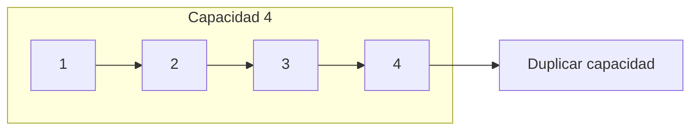
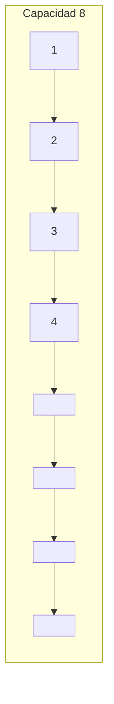

# Arreglos dinámicos

Un **arreglo dinámico** es una estructura de datos lineal que, a diferencia de un arreglo estático, **puede crecer o reducirse durante la ejecución**. Permite agregar elementos sin conocer de antemano cuántos serán, lo que lo hace muy útil en programación moderna.

Internamente, el arreglo dinámico comienza con un **tamaño inicial fijo**. Cuando se llena, se crea un nuevo arreglo más grande (usualmente el doble del tamaño), y se copian los datos antiguos al nuevo.

## ¿Cómo funciona el redimensionamiento?

1. Cuando el arreglo se llena:

   - Se crea un nuevo con tamaño `2 * n`.
   - Se copian los `n` elementos al nuevo arreglo.
   - El arreglo viejo se descarta.

2. Algunos implementaciones también permiten **reducir el tamaño** si hay mucho espacio desperdiciado (shrinkage).

## Costo amortizado

El redimensionamiento **no ocurre en cada operación**, por lo que su costo se reparte entre muchas operaciones.

- **Agregar** normalmente cuesta `O(1)` (cuando hay espacio).
- **Redimensionar** cuesta `O(n)` pero ocurre rara vez.
- **Costo amortizado de inserción:** `O(1)` en promedio.

> *El análisis de costo amortizado es clave para entender por qué los arreglos dinámicos son eficientes en la práctica, incuso con redimensionamientos (Tarjan, 1985; Cormen et al., 2022)*

## Aplicaciones prácticas

|Uso|Arreglo dinámico como base|
|--|--|
|Vectores (C++), ArrayList (Java)|Arreglos dinámicos|
|Listas de reproducción de Spotify|Crece al añadir nuevas canciones|
|Buffers de red|Acumulan paquetes hasta cierto límite|
|Pilas y colas implementadas con arrays dinámicos|Estructuras auxiliares|

## Representación visual

