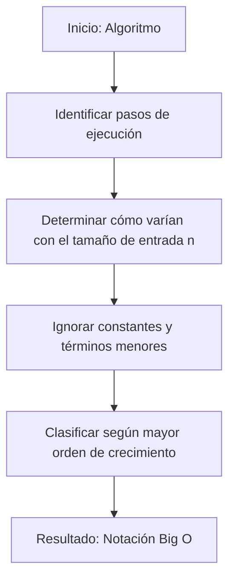

# Notación Big O

La **notación Big O** (o "O grande") es una herramienta matemática usada para describir el **comportamiento asintótico** de un algoritmo, es decir, cómo crece el tiempo de ejecución o el uso de memoria en función del tamaño de la entrada `n`. Esta notación es esencial en el análisis de algoritmos porque permite comparar su eficiencia de forma independiente al hardware o lenguaje utilizado (Cormen et al., 2022).

## Principales características

1. Describe el **peor caso** (upper bound) de crecimiento de un algoritmo.
2. Ignora constantes y términos de menor orden porque, a gran escala, no afectan significativamente el crecimiento.
3. Permite clasificar algoritmos en categorías de eficiencia.

## Categorías comunes de complejidad

- $O(1)$: Tiempo constante. El tiempo de ejecución no depende de `n`.
- $O(log n)$: Tiempo logarítmico. Ejemplo: búsqueda binaria.
- $O(n)$: Tiempo lineal. Ejemplo: recorrer un arreglo completo.
- $O(n log n)$: Combinación. Ejemplo: algoritmos de ordenamiento eficientes como MergeSort.
- $O({n}^{2})$: Tiempo cuadrático. Ejemplo: doble bucle anidado.
- $O({2}^{n})$: Tiempo exponencial. Ejemplo: algoritmos de fuerza bruta.

## Ejemplo

Si un algoritmo tiene las siguientes operaciones:

- 5 operaciones iniciales (constante)
- Un bucle que se ejecuta `n` veces
- Un bucle interno que se ejecuta `n` veces

El número total de operaciones será aproximadamente:

$$
5 + n + {n}^{2} \approx {n}^{2} \Longrightarrow O({n}^{2})
$$

## Flujo conceptual de análisis Big O



## Ejemplo técnico

import Tabs from "@theme/Tabs"
import TabItem from "@theme/TabItem"

<Tabs>
<TabItem value="java" label="Paradima: Orientado a Objetos">

<Tabs>
<TabItem value="code" label="Código Java Ejemplo">

```java showLineNumbers
/**
 * Class demonstrating algorithms with different Big O complexities.
 */
public class ComplexityExamples {

    // O(1): Constant time
    public int getFirstElement(int[] array) {
        return array[0];
    }

    // O(n): Linear time
    public boolean contains(int[] array, int target) {
        for (int value : array) {
            if (value == target) {
                return true;
            }
        }
        return false;
    }

    // O(n^2): Quadratic time
    public void printAllPairs(int[] array) {
        for (int i : array) {
            for (int j : array) {
                System.out.println(i + ", " + j);
            }
        }
    }
}
```

</TabItem>
<TabItem value="test" label="Test Unitario">

```java showLineNumbers
import org.junit.jupiter.api.Test;
import static org.junit.jupiter.api.Assertions.*;

public class ComplexityExamplesTest {

    @Test
    void testGetFirstElement() {
        ComplexityExamples ce = new ComplexityExamples();
        assertEquals(1, ce.getFirstElement(new int[]{1, 2, 3}));
    }

    @Test
    void testContains() {
        ComplexityExamples ce = new ComplexityExamples();
        assertTrue(ce.contains(new int[]{1, 2, 3}, 2));
        assertFalse(ce.contains(new int[]{1, 2, 3}, 4));
    }
}
```

</TabItem>
</Tabs>

</TabItem>
<TabItem value="python" label="Paradima: Procedural">

<Tabs>
<TabItem value="code" label="Código Python Ejemplo">

```py showLineNumbers
def get_first_element(arr):
    """O(1): constant time"""
    return arr[0]

def contains(arr, target):
    """O(n): linear time"""
    for item in arr:
        if item == target:
            return True
    return False

def print_all_pairs(arr):
    """O(n^2): quadratic time"""
    for i in arr:
        for j in arr:
            print(f"{i}, {j}")
```

</TabItem>
<TabItem value="test" label="Test Unitario">

```py showLineNumbers
from complexity_examples import get_first_element, contains

def test_get_first_element():
    assert get_first_element([1, 2, 3]) == 1

def test_contains():
    assert contains([1, 2, 3], 2) is True
    assert contains([1, 2, 3], 5) is False
```

</TabItem>
</Tabs>

</TabItem>
<TabItem value="ts" label="Paradima: Funcional">

<Tabs>
<TabItem value="code" label="Código TS Ejemplo">

```ts showLineNumbers
export const getFirstElement = <T>(arr: T[]): T => arr[0];

export const contains = <T>(arr: T[], target: T): boolean =>
  arr.some((value) => value === target);

export const printAllPairs = <T>(arr: T[]): void =>
  arr.forEach((i) => arr.forEach((j) => console.log(`${i}, ${j}`)));
```

</TabItem>
<TabItem value="test" label="Test Unitario">

```ts showLineNumbers
import { getFirstElement, contains } from "./complexityExamples";

test("getFirstElement", () => {
  expect(getFirstElement([1, 2, 3])).toBe(1);
});

test("contains", () => {
  expect(contains([1, 2, 3], 2)).toBe(true);
  expect(contains([1, 2, 3], 5)).toBe(false);
});
```

</TabItem>
</Tabs>

</TabItem>
</Tabs>

## Aplicaciones Prácticas

- **Evaluar algoritmos de búsqueda y ordenamiento:** Elegir entre búsqueda lineal o binaria según la estructura de datos.
- **Optimizar software empresarial:** Determinar cuellos de botella en consultas a bases de datos.
- **Diseño de aplicaciones en tiempo real:** Seleccionar estructuras de datos con complejidad O(1) u O(log n) para garantizar rapidez.
- **Escalabilidad en sistemas distribuidos:** Elegir algoritmos que soporten grandes volúmenes de datos.

## Buenas prácticas

- **Responsabilidad única (SRP):** Cada función demuestra un solo comportamiento.
- **Nombres descriptivos:** `getFirstElement`, `contains` explican su propósito claramente.
- **Modularidad:** Separar lógica de negocio y pruebas facilita refactorización.
- **Medición objetiva:** Los tests y ejemplos facilitan verificar comportamiento y desempeño.

## Referencias

- Cormen, T. H., Leiserson, C. E., Rivest, R. L., & Stein, C. (2022). Introduction to Algorithms (4th ed.). MIT Press.
- Weiss, M. A. (2020). Data Structures and Algorithm Analysis in Java (4th ed.). Pearson.
- McDowell, G. (2016). Cracking the Coding Interview. CareerCup.
- [Big-O Cheat Sheet](https://www.bigocheatsheet.com/)
- [Python 3](https://docs.python.org/3/tutorial)
