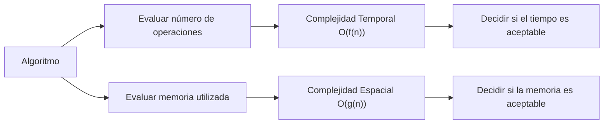

# Complejidad temporal y espacial

La complejidad temporal y espacial son métricas fundamentales en el análisis de algoritmos. Permiten evaluar el rendimiento (tiempo) y el uso de recursos (memoria) de un programa. Estas métricas son independientes del hardware y se expresan generalmente en función del tamaño de la entrada `n`.

Un algoritmo eficiente debe balancear tiempo y memoria. En algunos contextos se prioriza tiempo (aplicaciones en tiempo real) y en otros memoria (sistemas embebidos).

## Complejidad Temporal

**Definición:** Medida de cómo el tiempo de ejecución de un algoritmo crece con respecto al tamaño de los datos de entrada.

**Factores que influyen:**

1. Cantidad de operaciones ejecutadas.
2. Estructura de bucles y recursividad.
3. Llamadas a funciones externas.

**Ejemplos:**

- $O(1)$: Acceso a un elemento en un arreglo.
- $O(n)$: Recorrer una lista de longitud `n`.
- $O({n}^{2})$: Doble bucle anidado.

## Complejidad Espacial

**Definición:** Medida de la cantidad de memoria que necesita un algoritmo para ejecutarse.

**Factores que influyen:**

1. Variables y estructuras de datos utilizadas.
2. Memoria asignada por recursión.
3. Estructuras auxiliares (arreglos temporales, tablas hash, etc.).

**Ejemplos:**

- $O(1)$: Algoritmo que utiliza memoria constante.
- $O(n)$: Algoritmo que almacena una copia de todos los elementos.

## Diagrama conceptual de complejidades

## Aplicaciones Prácticas

- **Optimización de algoritmos:** Seleccionar el balance adecuado entre memoria y velocidad.
- **Sistemas embebidos:** Usar algoritmos de baja complejidad espacial (memoria limitada).
- **Big Data:** Algoritmos de baja complejidad temporal para manejar millones de registros.
- **Aplicaciones móviles:** Minimizar consumo de memoria para evitar cierres inesperados.

## Referencias

- Cormen, T. H., Leiserson, C. E., Rivest, R. L., & Stein, C. (2022). Introduction to Algorithms (4th ed.). MIT Press.
- Weiss, M. A. (2020). Data Structures and Algorithm Analysis in Java (4th ed.). Pearson.
- McDowell, G. (2016). Cracking the Coding Interview. CareerCup.
- [Big-O Cheat Sheet](https://www.bigocheatsheet.com/)
- [Python 3](https://docs.python.org/3/tutorial)
