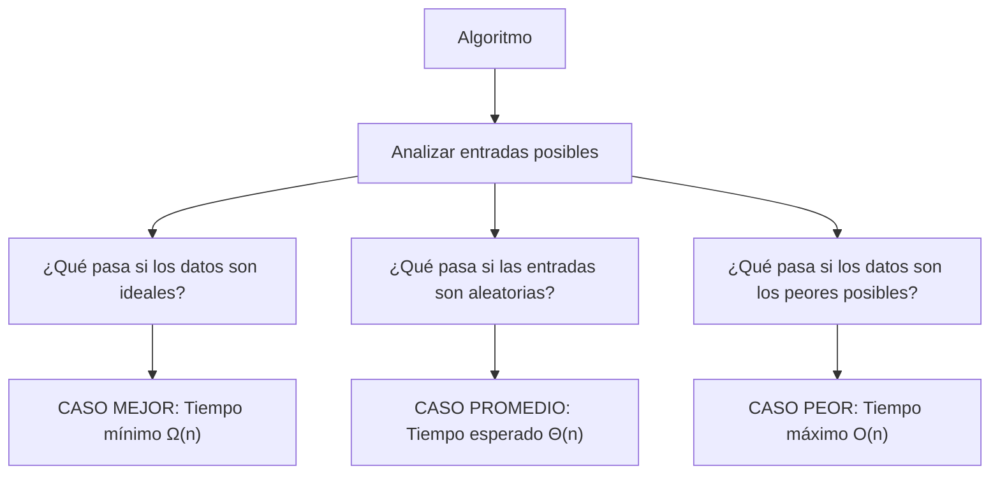

# Casos mejor, promedio y peor

El **análisis de algoritmos** no solo se enfoca en el crecimiento de su tiempo de ejecución o uso de memoria (Big O y complejidad temporal/espacial), sino también en **cómo se comportan en diferentes escenarios de entrada**. Por eso se utilizan los conceptos de:

## Best Case (Mejor Caso)

**Definición:** El tiempo de ejecución mínimo que puede tener un algoritmo, es decir, cuando los datos de entrada están en la mejor condición posible.

**Ejemplo:** En una búsqueda lineal, el caso mejor es cuando el elemento que buscamos está en la primera posición.

**Notación:** Generalmente se expresa como $Ω(n)$ (Omega).

## Average Case (Caso Promedio)

**Definición:** El tiempo de ejecución esperado, considerando todas las posibles entradas y su probabilidad de ocurrencia.

**Ejemplo:** En búsqueda lineal, el caso promedio es que el elemento esté en cualquier posición con igual probabilidad, por lo que en promedio se recorre la mitad de la lista.

**Notación:** Se expresa como $Θ(n)$ (Theta).

## Worst Case (Caso Peor)

**Definición:** El tiempo máximo que un algoritmo puede tardar en ejecutarse, es decir, la situación más desfavorable.

**Ejemplo:** En búsqueda lineal, el caso peor ocurre cuando el elemento no está en la lista, y se recorren todas las posiciones.

**Notación:** Se expresa como $O(n)$ (Big O).

## Importancia

1. **Garantía de rendimiento:** El caso peor es crítico en sistemas en tiempo real.
2. **Evaluación probabilística:** El caso promedio es útil en aplicaciones donde la distribución de datos es conocida.
3. **Optimización:** Conocer el caso mejor ayuda a identificar situaciones que optimizan el rendimiento.

## Evaluación de casos



## Ejemplo técnico

import Tabs from "@theme/Tabs"
import TabItem from "@theme/TabItem"

<Tabs>
<TabItem value="java" label="Paradigma: Orientado a Objetos">

<Tabs>
<TabItem value="code" label="Código Java Ejemplo">

```java showLineNumbers
/**
 * Linear search demonstrating best, average and worst cases.
 */
public class LinearSearch {

    /**
     * O(n) worst case, O(1) best case.
     */
    public int search(int[] array, int target) {
        for (int i = 0; i < array.length; i++) {
            if (array[i] == target) {
                return i; // Best case if found early
            }
        }
        return -1; // Worst case if not found
    }
}
```

</TabItem>
<TabItem value="test" label="Test Unitario">

```java showLineNumbers
import org.junit.jupiter.api.Test;
import static org.junit.jupiter.api.Assertions.*;

public class LinearSearchTest {
    @Test
    void testBestCase() {
        LinearSearch ls = new LinearSearch();
        int[] arr = {5, 10, 15};
        assertEquals(0, ls.search(arr, 5)); // Best case
    }

    @Test
    void testWorstCase() {
        LinearSearch ls = new LinearSearch();
        int[] arr = {5, 10, 15};
        assertEquals(-1, ls.search(arr, 100)); // Worst case
    }
}
```

</TabItem>
</Tabs>

</TabItem>
<TabItem value="python" label="Paradigma: Procedural">

<Tabs>
<TabItem value="code" label="Código Python Ejemplo">

```py showLineNumbers
def linear_search(arr, target):
    """Linear search with best and worst case scenarios."""
    for i, value in enumerate(arr):
        if value == target:
            return i  # Best case: found early
    return -1  # Worst case: not found
```

</TabItem>
<TabItem value="test" label="Test Unitario">

```py showLineNumbers
from search import linear_search

def test_best_case():
    assert linear_search([1, 2, 3], 1) == 0

def test_worst_case():
    assert linear_search([1, 2, 3], 10) == -1
```

</TabItem>
</Tabs>

</TabItem>
<TabItem value="ts" label="Paradigma: Funcional">

<Tabs>
<TabItem value="code" label="Código TS Ejemplo">

```ts showLineNumbers
export const linearSearch = <T>(arr: T[], target: T): number =>
  arr.findIndex((value) => value === target);
```

</TabItem>
<TabItem value="test" label="Test Unitario">

```ts showLineNumbers
import { linearSearch } from "./linearSearch";

test("best case", () => {
  expect(linearSearch([1, 2, 3], 1)).toBe(0);
});

test("worst case", () => {
  expect(linearSearch([1, 2, 3], 10)).toBe(-1);
});
```

</TabItem>
</Tabs>

</TabItem>
</Tabs>

## Aplicaciones Prácticas

- **Sistemas de búsqueda:** Evaluar el comportamiento de motores de búsqueda según la posición de los datos.
- **Ordenamiento:** QuickSort tiene un caso peor $O({n}^{2})$ cuando la entrada está ordenada de cierta forma, y un caso promedio $O(n log n)$.
- **Criptografía:** Evaluar el peor caso es esencial para garantizar seguridad ante ataques de fuerza bruta.
- **Bases de datos:** Diseñar índices para evitar los casos peores en consultas.

## Referencias

- Cormen, T. H., Leiserson, C. E., Rivest, R. L., & Stein, C. (2022). Introduction to Algorithms (4th ed.). MIT Press.
- Weiss, M. A. (2020). Data Structures and Algorithm Analysis in Java (4th ed.). Pearson.
- McDowell, G. (2016). Cracking the Coding Interview. CareerCup.
- [Big-O Cheat Sheet](https://www.bigocheatsheet.com/)
- [Python 3](https://docs.python.org/3/tutorial)
