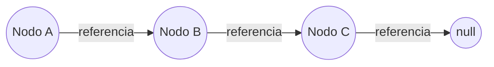

# Nodos y Punteros

En estructuras de datos como **listas enlazadas**, **árboles** o **grafos**, los conceptos de **nodos** y **punteros** son fundamentales:

1. **Nodo:** unidad básica de una estructura enlazada, que almacena un dato y una o más referencias a otros nodos.
2. **Puntero:** dirección de memoria que permite acceder a otros nodos (en C o C++ se utilizan explícitamente).

## Lenguajes con punteros explícitos vs. implícitos

En lenguajes como **C/C++**, los punteros son variables que contienen direcciones de memoria.

En lenguajes como J**ava, Python o TypeScript**, no se accede a la memoria directamente. En lugar de punteros explícitos, se utilizan **referencias**, que funcionan como punteros seguros gestionados por el runtime.

## Simulación en lenguajes sin punteros explícitos

Para simular nodos y punteros:

1. Cada nodo debe tener un **atributo de referencia** al siguiente nodo (o a nodos hijos).
2. La referencia será `null` o `None` cuando no exista conexión.
3. Se usan **clases** u **objetos** para crear nodos dinámicamente.



Aquí, cada nodo guarda el dato y una referencia al siguiente nodo.

## Ejemplo Técnico

import Tabs from "@theme/Tabs"
import TabItem from "@theme/TabItem"

<Tabs>
<TabItem value="java" label="Paradigma: Orientado a Objetos">

<Tabs>
<TabItem value="code" label="Código Java Ejemplo">

```java showLineNumbers
/**
 * Class representing a Node in a singly linked list.
 */
public class Node<T> {
    private T data;
    private Node<T> next; // Simulates pointer/reference to next node

    public Node(T data) {
        this.data = data;
        this.next = null;
    }

    public T getData() { return data; }
    public void setNext(Node<T> next) { this.next = next; }
    public Node<T> getNext() { return next; }
}

/**
 * Singly linked list using references instead of explicit pointers.
 */
public class LinkedList<T> {
    private Node<T> head;

    public void insertAtEnd(T data) {
        Node<T> newNode = new Node<>(data);
        if (head == null) {
            head = newNode;
            return;
        }
        Node<T> current = head;
        while (current.getNext() != null) {
            current = current.getNext();
        }
        current.setNext(newNode);
    }

    public String printList() {
        StringBuilder sb = new StringBuilder();
        Node<T> current = head;
        while (current != null) {
            sb.append(current.getData()).append(" -> ");
            current = current.getNext();
        }
        return sb.append("null").toString();
    }
}
```

</TabItem>
<TabItem value="test" label="Test Unitario">

```java showLineNumbers
import org.junit.jupiter.api.Test;
import static org.junit.jupiter.api.Assertions.*;

public class LinkedListTest {
    @Test
    void testInsertAtEnd() {
        LinkedList<Integer> list = new LinkedList<>();
        list.insertAtEnd(1);
        list.insertAtEnd(2);
        assertEquals("1 -> 2 -> null", list.printList());
    }
}
```

</TabItem>
</Tabs>

</TabItem>
<TabItem value="python" label="Paradigma: Procedural">

<Tabs>
<TabItem value="code" label="Código Python Ejemplo">

```py showLineNumbers
class Node:
    def __init__(self, data):
        self.data = data
        self.next = None  # Reference simulating a pointer

def insert_at_end(head, data):
    new_node = Node(data)
    if head is None:
        return new_node
    current = head
    while current.next:
        current = current.next
    current.next = new_node
    return head

def print_list(head):
    current = head
    result = ""
    while current:
        result += f"{current.data} -> "
        current = current.next
    return result + "None"
```

</TabItem>
<TabItem value="test" label="Test Unitario">

```py showLineNumbers
from linked_list import insert_at_end, print_list, Node

def test_insert_at_end():
    head = None
    head = insert_at_end(head, 1)
    head = insert_at_end(head, 2)
    assert print_list(head) == "1 -> 2 -> None"
```

</TabItem>
</Tabs>

</TabItem>
<TabItem value="ts" label="Paradigma: Funcional">

<Tabs>
<TabItem value="code" label="Código TS Ejemplo">

```ts showLineNumbers
export type Node<T> = {
  data: T;
  next: Node<T> | null; // Simulates pointer/reference
};

export const insertAtEnd = <T>(head: Node<T> | null, data: T): Node<T> => {
  const newNode: Node<T> = { data, next: null };
  if (!head) return newNode;

  let current = head;
  while (current.next) current = current.next;
  current.next = newNode;
  return head;
};

export const printList = <T>(head: Node<T> | null): string => {
  let result = "";
  let current = head;
  while (current) {
    result += `${current.data} -> `;
    current = current.next;
  }
  return result + "null";
};
```

</TabItem>
<TabItem value="test" label="Test Unitario">

```ts showLineNumbers
import { insertAtEnd, printList, Node } from "./linkedList";

test("insertAtEnd and printList", () => {
  let head: Node<number> | null = null;
  head = insertAtEnd(head, 1);
  head = insertAtEnd(head, 2);
  expect(printList(head)).toBe("1 -> 2 -> null");
});
```

</TabItem>
</Tabs>

</TabItem>
</Tabs>

## Aplicaciones prácticas

- **Implementación de estructuras dinámicas:** Listas enlazadas, pilas, colas y árboles.
- **Memoria dinámica:** Permite crecer o decrecer estructuras sin saber el tamaño de antemano.
- **Simulación de estructuras complejas:** Árboles binarios de búsqueda, tablas hash con listas enlazadas.
- **Sistemas de archivos:** Directorios y subdirectorios modelados como nodos enlazados.

## Buenas prácticas

- **SRP:** `Node` y `LinkedList` tienen responsabilidades separadas.
- **Nombres claros:** Los atributos `data` y `next` reflejan su propósito.
- **Modularidad:** Funciones como `printList` y `insertAtEnd` están desacopladas.
- **Pruebas unitarias:** Verifican el comportamiento en cada lenguaje.
- **Seguridad en memoria:** En lenguajes con referencias, se evita el acceso inválido a memoria.

## Referencias

- Cormen, T. H., Leiserson, C. E., Rivest, R. L., & Stein, C. (2022). Introduction to Algorithms (4th ed.). MIT Press.
- Weiss, M. A. (2020). Data Structures and Algorithm Analysis in Java (4th ed.). Pearson.
- McDowell, G. (2016). Cracking the Coding Interview. CareerCup.
- [Python 3](https://docs.python.org/3/tutorial/classes.html)
- [Working with objects](https://developer.mozilla.org/en-US/docs/Web/JavaScript/Guide/Working_with_Objects)
