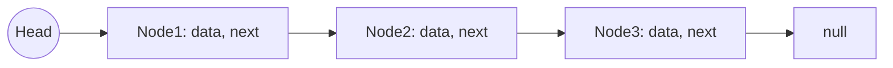
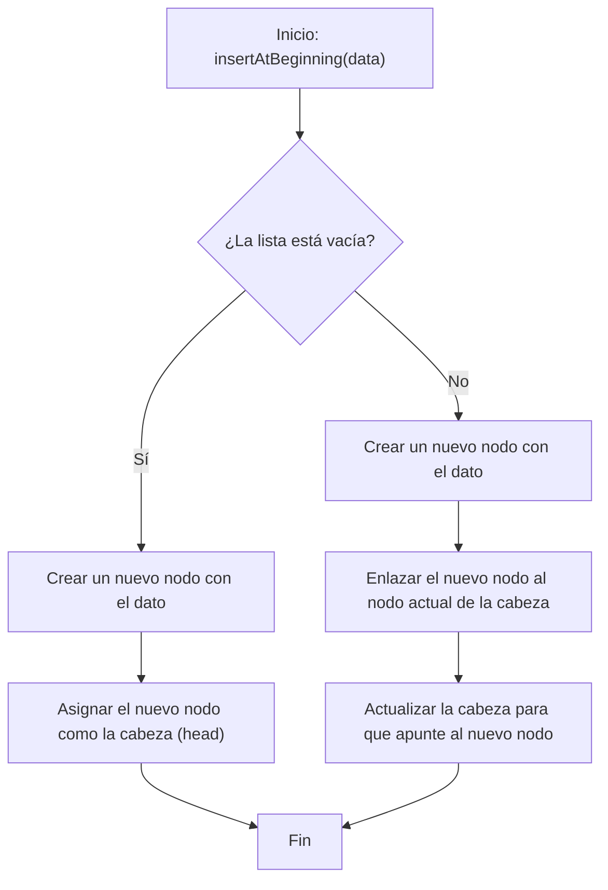
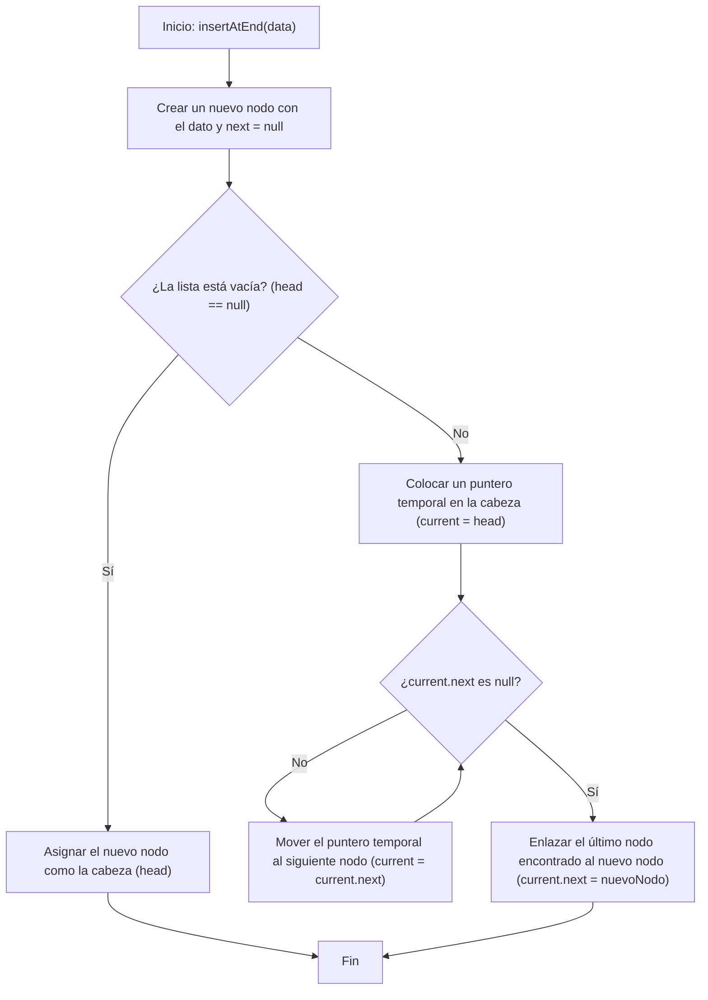
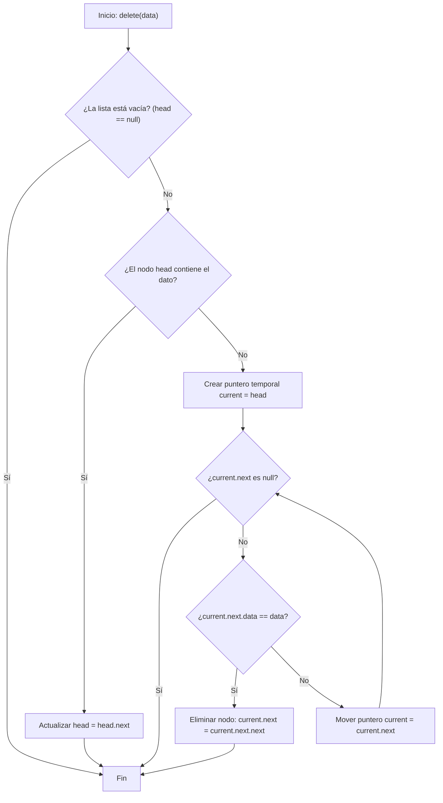
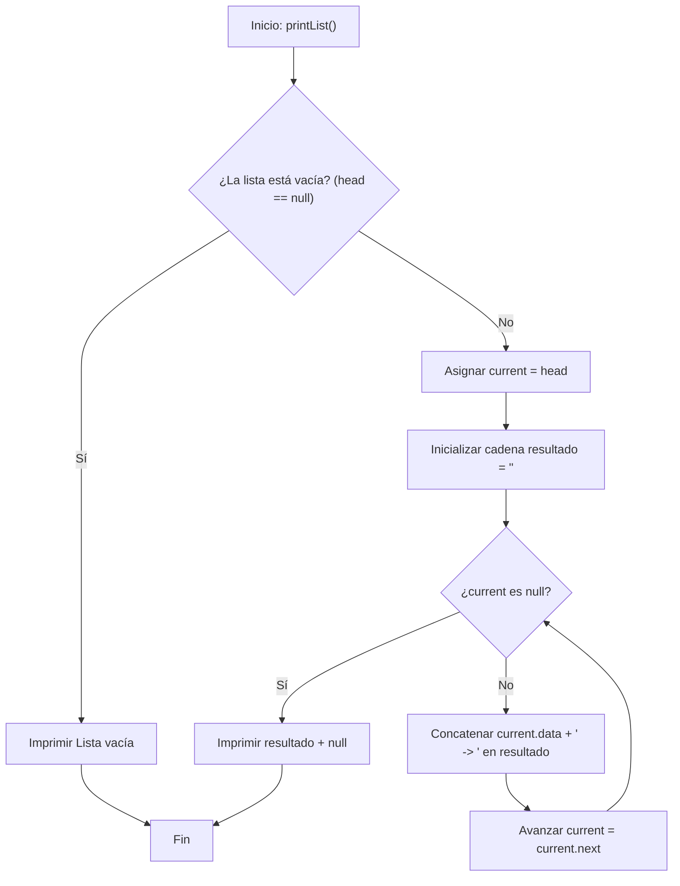

# Lista Enlazada Simple

Una **lista enlazada simple** (**Singly Linked List**) es una **estructura de datos lineal y dinámica** en la que los elementos (llamados **nodos**) se enlazan uno tras otro mediante referencias. A diferencia de los arreglos o vectores, sus elementos **no se almacenan de forma contigua en memoria**, sino que cada nodo guarda la ubicación del siguiente.

## Características principales

1. Cada nodo contiene:

   - Un **dato**.
   - Una **referencia** (o puntero) al siguiente nodo de la lista.

2. La lista tiene un único punto de entrada llamado **cabeza (head)**, que apunta al primer nodo.
3. El último nodo apunta a `null` o `None`.
4. Su tamaño es **dinámico**, puede crecer o reducirse fácilmente.

## Ventajas

1. Inserción y eliminación eficientes en posiciones específicas (al inicio, por ejemplo) sin necesidad de desplazar elementos.
2. Uso dinámico de memoria.

## Desventajas

1. No permite acceso directo a posiciones (como los arreglos): para acceder a un elemento en la posición `i` se requiere recorrer la lista desde el inicio.
2. Requiere memoria adicional para almacenar referencias.

## Complejidad de operaciones básicas

|Funcionalidad|Complejidad Big-O|
|--|--|
|Acceso|$O(n)$|
|Inserción al inicio|$O(1)$|
|Inserción al final|$O(n)$|
|Eliminación por valor|$O(n)$|

## Representación visual



## Flujo de acciones

### Inserción al inicio



1. **Verificar si la lista está vacía:** Se revisa si `head` es `null` o `None`.
2. **Caso lista vacía:** Si la lista no tiene elementos, el nuevo nodo se convierte en la cabeza (`head`).
3. **Caso lista con elementos:**
   - Crear un nuevo nodo con el dato.
   - Enlazar su atributo next al nodo que actualmente es la cabeza.
   - Actualizar la referencia de `head` para que ahora apunte al nuevo nodo.

### Inserción al final



1. **Crear nuevo nodo:** Se inicializa un nodo con el dato y su referencia `next` como `null`.
2. **Verificar si la lista está vacía:** Si `head` es `null`, el nuevo nodo se convierte en la cabeza.
3. **Si la lista no está vacía:**
   - Se inicializa un puntero temporal en la cabeza (`current = head`).
   - Se recorre la lista hasta encontrar el último nodo (`current.next == null`).
   - Una vez encontrado, se enlaza el último nodo al nuevo (`current.next = nuevoNodo`).

### Eliminación



1. **Verificar si la lista está vacía:** Si `head` es `null`, no hay elementos que eliminar.
2. **Verificar si el primer nodo es el que debe eliminarse:** Si el dato está en la cabeza, se actualiza `head` al siguiente nodo.
3. **Recorrer la lista:**
   - Se coloca un puntero temporal en la cabeza (`current = head`).
   - Se recorre hasta que el siguiente nodo sea `null` (no se encontró el dato) o hasta que `current.next.data == data`.
4. **Eliminar el nodo:** Si se encuentra el nodo, se “salta” el nodo objetivo actualizando la referencia `current.next = current.next.next`.

### Imprimir lista



1. **Verificar si la lista está vacía:** Si `head` es `null`, se imprime "Lista vacía" y termina el método.
2. **Recorrer la lista:**
   - Inicializar un puntero current en `head` y una cadena vacía resultado.
   - Mientras current no sea `null`, concatenar `current.data` a la cadena resultado seguido de " -> ".
   - Avanzar el puntero a `current.next`.
3. **Finalizar impresión:** Al terminar el recorrido, se imprime resultado + "null".

## Ejemplo de implementación

import Tabs from "@theme/Tabs"
import TabItem from "@theme/TabItem"

<Tabs>
<TabItem value="java" label="Paradigma:">

<Tabs>
<TabItem value="code" label="Código Java Ejemplo">

```java title="Node.java" showLineNumbers
/**
 * Node class representing an element in the singly linked list.
 */
class Node<T> {
    private T data;
    private Node<T> next;

    public Node(T data) {
        this.data = data;
        this.next = null;
    }

    public T getData() { return data; }
    public Node<T> getNext() { return next; }
    public void setNext(Node<T> next) { this.next = next; }
}
```

```java title="SinglyLinkedList.java" showLineNumbers
/**
 * Singly linked list implementation.
 */
public class SinglyLinkedList<T> {
    private Node<T> head;

    public void insertAtBeginning(T data) {
        Node<T> newNode = new Node<>(data);
        newNode.setNext(head);
        head = newNode;
    }

    public void insertAtEnd(T data) {
        Node<T> newNode = new Node<>(data);
        if (head == null) {
            head = newNode;
            return;
        }
        Node<T> current = head;
        while (current.getNext() != null) {
            current = current.getNext();
        }
        current.setNext(newNode);
    }

    public boolean delete(T data) {
        if (head == null) return false;

        if (head.getData().equals(data)) {
            head = head.getNext();
            return true;
        }

        Node<T> current = head;
        while (current.getNext() != null) {
            if (current.getNext().getData().equals(data)) {
                current.setNext(current.getNext().getNext());
                return true;
            }
            current = current.getNext();
        }
        return false;
    }

    public String printList() {
        StringBuilder sb = new StringBuilder();
        Node<T> current = head;
        while (current != null) {
            sb.append(current.getData()).append(" -> ");
            current = current.getNext();
        }
        return sb.append("null").toString();
    }
}
```

</TabItem>
<TabItem value="test" label="Test Unitario">

```java showLineNumbers
import org.junit.jupiter.api.Test;
import static org.junit.jupiter.api.Assertions.*;

public class SinglyLinkedListTest {
    @Test
    void testInsertAndDelete() {
        SinglyLinkedList<Integer> list = new SinglyLinkedList<>();
        list.insertAtBeginning(1);
        list.insertAtEnd(2);
        assertEquals("1 -> 2 -> null", list.printList());
        list.delete(1);
        assertEquals("2 -> null", list.printList());
    }
}
```

</TabItem>
</Tabs>

</TabItem>
<TabItem value="python" label="Paradigma: Procedural">

<Tabs>
<TabItem value="code" label="Código Python Ejemplo">

```py showLineNumbers
class Node:
    def __init__(self, data):
        self.data = data
        self.next = None

def insert_at_beginning(head, data):
    new_node = Node(data)
    new_node.next = head
    return new_node

def insert_at_end(head, data):
    new_node = Node(data)
    if head is None:
        return new_node
    current = head
    while current.next:
        current = current.next
    current.next = new_node
    return head

def delete_node(head, data):
    if head is None:
        return None
    if head.data == data:
        return head.next
    current = head
    while current.next:
        if current.next.data == data:
            current.next = current.next.next
            return head
        current = current.next
    return head

def print_list(head):
    result = ""
    current = head
    while current:
        result += f"{current.data} -> "
        current = current.next
    return result + "None"
```

</TabItem>
<TabItem value="test" label="Test Unitario">

```py showLineNumbers
from linked_list import insert_at_beginning, insert_at_end, delete_node, print_list

def test_linked_list():
    head = None
    head = insert_at_beginning(head, 1)
    head = insert_at_end(head, 2)
    assert print_list(head) == "1 -> 2 -> None"
    head = delete_node(head, 1)
    assert print_list(head) == "2 -> None"
```

</TabItem>
</Tabs>

</TabItem>
<TabItem value="ts" label="Paradigma: Funcional">

<Tabs>
<TabItem value="code" label="Código TS Ejemplo">

```ts showLineNumbers
export type Node<T> = {
  data: T;
  next: Node<T> | null;
};

export const insertAtBeginning = <T>(
  head: Node<T> | null,
  data: T
): Node<T> => ({ data, next: head });

export const insertAtEnd = <T>(
  head: Node<T> | null,
  data: T
): Node<T> => {
  const newNode: Node<T> = { data, next: null };
  if (!head) return newNode;

  let current = head;
  while (current.next) current = current.next;
  current.next = newNode;
  return head;
};

export const deleteNode = <T>(head: Node<T> | null, data: T): Node<T> | null => {
  if (!head) return null;
  if (head.data === data) return head.next;

  let current = head;
  while (current.next) {
    if (current.next.data === data) {
      current.next = current.next.next;
      return head;
    }
    current = current.next;
  }
  return head;
};

export const printList = <T>(head: Node<T> | null): string => {
  let result = "";
  let current = head;
  while (current) {
    result += `${current.data} -> `;
    current = current.next;
  }
  return result + "null";
};
```

</TabItem>
<TabItem value="test" label="Test Unitario">

```ts showLineNumbers
import { insertAtBeginning, insertAtEnd, deleteNode, printList, Node } from "./linkedList";

test("linked list operations", () => {
  let head: Node<number> | null = null;
  head = insertAtBeginning(head, 1);
  head = insertAtEnd(head, 2);
  expect(printList(head)).toBe("1 -> 2 -> null");
  head = deleteNode(head, 1);
  expect(printList(head)).toBe("2 -> null");
});
```

</TabItem>
</Tabs>

</TabItem>
</Tabs>

## Métodos útiles adicionales

Las listas enlazadas pueden implementar más métodos, tales como:

- `insertAtPosition(pos, data)`: Inserta un nodo en una posición específica.
- `deleteAtPosition(pos)`: Elimina un nodo en una posición determinada.
- `search(data)`: Busca un nodo que contenga un dato específico y devuelve su posición.
- `length()`: Devuelve la cantidad de nodos en la lista.
- `isEmpty()`: Indica si la lista está vacía.
- `getFirst()`: Devuelve el dato del primer nodo.
- `getLast()`: Devuelve el dato del último nodo.
- `reverse()`: Invierte el orden de los nodos de la lista.
- `clear()`: Elimina todos los nodos de la lista.
- `toArray()`: Convierte la lista enlazada en un arreglo o lista nativa.
- `insertAfter(value, data)`: Inserta un nodo después de un nodo con un valor dado.
- `insertBefore(value, data)`: Inserta un nodo antes de un nodo con un valor dado.
- `clone()`: Crea una copia de la lista.
- `hasCycle()`: Detecta si la lista tiene un ciclo (usando el algoritmo de tortuga y liebre).
- `findMiddle()`: Encuentra el nodo que está en la posición central.

## Aplicaciones prácticas

- **Implementación de Pilas y Colas:** La lista enlazada simple es la base de estas estructuras.
- **Gestión de memoria dinámica:** En sistemas donde no se conoce el tamaño de los datos de antemano.
- **Sistemas de reproducción de multimedia:** Navegar secuencialmente entre canciones o videos.
- **Algoritmos de grafos:** Representar listas de adyacencia.

## Buenas prácticas

- **SRP:** `Node` y `SinglyLinkedList` cumplen funciones separadas.
- **Nombres claros y autoexplicativos:** `insertAtEnd`, `deleteNode`, etc.
- **Modularidad:** Cada operación está implementada en un método independiente.
- **Separación de responsabilidades:** La impresión de la lista se hace en un método separado (printList).

## Referencias

- Cormen, T. H., Leiserson, C. E., Rivest, R. L., & Stein, C. (2022). Introduction to Algorithms (4th ed.). MIT Press.
- Weiss, M. A. (2020). Data Structures and Algorithm Analysis in Java (4th ed.). Pearson.
- McDowell, G. (2016). Cracking the Coding Interview. CareerCup.
- [Python 3](https://docs.python.org/3/tutorial)
- [Jest](https://jestjs.io/docs/getting-started)
