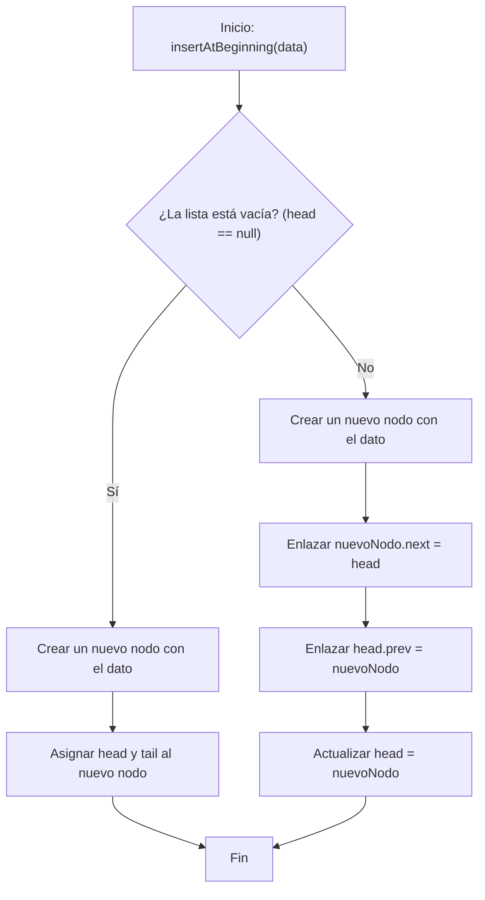
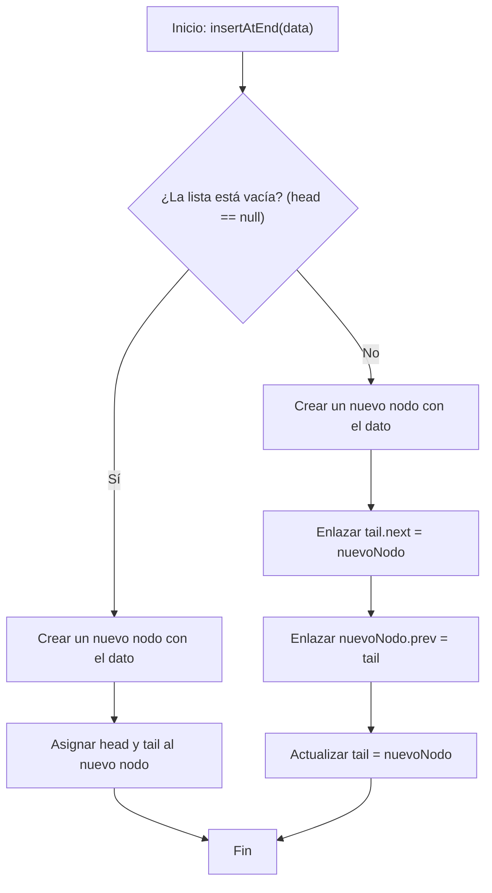
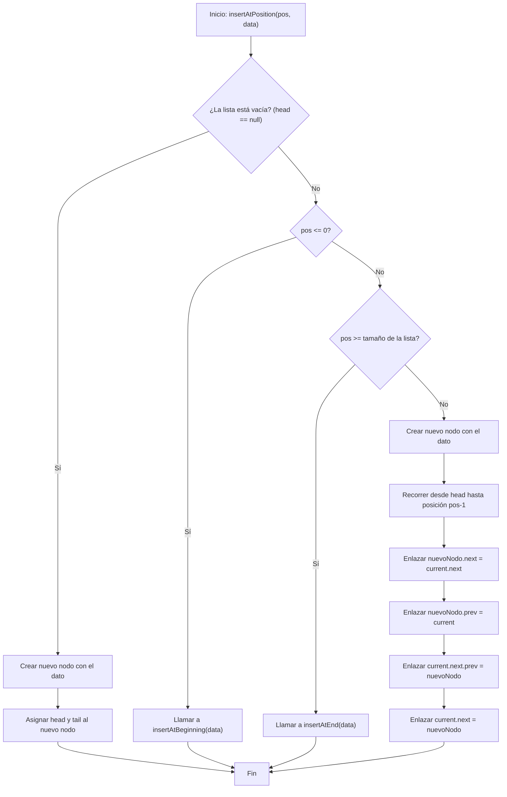
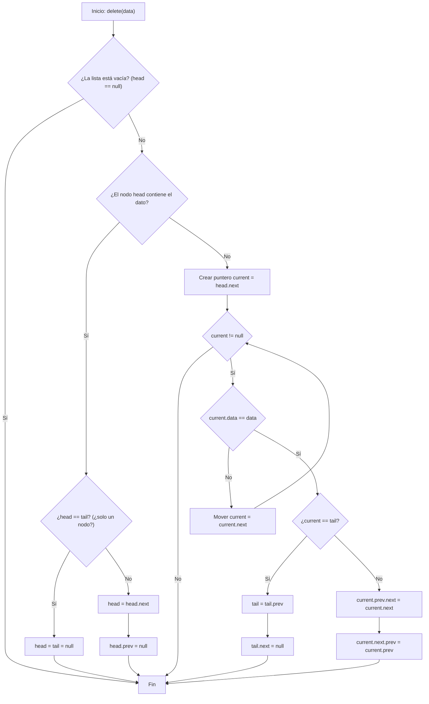

# Lista Enlazada Doble

Una **lista enlazada doble** es una estructura de datos lineal que extiende el concepto de la lista enlazada simple. Cada nodo contiene referencias tanto al **siguiente nodo** como al anterior, permitiendo un recorrido en ambas direcciones.

## Características

1. Cada nodo contiene:
   - Un dato.
   - Una referencia al siguiente nodo (`next`).
   - Una referencia al nodo anterior (`prev`).
2. Tiene dos puntos de referencia principales:
   - **head:** apunta al primer nodo.
   - **tail:** apunta al último nodo.

El primer nodo tiene su referencia `prev = null` y el último nodo tiene `next = null`.

## Ventajas

- Permite recorrer la lista hacia adelante y hacia atrás.
- Las operaciones de inserción y eliminación son más flexibles (no se requiere recorrer desde el inicio si tenemos un puntero al nodo).

## Desventajas

- Ocupa más memoria (almacena dos referencias por nodo).
- Mayor complejidad en la manipulación de punteros/referencias.

## Complejidad de operaciones

- Acceso: $O(n)$
- Inserción/Eliminación en extremos: $O(1)$
- Inserción/Eliminación en posición intermedia: $O(n)$

## Representación Visual


## Flujo de acciones

### Inserción al inicio



1. **Verificar si la lista está vacía:** Si `head == null`, se crea un nuevo nodo y tanto `head` como `tail` apuntan a él.
2. **Si la lista no está vacía:**
   - Se crea un nuevo nodo.
   - Su puntero `next` apunta al nodo actual de `head`.
   - Se actualiza el puntero `prev` del nodo original de `head` para que apunte al nuevo nodo.
   - Finalmente, se asigna el nuevo nodo como `head`.

### Inserción al final



1. **Verificar si la lista está vacía:** Si `head == null`, se crea un nuevo nodo y tanto `head` como `tail` apuntan a él.
2. **Si la lista no está vacía:**
   - Se crea un nuevo nodo.
   - Se enlaza el puntero `next` del `tail` actual al nuevo nodo.
   - Se enlaza el puntero `prev` del nuevo nodo al `tail` actual.
   - Se actualiza el `tail` para que apunte al nuevo nodo.

### Insertar en una posición especifica



1. **Lista vacía:** Si la lista está vacía (`head == null`), se crea un nodo y se asigna como `head` y `tail`.
2. **Posición inicial:** Si `pos <= 0`, se llama a `insertAtBeginning(data)`.
3. **Posición al final o más grande que el tamaño:** Si `pos >= tamaño`, se llama a `insertAtEnd(data)`.
4. **Posición intermedia:**
   - Se recorre la lista hasta llegar a la posición anterior a `pos` (`pos-1`).
   - Se enlaza el nuevo nodo entre el nodo actual (`current`) y el siguiente.
   - Se actualizan los punteros `next` y `prev` de los nodos vecinos.

### Eliminación



1. **Lista vacía:** Si `head == null`, no hay nada que eliminar.
2. **Eliminar la cabeza:**
   1. Si el primer nodo contiene el dato:
      - Si es el único nodo (`head == tail`), se deja la lista vacía (`head = tail = null`).
      - Si hay más nodos, se mueve la cabeza al siguiente y se elimina el enlace al nodo previo (`head.prev = null`).
3. **Buscar el nodo:**
   - Se recorre la lista desde `head.next`.
   - Si no se encuentra el dato, la función termina.
4. **Eliminar el nodo encontrado:**
   - Si el nodo es el `tail`, se mueve la cola hacia atrás y se elimina el enlace al siguiente (`tail.next = null`).
   - Si está en el medio, se saltan los enlaces:
     1. `current.prev.next = current.next`
     2. `current.next.prev = current.prev`

## Ejemplo Técnico

import Tabs from "@theme/Tabs";
import TabItem from "@theme/TabItem";

<Tabs>
<TabItem value="java" label="Paradigma: Orientado a Objetos">

<Tabs>
<TabItem value="code" label="Código Java Ejemplo">

```java title="DNode.java" showLineNumbers
/**
 * Node for doubly linked list
 */
class DNode<T> {
    private T data;
    private DNode<T> next;
    private DNode<T> prev;

    public DNode(T data) {
        this.data = data;
        this.next = null;
        this.prev = null;
    }

    public T getData() { return data; }
    public void setNext(DNode<T> next) { this.next = next; }
    public DNode<T> getNext() { return next; }
    public void setPrev(DNode<T> prev) { this.prev = prev; }
    public DNode<T> getPrev() { return prev; }
}
```

```java title="DoublyLinkedList.java" showLineNumbers
/**
 * Doubly linked list implementation
 */
public class DoublyLinkedList<T> {
    private DNode<T> head;
    private DNode<T> tail;
    private int size = 0;

    public void insertAtBeginning(T data) {
        DNode<T> newNode = new DNode<>(data);
        if (head == null) {
            head = tail = newNode;
        } else {
            newNode.setNext(head);
            head.setPrev(newNode);
            head = newNode;
        }
        size++;
    }

    public void insertAtEnd(T data) {
        DNode<T> newNode = new DNode<>(data);
        if (tail == null) {
            head = tail = newNode;
        } else {
            tail.setNext(newNode);
            newNode.setPrev(tail);
            tail = newNode;
        }
        size++;
    }

    public void insertAtPosition(int index, T data) {
        if (index <= 0) {
            insertAtBeginning(data);
            return;
        }
        if (index >= size) {
            insertAtEnd(data);
            return;
        }
        DNode<T> current = head;
        for (int i = 0; i < index - 1; i++) {
            current = current.getNext();
        }
        DNode<T> newNode = new DNode<>(data);
        newNode.setNext(current.getNext());
        newNode.setPrev(current);
        current.getNext().setPrev(newNode);
        current.setNext(newNode);
        size++;
    }

    public boolean delete(T data) {
        if (head == null) return false;

        if (head.getData().equals(data)) {
            head = head.getNext();
            if (head != null) head.setPrev(null);
            else tail = null;
            size--;
            return true;
        }

        DNode<T> current = head;
        while (current != null) {
            if (current.getData().equals(data)) {
                if (current.getNext() != null)
                    current.getNext().setPrev(current.getPrev());
                else tail = current.getPrev();

                if (current.getPrev() != null)
                    current.getPrev().setNext(current.getNext());
                size--;
                return true;
            }
            current = current.getNext();
        }
        return false;
    }

    public int length() { return size; }

    public String printForward() {
        StringBuilder sb = new StringBuilder();
        DNode<T> current = head;
        while (current != null) {
            sb.append(current.getData()).append(" <-> ");
            current = current.getNext();
        }
        return sb.append("null").toString();
    }

    public String printBackward() {
        StringBuilder sb = new StringBuilder();
        DNode<T> current = tail;
        while (current != null) {
            sb.append(current.getData()).append(" <-> ");
            current = current.getPrev();
        }
        return sb.append("null").toString();
    }
}
```

</TabItem>
<TabItem value="test" label="Test Unitario">

```java showLineNumbers
import org.junit.jupiter.api.Test;
import static org.junit.jupiter.api.Assertions.*;

public class DoublyLinkedListTest {
    @Test
    void testInsertAtBeginningAndEnd() {
        DoublyLinkedList<Integer> list = new DoublyLinkedList<>();
        list.insertAtBeginning(2);
        list.insertAtEnd(3);
        list.insertAtBeginning(1);
        assertEquals("1 <-> 2 <-> 3 <-> null", list.printForward());
    }
}
```

</TabItem>
</Tabs>

</TabItem>
<TabItem value="python" label="Paradigma: Procedural">

<Tabs>
<TabItem value="code" label="Código Python Ejemplo">

```py showLineNumbers
class DNode:
    def __init__(self, data):
        self.data = data
        self.next = None
        self.prev = None

# Insertar al inicio
def insert_at_beginning(head, tail, data):
    new_node = DNode(data)
    if head is None:
        head = tail = new_node
    else:
        new_node.next = head
        head.prev = new_node
        head = new_node
    return head, tail

# Insertar al final
def insert_at_end(head, tail, data):
    new_node = DNode(data)
    if tail is None:
        head = tail = new_node
    else:
        tail.next = new_node
        new_node.prev = tail
        tail = new_node
    return head, tail

# Insertar en una posición específica
def insert_at_position(head, tail, index, data):
    if index <= 0:
        return insert_at_beginning(head, tail, data)

    current = head
    count = 0
    while current and count < index - 1:
        current = current.next
        count += 1

    if current is None or current.next is None:
        return insert_at_end(head, tail, data)

    new_node = DNode(data)
    new_node.next = current.next
    new_node.prev = current
    current.next.prev = new_node
    current.next = new_node
    return head, tail

# Eliminar un nodo por valor
def delete_node(head, tail, data):
    current = head
    while current:
        if current.data == data:
            if current.prev:
                current.prev.next = current.next
            else:
                head = current.next

            if current.next:
                current.next.prev = current.prev
            else:
                tail = current.prev
            return head, tail, True
        current = current.next
    return head, tail, False

# Calcular longitud
def length(head):
    count = 0
    current = head
    while current:
        count += 1
        current = current.next
    return count

# Imprimir en orden
def print_forward(head):
    result = ""
    current = head
    while current:
        result += f"{current.data} <-> "
        current = current.next
    return result + "None"

# Imprimir en orden inverso
def print_backward(tail):
    result = ""
    current = tail
    while current:
        result += f"{current.data} <-> "
        current = current.prev
    return result + "None"
```

</TabItem>
<TabItem value="test" label="Test Unitario">

```py showLineNumbers
from doubly_linked_list import insert_at_beginning, insert_at_end, print_forward

def test_insert():
    head, tail = None, None
    head, tail = insert_at_beginning(head, tail, 2)
    head, tail = insert_at_end(head, tail, 3)
    head, tail = insert_at_beginning(head, tail, 1)
    assert print_forward(head) == "1 <-> 2 <-> 3 <-> None"
```

</TabItem>
</Tabs>

</TabItem>
<TabItem value="ts" label="Paradigma: Funcional">

<Tabs>
<TabItem value="code" label="Código TS Ejemplo">

```ts showLineNumbers
export type DNode<T> = {
  data: T;
  next: DNode<T> | null;
  prev: DNode<T> | null;
};

// Insertar al inicio
export const insertAtBeginning = <T>(
  head: DNode<T> | null,
  tail: DNode<T> | null,
  data: T
): { head: DNode<T>; tail: DNode<T> } => {
  const newNode: DNode<T> = { data, next: head, prev: null };

  if (!head) {
    return { head: newNode, tail: newNode };
  }

  head.prev = newNode;
  return { head: newNode, tail: tail! };
};

// Insertar al final
export const insertAtEnd = <T>(
  head: DNode<T> | null,
  tail: DNode<T> | null,
  data: T
): { head: DNode<T>; tail: DNode<T> } => {
  const newNode: DNode<T> = { data, next: null, prev: tail };

  if (!tail) {
    return { head: newNode, tail: newNode };
  }

  tail.next = newNode;
  return { head: head!, tail: newNode };
};

// Insertar en una posición específica
export const insertAtPosition = <T>(
  head: DNode<T> | null,
  tail: DNode<T> | null,
  index: number,
  data: T
): { head: DNode<T>; tail: DNode<T> } => {
  if (index <= 0 || !head) {
    return insertAtBeginning(head, tail, data);
  }

  let current = head;
  let i = 0;
  while (current.next && i < index - 1) {
    current = current.next;
    i++;
  }

  if (!current.next) {
    return insertAtEnd(head, tail, data);
  }

  const newNode: DNode<T> = { data, next: current.next, prev: current };
  current.next.prev = newNode;
  current.next = newNode;

  return { head, tail: tail! };
};

// Eliminar un nodo por valor
export const deleteNode = <T>(
  head: DNode<T> | null,
  tail: DNode<T> | null,
  data: T
): { head: DNode<T> | null; tail: DNode<T> | null; deleted: boolean } => {
  let current = head;

  while (current) {
    if (current.data === data) {
      if (current.prev) {
        current.prev.next = current.next;
      } else {
        head = current.next;
      }

      if (current.next) {
        current.next.prev = current.prev;
      } else {
        tail = current.prev;
      }

      return { head, tail, deleted: true };
    }
    current = current.next;
  }

  return { head, tail, deleted: false };
};

// Calcular longitud
export const length = <T>(head: DNode<T> | null): number => {
  let count = 0;
  let current = head;
  while (current) {
    count++;
    current = current.next;
  }
  return count;
};

// Imprimir en orden
export const printForward = <T>(head: DNode<T> | null): string => {
  let result = "";
  let current = head;
  while (current) {
    result += `${current.data} <-> `;
    current = current.next;
  }
  return result + "null";
};

// Imprimir en orden inverso
export const printBackward = <T>(tail: DNode<T> | null): string => {
  let result = "";
  let current = tail;
  while (current) {
    result += `${current.data} <-> `;
    current = current.prev;
  }
  return result + "null";
};
```

</TabItem>
<TabItem value="test" label="Test Unitario">

```ts showLineNumbers
import { insertAtBeginning, insertAtEnd, printForward, DNode } from "./doublyLinkedList";

test("insert doubly linked list", () => {
  let head: DNode<number> | null = null;
  let tail: DNode<number> | null = null;

  ({ head, tail } = insertAtBeginning(head, tail, 2));
  ({ head, tail } = insertAtEnd(head, tail, 3));
  ({ head, tail } = insertAtBeginning(head, tail, 1));

  expect(printForward(head)).toBe("1 <-> 2 <-> 3 <-> null");
});
```

</TabItem>
</Tabs>

</TabItem>
</Tabs>

## Aplicaciones Prácticas

- **Navegadores web:** Botones de atrás y adelante en el historial de navegación.
- **Edición de texto:** Implementación de cursores que se mueven en ambas direcciones.
- **Sistemas de archivos:** Permite recorrer directorios hacia adelante y atrás.
- **Algoritmos de caché (LRU):** Eliminación rápida de nodos en ambas direcciones.

## Referencias

- Cormen, T. H., Leiserson, C. E., Rivest, R. L., & Stein, C. (2022). Introduction to Algorithms (4th ed.). MIT Press.
- Weiss, M. A. (2020). Data Structures and Algorithm Analysis in Java (4th ed.). Pearson.
- McDowell, G. (2016). Cracking the Coding Interview. CareerCup.
- [Python 3](https://docs.python.org/3/tutorial)
- [Jest](https://jestjs.io/docs/getting-started)
