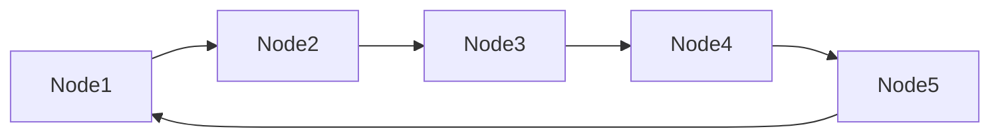

# Lista Enlazada Circular Simple

Una **lista enlazada circular simple** es una variación de la lista enlazada simple en la que el último nodo no apunta a `null`, sino que enlaza nuevamente al **primer nodo (head)**, formando un ciclo.

## Características principales

1. Cada nodo tiene:
   - Dato.
   - Referencia al siguiente nodo (next).
2. El último nodo apunta al primero, formando una estructura circular.
3. Solo hay una referencia principal (`head`), aunque opcionalmente se puede mantener un puntero al último nodo (`tail`) para facilitar inserciones.

## Ventajas

- Se puede recorrer infinitamente sin preocuparse de `null`.
- Ideal para estructuras que requieren circularidad como colas de procesos.

## Desventajas

- Mayor complejidad al implementar inserciones y eliminaciones (mantener el enlace circular correctamente).
- Puede causar bucles infinitos si no se maneja bien la condición de parada.

## Complejidad

- Acceso a un elemento: $O(n)$.
- Inserción en cabeza o cola: $O(1)$ si se mantiene referencia al último nodo.
- Eliminación: $O(n)$ en el peor caso.

## Representación visual



## Ejemplo Técnico

<Tabs>
<TabItem value="java" label="Paradigma:">

<Tabs>
<TabItem value="code" label="Código Java Ejemplo">

```java title="CNode.java" showLineNumbers
/**
 * Node for circular singly linked list
 */
class CNode<T> {
    private T data;
    private CNode<T> next;

    public CNode(T data) {
        this.data = data;
        this.next = null;
    }

    public T getData() { return data; }
    public CNode<T> getNext() { return next; }
    public void setNext(CNode<T> next) { this.next = next; }
}
```

```java title="CircularSinglyLinkedList.java" showLineNumbers
/**
 * Circular singly linked list
 */
public class CircularSinglyLinkedList<T> {
    private CNode<T> head;
    private CNode<T> tail;

    public void insertAtEnd(T data) {
        CNode<T> newNode = new CNode<>(data);
        if (head == null) {
            head = tail = newNode;
            newNode.setNext(head);
        } else {
            tail.setNext(newNode);
            tail = newNode;
            tail.setNext(head);
        }
    }

    public boolean delete(T data) {
        if (head == null) return false;

        // Caso especial: solo un nodo
        if (head == tail && head.getData().equals(data)) {
            head = tail = null;
            return true;
        }

        CNode<T> current = head;
        CNode<T> prev = tail;

        do {
            if (current.getData().equals(data)) {
                if (current == head) head = head.getNext();
                if (current == tail) tail = prev;
                prev.setNext(current.getNext());
                return true;
            }
            prev = current;
            current = current.getNext();
        } while (current != head);

        return false;
    }

    public String printList() {
        if (head == null) return "Lista vacía";

        StringBuilder sb = new StringBuilder();
        CNode<T> current = head;
        do {
            sb.append(current.getData()).append(" -> ");
            current = current.getNext();
        } while (current != head);

        return sb.append("(head)").toString();
    }
}
```

</TabItem>
<TabItem value="test" label="Test Unitario">

```java showLineNumbers
import org.junit.jupiter.api.Test;
import static org.junit.jupiter.api.Assertions.*;

public class CircularSinglyLinkedListTest {
    @Test
    void testInsertAndDelete() {
        CircularSinglyLinkedList<Integer> list = new CircularSinglyLinkedList<>();
        list.insertAtEnd(1);
        list.insertAtEnd(2);
        assertEquals("1 -> 2 -> (head)", list.printList());
        list.delete(1);
        assertTrue(list.printList().contains("2"));
    }
}
```

</TabItem>
</Tabs>

</TabItem>
<TabItem value="python" label="Paradigma: Procedural">

<Tabs>
<TabItem value="code" label="Código Python Ejemplo">

```py showLineNumbers
class CNode:
    def __init__(self, data):
        self.data = data
        self.next = None

def insert_at_end(head, tail, data):
    new_node = CNode(data)
    if head is None:
        head = tail = new_node
        new_node.next = head
    else:
        tail.next = new_node
        tail = new_node
        tail.next = head
    return head, tail

def delete_node(head, tail, data):
    if head is None:
        return head, tail, False

    # Caso: solo un nodo
    if head == tail and head.data == data:
        return None, None, True

    current = head
    prev = tail
    while True:
        if current.data == data:
            if current == head:
                head = head.next
            if current == tail:
                tail = prev
            prev.next = current.next
            return head, tail, True
        prev = current
        current = current.next
        if current == head:
            break
    return head, tail, False

def print_list(head):
    if head is None:
        return "Lista vacía"
    result = ""
    current = head
    while True:
        result += f"{current.data} -> "
        current = current.next
        if current == head:
            break
    return result + "(head)"
```

</TabItem>
<TabItem value="test" label="Test Unitario">

```py showLineNumbers
import pytest
from circular_singly_linked_list import (
    CNode,
    insert_at_end,
    delete_node,
    print_list
)

def test_insert_at_end_and_print_list():
    head, tail = None, None

    # Insertamos nodos
    head, tail = insert_at_end(head, tail, 1)
    head, tail = insert_at_end(head, tail, 2)
    head, tail = insert_at_end(head, tail, 3)

    result = print_list(head)
    assert result == "1 -> 2 -> 3 -> (head)"

def test_delete_node_existing():
    head, tail = None, None
    head, tail = insert_at_end(head, tail, 1)
    head, tail = insert_at_end(head, tail, 2)
    head, tail = insert_at_end(head, tail, 3)

    head, tail, deleted = delete_node(head, tail, 2)
    assert deleted is True
    result = print_list(head)
    assert result == "1 -> 3 -> (head)"

def test_delete_node_head_and_tail():
    head, tail = None, None
    head, tail = insert_at_end(head, tail, 10)
    head, tail = insert_at_end(head, tail, 20)

    # Eliminar la cabeza
    head, tail, deleted = delete_node(head, tail, 10)
    assert deleted is True
    assert print_list(head) == "20 -> (head)"

    # Eliminar el último nodo (lista con 1 elemento)
    head, tail, deleted = delete_node(head, tail, 20)
    assert deleted is True
    assert print_list(head) == "Lista vacía"

def test_delete_non_existing():
    head, tail = None, None
    head, tail = insert_at_end(head, tail, 5)
    head, tail = insert_at_end(head, tail, 15)

    head, tail, deleted = delete_node(head, tail, 99)
    assert deleted is False
    assert print_list(head) == "5 -> 15 -> (head)"
```

</TabItem>
</Tabs>

</TabItem>
<TabItem value="ts" label="Paradigma: Funcional">

<Tabs>
<TabItem value="code" label="Código TS Ejemplo">

```ts showLineNumbers
export type CNode<T> = {
  data: T;
  next: CNode<T> | null;
};

export const insertAtEnd = <T>(
  head: CNode<T> | null,
  tail: CNode<T> | null,
  data: T
): { head: CNode<T>; tail: CNode<T> } => {
  const newNode: CNode<T> = { data, next: null };

  if (!head) {
    newNode.next = newNode;
    return { head: newNode, tail: newNode };
  }

  tail!.next = newNode;
  newNode.next = head;
  return { head, tail: newNode };
};

export const deleteNode = <T>(
  head: CNode<T> | null,
  tail: CNode<T> | null,
  data: T
): { head: CNode<T> | null; tail: CNode<T> | null; deleted: boolean } => {
  if (!head) return { head, tail, deleted: false };

  if (head === tail && head.data === data) {
    return { head: null, tail: null, deleted: true };
  }

  let current = head;
  let prev = tail!;
  do {
    if (current.data === data) {
      if (current === head) head = head.next;
      if (current === tail) tail = prev;
      prev.next = current.next;
      return { head, tail, deleted: true };
    }
    prev = current;
    current = current.next!;
  } while (current !== head);

  return { head, tail, deleted: false };
};

export const printList = <T>(head: CNode<T> | null): string => {
  if (!head) return "Lista vacía";

  let result = "";
  let current = head;
  do {
    result += `${current.data} -> `;
    current = current.next!;
  } while (current !== head);

  return result + "(head)";
};
```

</TabItem>
<TabItem value="test" label="Test Unitario">

```ts showLineNumbers
import {
  CNode,
  insertAtEnd,
  deleteNode,
  printList
} from "./circularSinglyLinkedList";

test("insertAtEnd and printList", () => {
  let head: CNode<number> | null = null;
  let tail: CNode<number> | null = null;

  ({ head, tail } = insertAtEnd(head, tail, 1));
  ({ head, tail } = insertAtEnd(head, tail, 2));
  ({ head, tail } = insertAtEnd(head, tail, 3));

  expect(printList(head)).toBe("1 -> 2 -> 3 -> (head)");
});

test("deleteNode existing element", () => {
  let head: CNode<number> | null = null;
  let tail: CNode<number> | null = null;

  ({ head, tail } = insertAtEnd(head, tail, 1));
  ({ head, tail } = insertAtEnd(head, tail, 2));
  ({ head, tail } = insertAtEnd(head, tail, 3));

  const result = deleteNode(head, tail, 2);
  head = result.head;
  tail = result.tail;

  expect(result.deleted).toBe(true);
  expect(printList(head)).toBe("1 -> 3 -> (head)");
});

test("deleteNode head and tail", () => {
  let head: CNode<number> | null = null;
  let tail: CNode<number> | null = null;

  ({ head, tail } = insertAtEnd(head, tail, 10));
  ({ head, tail } = insertAtEnd(head, tail, 20));

  // Eliminar la cabeza
  let result = deleteNode(head, tail, 10);
  head = result.head;
  tail = result.tail;
  expect(result.deleted).toBe(true);
  expect(printList(head)).toBe("20 -> (head)");

  // Eliminar el último nodo (único elemento)
  result = deleteNode(head, tail, 20);
  head = result.head;
  tail = result.tail;
  expect(result.deleted).toBe(true);
  expect(printList(head)).toBe("Lista vacía");
});

test("deleteNode non existing", () => {
  let head: CNode<number> | null = null;
  let tail: CNode<number> | null = null;

  ({ head, tail } = insertAtEnd(head, tail, 5));
  ({ head, tail } = insertAtEnd(head, tail, 15));

  const result = deleteNode(head, tail, 99);
  expect(result.deleted).toBe(false);
  expect(printList(head)).toBe("5 -> 15 -> (head)");
});
```

</TabItem>
</Tabs>

</TabItem>
</Tabs>

## Aplicaciones Prácticas

- **Sistemas operativos:** Planificadores de procesos utilizan colas circulares.
- **Juegos:** Navegación circular por turnos.
- **Multimedia:** Listas de reproducción en bucle.

## Referencias

- Cormen, T. H., Leiserson, C. E., Rivest, R. L., & Stein, C. (2022). Introduction to Algorithms (4th ed.). MIT Press.
- Weiss, M. A. (2020). Data Structures and Algorithm Analysis in Java (4th ed.). Pearson.
- McDowell, G. (2016). Cracking the Coding Interview. CareerCup.
- [Python 3](https://docs.python.org/3/tutorial)
- [Jest](https://jestjs.io/docs/getting-started)
