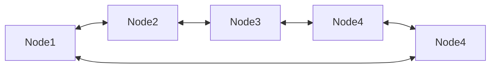

# Lista Enlazada Circular Doble

Una **lista enlazada circular doble** es una estructura de datos lineal y dinámica que combina las propiedades de:

1. **Lista doblemente enlazada:** cada nodo tiene una referencia al siguiente y al anterior nodo.
2. **Lista circular:** el último nodo apunta nuevamente al primer nodo (`head`) y el primer nodo apunta hacia atrás al último nodo (`tail`).

## Características

1. Cada **nodo** contiene:
   - Dato.
   - Referencia al nodo siguiente.
   - Referencia al nodo anterior.
2. El último nodo (`tail`) apunta al primero (`head`) y viceversa, formando un ciclo cerrado.
3. Puede recorrerse en **ambas direcciones de forma continua**.

## Ventajas

- Recorrido bidireccional y circular, facilitando el acceso desde cualquier nodo.
- Operaciones de inserción y eliminación más eficientes en ambos extremos ($O(1)$) si se mantiene referencia al último nodo.

## Desventajas

- Mayor uso de memoria (dos referencias por nodo).
- Mayor complejidad de implementación (mantenimiento de punteros al eliminar o insertar).

## Complejidad

- Inserción/eliminación en extremos: $O(1)$.
- Inserción/eliminación en posiciones intermedias: $O(n)$.
- Recorrido: $O(n)$.

## Representación visual



## Ejemplo Técnico

import Tabs from "@theme/Tabs";
import TabItem from "@theme/TabItem";

<Tabs>
<TabItem value="java" label="Paradigma: Orientado a Objetos">

<Tabs>
<TabItem value="code" label="Código Java Ejemplo">

```java title="DCNode.java" showLineNumbers
class DCNode<T> {
    private T data;
    private DCNode<T> next;
    private DCNode<T> prev;

    public DCNode(T data) {
        this.data = data;
    }

    public T getData() { return data; }
    public DCNode<T> getNext() { return next; }
    public void setNext(DCNode<T> next) { this.next = next; }
    public DCNode<T> getPrev() { return prev; }
    public void setPrev(DCNode<T> prev) { this.prev = prev; }
}
```

```java title="DoublyCircularLinkedList.java" showLineNumbers
public class DoublyCircularLinkedList<T> {
    private DCNode<T> head = null;
    private DCNode<T> tail = null;

    public void insertAtEnd(T data) {
        DCNode<T> newNode = new DCNode<>(data);
        if (head == null) {
            head = tail = newNode;
            head.setNext(head);
            head.setPrev(head);
        } else {
            tail.setNext(newNode);
            newNode.setPrev(tail);
            newNode.setNext(head);
            head.setPrev(newNode);
            tail = newNode;
        }
    }

    public boolean delete(T data) {
        if (head == null) return false;

        DCNode<T> current = head;
        do {
            if (current.getData().equals(data)) {
                if (current == head && current == tail) {
                    head = tail = null;
                } else {
                    current.getPrev().setNext(current.getNext());
                    current.getNext().setPrev(current.getPrev());
                    if (current == head) head = current.getNext();
                    if (current == tail) tail = current.getPrev();
                }
                return true;
            }
            current = current.getNext();
        } while (current != head);

        return false;
    }

    public String printForward() {
        if (head == null) return "Lista vacía";
        StringBuilder sb = new StringBuilder();
        DCNode<T> current = head;
        do {
            sb.append(current.getData()).append(" <-> ");
            current = current.getNext();
        } while (current != head);
        return sb.append("(head)").toString();
    }
}
```

</TabItem>
<TabItem value="test" label="Test Unitario">

```java showLineNumbers
import org.junit.jupiter.api.Test;
import static org.junit.jupiter.api.Assertions.*;

public class DoublyCircularLinkedListTest {
    @Test
    void testInsertAndDelete() {
        DoublyCircularLinkedList<Integer> list = new DoublyCircularLinkedList<>();
        list.insertAtEnd(1);
        list.insertAtEnd(2);
        list.insertAtEnd(3);
        assertTrue(list.printForward().contains("1 <-> 2 <-> 3"));
        list.delete(2);
        assertFalse(list.printForward().contains("2 <->"));
    }
}
```

</TabItem>
</Tabs>

</TabItem>
<TabItem value="python" label="Paradigma: Procedural">

<Tabs>
<TabItem value="code" label="Código Python Ejemplo">

```py showLineNumbers
class DCNode:
    def __init__(self, data):
        self.data = data
        self.next = None
        self.prev = None

def insert_at_end(head, tail, data):
    new_node = DCNode(data)
    if head is None:
        head = tail = new_node
        head.next = head
        head.prev = head
    else:
        tail.next = new_node
        new_node.prev = tail
        new_node.next = head
        head.prev = new_node
        tail = new_node
    return head, tail

def delete_node(head, tail, data):
    if head is None:
        return head, tail, False

    current = head
    while True:
        if current.data == data:
            if current == head and current == tail:
                return None, None, True
            current.prev.next = current.next
            current.next.prev = current.prev
            if current == head:
                head = current.next
            if current == tail:
                tail = current.prev
            return head, tail, True
        current = current.next
        if current == head:
            break
    return head, tail, False

def print_forward(head):
    if head is None:
        return "Lista vacía"
    result = ""
    current = head
    while True:
        result += f"{current.data} <-> "
        current = current.next
        if current == head:
            break
    return result + "(head)"
```

</TabItem>
<TabItem value="test" label="Test Unitario">

```py showLineNumbers
import pytest
from doubly_circular_linked_list import (
    insert_at_end,
    delete_node,
    print_forward
)

def test_insert_at_end_and_print_forward():
    head, tail = None, None

    # Insertar nodos
    head, tail = insert_at_end(head, tail, 1)
    head, tail = insert_at_end(head, tail, 2)
    head, tail = insert_at_end(head, tail, 3)

    result = print_forward(head)
    assert result == "1 <-> 2 <-> 3 <-> (head)"

def test_delete_node_existing():
    head, tail = None, None
    head, tail = insert_at_end(head, tail, 1)
    head, tail = insert_at_end(head, tail, 2)
    head, tail = insert_at_end(head, tail, 3)

    # Eliminar nodo intermedio
    head, tail, deleted = delete_node(head, tail, 2)
    assert deleted is True
    assert print_forward(head) == "1 <-> 3 <-> (head)"

def test_delete_node_head_and_tail():
    head, tail = None, None
    head, tail = insert_at_end(head, tail, 10)
    head, tail = insert_at_end(head, tail, 20)

    # Eliminar el head
    head, tail, deleted = delete_node(head, tail, 10)
    assert deleted is True
    assert print_forward(head) == "20 <-> (head)"

    # Eliminar el tail (último nodo)
    head, tail, deleted = delete_node(head, tail, 20)
    assert deleted is True
    assert print_forward(head) == "Lista vacía"

def test_delete_node_non_existing():
    head, tail = None, None
    head, tail = insert_at_end(head, tail, 5)
    head, tail = insert_at_end(head, tail, 15)

    # Intentar eliminar nodo que no existe
    head, tail, deleted = delete_node(head, tail, 99)
    assert deleted is False
    assert print_forward(head) == "5 <-> 15 <-> (head)"
```

</TabItem>
</Tabs>

</TabItem>
<TabItem value="ts" label="Paradigma: Funcional">

<Tabs>
<TabItem value="code" label="Código TS Ejemplo">

```ts showLineNumbers
export type DCNode<T> = {
  data: T;
  next: DCNode<T> | null;
  prev: DCNode<T> | null;
};

export const insertAtEnd = <T>(
  head: DCNode<T> | null,
  tail: DCNode<T> | null,
  data: T
): { head: DCNode<T>; tail: DCNode<T> } => {
  const newNode: DCNode<T> = { data, next: null, prev: null };

  if (!head) {
    newNode.next = newNode;
    newNode.prev = newNode;
    return { head: newNode, tail: newNode };
  }

  tail!.next = newNode;
  newNode.prev = tail;
  newNode.next = head;
  head.prev = newNode;

  return { head, tail: newNode };
};

export const deleteNode = <T>(
  head: DCNode<T> | null,
  tail: DCNode<T> | null,
  data: T
): { head: DCNode<T> | null; tail: DCNode<T> | null; deleted: boolean } => {
  if (!head) return { head, tail, deleted: false };

  let current = head;
  do {
    if (current.data === data) {
      if (current === head && current === tail) {
        return { head: null, tail: null, deleted: true };
      }

      current.prev!.next = current.next;
      current.next!.prev = current.prev;

      if (current === head) head = current.next;
      if (current === tail) tail = current.prev;

      return { head, tail, deleted: true };
    }
    current = current.next!;
  } while (current !== head);

  return { head, tail, deleted: false };
};

export const printForward = <T>(head: DCNode<T> | null): string => {
  if (!head) return "Lista vacía";

  let result = "";
  let current = head;
  do {
    result += `${current.data} <-> `;
    current = current.next!;
  } while (current !== head);

  return result + "(head)";
};
```

</TabItem>
<TabItem value="test" label="Test Unitario">

```ts showLineNumbers
import {
  DCNode,
  insertAtEnd,
  deleteNode,
  printForward
} from "./doublyCircularLinkedList";

test("insertAtEnd and printForward", () => {
  let head: DCNode<number> | null = null;
  let tail: DCNode<number> | null = null;

  ({ head, tail } = insertAtEnd(head, tail, 1));
  ({ head, tail } = insertAtEnd(head, tail, 2));
  ({ head, tail } = insertAtEnd(head, tail, 3));

  expect(printForward(head)).toBe("1 <-> 2 <-> 3 <-> (head)");
});

test("deleteNode existing element", () => {
  let head: DCNode<number> | null = null;
  let tail: DCNode<number> | null = null;

  ({ head, tail } = insertAtEnd(head, tail, 1));
  ({ head, tail } = insertAtEnd(head, tail, 2));
  ({ head, tail } = insertAtEnd(head, tail, 3));

  const result = deleteNode(head, tail, 2);
  head = result.head;
  tail = result.tail;

  expect(result.deleted).toBe(true);
  expect(printForward(head)).toBe("1 <-> 3 <-> (head)");
});

test("deleteNode head and tail", () => {
  let head: DCNode<number> | null = null;
  let tail: DCNode<number> | null = null;

  ({ head, tail } = insertAtEnd(head, tail, 10));
  ({ head, tail } = insertAtEnd(head, tail, 20));

  // Eliminar el head
  let result = deleteNode(head, tail, 10);
  head = result.head;
  tail = result.tail;
  expect(result.deleted).toBe(true);
  expect(printForward(head)).toBe("20 <-> (head)");

  // Eliminar el tail (último nodo)
  result = deleteNode(head, tail, 20);
  head = result.head;
  tail = result.tail;
  expect(result.deleted).toBe(true);
  expect(printForward(head)).toBe("Lista vacía");
});

test("deleteNode non existing element", () => {
  let head: DCNode<number> | null = null;
  let tail: DCNode<number> | null = null;

  ({ head, tail } = insertAtEnd(head, tail, 5));
  ({ head, tail } = insertAtEnd(head, tail, 15));

  const result = deleteNode(head, tail, 99);
  expect(result.deleted).toBe(false);
  expect(printForward(head)).toBe("5 <-> 15 <-> (head)");
});
```

</TabItem>
</Tabs>

</TabItem>
</Tabs>

## Aplicaciones Prácticas

- **Sistemas de reproducción de multimedia:** Permiten navegar al siguiente o anterior elemento de forma circular.
- **Sistemas operativos:** Estructuras de planificación de procesos circulares.
- **Navegadores:** Historial circular para navegar hacia atrás o adelante.

## Referencias

- Cormen, T. H., Leiserson, C. E., Rivest, R. L., & Stein, C. (2022). Introduction to Algorithms (4th ed.). MIT Press.
- Weiss, M. A. (2020). Data Structures and Algorithm Analysis in Java (4th ed.). Pearson.
- McDowell, G. (2016). Cracking the Coding Interview. CareerCup.
- [Python 3](https://docs.python.org/3/tutorial)
- [Jest](https://jestjs.io/docs/getting-started)
