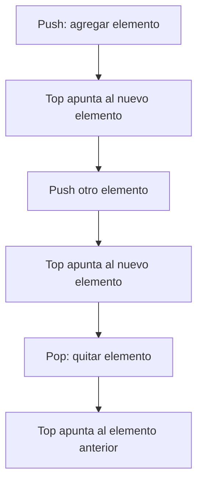
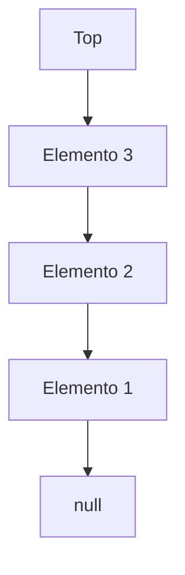
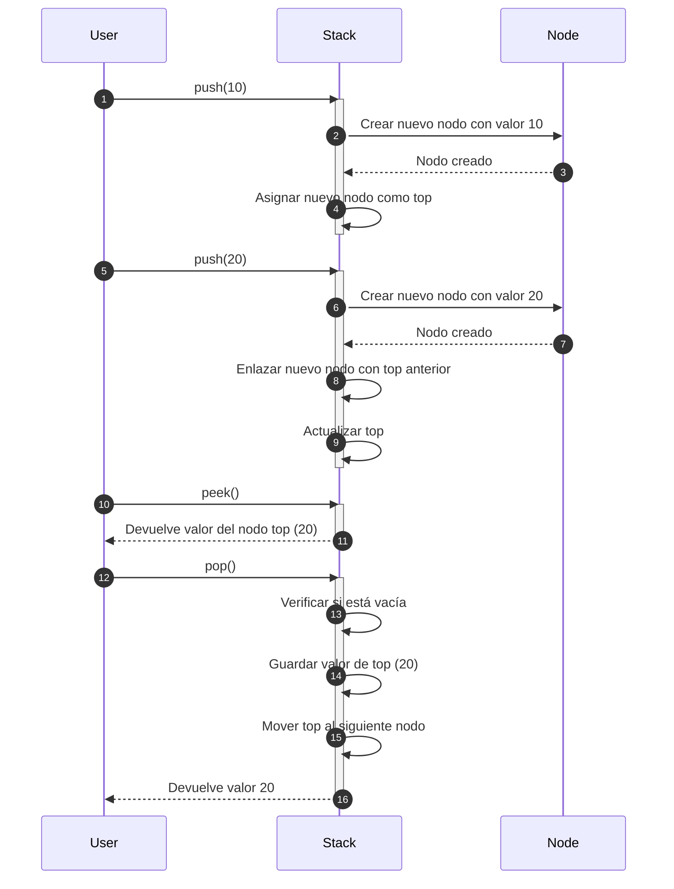

# Stack (Pilas): LIFO, implementación con arrays y listas enlazadas

Una **pila (Stack)** es una estructura de datos lineal que sigue el principio **LIFO (Last In, First Out)**, es decir, el último elemento en entrar es el primero en salir.

## Características

1. Solo permite inserciones y eliminaciones por un extremo, llamado **tope (top)**.
2. Operaciones fundamentales:
   - **push:** Inserta un elemento en el tope de la pila.
   - **pop:** Elimina y devuelve el elemento del tope de la pila.
   - **peek (o top):** Devuelve el elemento en el tope sin eliminarlo.
   - **isEmpty:** Verifica si la pila está vacía.

## Ejemplo de LIFO

**Una pila de platos:** el último plato en ponerse es el primero que se retira.

## Implementación

Las pilas pueden implementarse de dos maneras:

1. **Usando arrays:** Aprovecha los índices del arreglo para insertar o eliminar en el final.
2. **Usando listas enlazadas:** Cada nodo contiene un dato y una referencia al siguiente nodo, y el tope se mueve dinámicamente.

## Flujo de operaciones LIFO



## Representación visual



## Ejemplo Técnico

import Tabs from "@theme/Tabs";
import TabItem from "@theme/TabItem";

<Tabs>
<TabItem value="java" label="Paradigma:">

<Tabs>
<TabItem value="code" label="Código Java Ejemplo">

**Implementación con arrays:**

```java title="StackArray.java" showLineNumbers
public class StackArray<T> {
    private Object[] elements;
    private int top;
    private int capacity;

    public StackArray(int size) {
        capacity = size;
        elements = new Object[size];
        top = -1;
    }

    public void push(T data) {
        if (top == capacity - 1) throw new RuntimeException("Stack overflow");
        elements[++top] = data;
    }

    public T pop() {
        if (isEmpty()) throw new RuntimeException("Stack underflow");
        return (T) elements[top--];
    }

    public T peek() {
        if (isEmpty()) throw new RuntimeException("Stack is empty");
        return (T) elements[top];
    }

    public boolean isEmpty() {
        return top == -1;
    }
}
```

**Implementación con listas enlazadas:**

```java title="DoublyCircularLinkedList.java" showLineNumbers
class Node<T> {
    T data;
    Node<T> next;
    Node(T data) { this.data = data; }
}

public class StackLinkedList<T> {
    private Node<T> top;

    public void push(T data) {
        Node<T> newNode = new Node<>(data);
        newNode.next = top;
        top = newNode;
    }

    public T pop() {
        if (isEmpty()) throw new RuntimeException("Stack underflow");
        T data = top.data;
        top = top.next;
        return data;
    }

    public T peek() {
        if (isEmpty()) throw new RuntimeException("Stack is empty");
        return top.data;
    }

    public boolean isEmpty() {
        return top == null;
    }
}
```

</TabItem>
<TabItem value="test" label="Test Unitario">

```java showLineNumbers
import org.junit.jupiter.api.Test;
import static org.junit.jupiter.api.Assertions.*;

public class StackTest {
    @Test
    void testPushPopArray() {
        StackArray<Integer> stack = new StackArray<>(3);
        stack.push(10);
        stack.push(20);
        assertEquals(20, stack.pop());
        assertEquals(10, stack.pop());
    }

    @Test
    void testPushPopLinkedList() {
        StackLinkedList<Integer> stack = new StackLinkedList<>();
        stack.push(5);
        stack.push(15);
        assertEquals(15, stack.pop());
        assertEquals(5, stack.pop());
    }
}
```

</TabItem>
</Tabs>

</TabItem>
<TabItem value="python" label="Paradigma: Procedural">

<Tabs>
<TabItem value="code" label="Código Python Ejemplo">

**Implementación con listas:** (arrays dinámicos en Python)

```py showLineNumbers
def create_stack():
    return []

def push(stack, data):
    stack.append(data)

def pop(stack):
    if is_empty(stack):
        raise IndexError("Stack underflow")
    return stack.pop()

def peek(stack):
    if is_empty(stack):
        raise IndexError("Stack is empty")
    return stack[-1]

def is_empty(stack):
    return len(stack) == 0
```

**Implementación con listas enlazadas:**

```py showLineNumbers
class Node:
    def __init__(self, data):
        self.data = data
        self.next = None

def create_linked_stack():
    return None

def push_linked(top, data):
    new_node = Node(data)
    new_node.next = top
    return new_node

def pop_linked(top):
    if top is None:
        raise IndexError("Stack underflow")
    return top.next, top.data

def peek_linked(top):
    if top is None:
        raise IndexError("Stack is empty")
    return top.data

def is_empty_linked(top):
    return top is None
```

</TabItem>
<TabItem value="test" label="Test Unitario">

```py showLineNumbers
from stack import create_stack, push, pop, peek, is_empty

def test_stack_array():
    stack = create_stack()
    push(stack, 1)
    push(stack, 2)
    assert pop(stack) == 2
    assert peek(stack) == 1

def test_stack_linked():
    from stack import create_linked_stack, push_linked, pop_linked, peek_linked
    top = create_linked_stack()
    top = push_linked(top, 5)
    top = push_linked(top, 10)
    top, data = pop_linked(top)
    assert data == 10
    assert peek_linked(top) == 5
```

</TabItem>
</Tabs>

</TabItem>
<TabItem value="ts" label="Paradigma: Funcional">

<Tabs>
<TabItem value="code" label="Código TS Ejemplo">

**Implementación con arrays:**

```ts showLineNumbers
export const createStack = <T>(): T[] => [];

export const push = <T>(stack: T[], data: T): void => {
  stack.push(data);
};

export const pop = <T>(stack: T[]): T => {
  if (isEmpty(stack)) throw new Error("Stack underflow");
  return stack.pop()!;
};

export const peek = <T>(stack: T[]): T => {
  if (isEmpty(stack)) throw new Error("Stack is empty");
  return stack[stack.length - 1];
};

export const isEmpty = <T>(stack: T[]): boolean => stack.length === 0;
```

**Implementación con :**

```ts showLineNumbers
export type Node<T> = {
  data: T;
  next: Node<T> | null;
};

export const pushLinked = <T>(top: Node<T> | null, data: T): Node<T> => {
  return { data, next: top };
};

export const popLinked = <T>(top: Node<T> | null): { top: Node<T> | null; data: T } => {
  if (!top) throw new Error("Stack underflow");
  return { top: top.next, data: top.data };
};

export const peekLinked = <T>(top: Node<T> | null): T => {
  if (!top) throw new Error("Stack is empty");
  return top.data;
};

export const isEmptyLinked = <T>(top: Node<T> | null): boolean => !top;
```

</TabItem>
<TabItem value="test" label="Test Unitario">

```ts showLineNumbers
import { createStack, push, pop, peek } from "./stack";

test("stack array push and pop", () => {
  const stack = createStack<number>();
  push(stack, 1);
  push(stack, 2);
  expect(pop(stack)).toBe(2);
  expect(peek(stack)).toBe(1);
});
```

</TabItem>
</Tabs>

</TabItem>
</Tabs>

## Aplicaciones Prácticas

- **Navegadores web:** Historial de páginas (ir atrás/adelante).
- **Evaluadores de expresiones:** Manejo de operadores y operandos.
- **Recursión:** La pila del sistema almacena llamadas a funciones.
- **Deshacer/Rehacer:** En editores de texto o gráficos.

## Buenas prácticas

- **SRP:** La pila debe encargarse solo de almacenar y recuperar elementos.
- **Nombres claros:** `push`, `pop`, `peek` indican exactamente su propósito.
- **Pruebas unitarias:** Validar condiciones de desbordamiento y subdesbordamiento.
- **Abstracción:** Las implementaciones (array o lista) pueden cambiar sin afectar la interfaz.

## Diagrama de secuencia



1. El usuario solicita insertar el elemento 10.
2. El Stack recibe la información y solicita crear un nodo con el valor enviado.
3. Se crea un nodo con valor 10 y se le informa a la pila.
4. Dentro de la pila asigna el nuevo nodo como top de la pila.
5. El usuario solicita insertar el elemento 20.
6. El Stack recibe la información y solicita crear un nodo con el valor enviado.
7. Se crea un nodo con valor 20 y se le informa a la pila.
8. En la pila, el nuevo nodo se enlaza con el nodo anterior mediante una referencia.
9. Dentro de la pila asigna el nuevo nodo como top de la pila.
10. El usuario solicita ver el elemento en el tope.
11. La pila devuelve el valor 20 sin eliminarlo.
12. El usuario solicita eliminar el elemento en el tope.
13. Se verifica que la pila no esté vacía.
14. Se obtiene el valor 20 y se guarda en una nueva variable.
15. Se actualiza el top al nodo siguiente (10), en otras palabras, se elimina del stack.
16. Se devuelve el valor eliminado.

## Referencias

- Cormen, T. H., Leiserson, C. E., Rivest, R. L., & Stein, C. (2022). Introduction to Algorithms (4th ed.). MIT Press.
- Weiss, M. A. (2020). Data Structures and Algorithm Analysis in Java (4th ed.). Pearson.
- McDowell, G. (2016). Cracking the Coding Interview. CareerCup.
- [Python 3](https://docs.python.org/3/tutorial)
- [Jest](https://jestjs.io/docs/getting-started)
