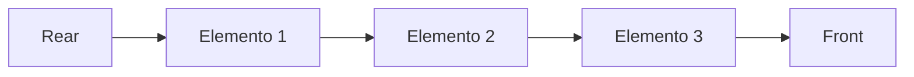
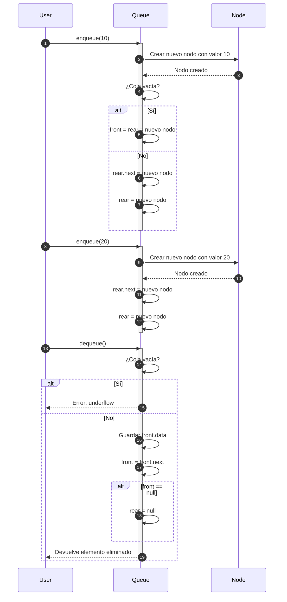

# Queue (Colas): FIFO, variantes (colas dobles, de prioridad)

Una **cola (Queue)** es una estructura de datos lineal que sigue el principio **FIFO** (First In, First Out), es decir, el primer elemento en entrar es el primero en salir.

## Características

1. Tiene dos extremos:
   - **Front (frente):** por donde se eliminan los elementos.
   - **Rear (final):** por donde se insertan los elementos.
2. Operaciones fundamentales:
   1. `enqueue`: Inserta un elemento en el final de la cola.
   2. `dequeue`: Elimina el elemento al frente de la cola.
   3. `peek`/`front`: Devuelve el elemento al frente sin eliminarlo.
   4. `isEmpty`: Verifica si la cola está vacía.

## Ejemplo de FIFO

Una fila en el banco: el primero que llega es el primero en ser atendido.

## Variantes de Colas

1. **Colas dobles (Deque - Double-Ended Queue):**
   - Permiten inserciones y eliminaciones por ambos extremos.
   - Métodos adicionales:
     - `enqueueFront`: insertar al frente.
     - `dequeueRear`: eliminar del final.
2. **Colas de prioridad (Priority Queue):**
   - Cada elemento tiene una prioridad asociada.
   - Al hacer `dequeue`, se elimina el elemento con mayor prioridad (no necesariamente el más antiguo).

## Cola FIFO



- `enqueue`: Se inserta en el extremo `Rear`.
- `dequeue`: Se elimina en el extremo `Front`.

## Ejemplo Técnico

import Tabs from "@theme/Tabs";
import TabItem from "@theme/TabItem";

<Tabs>
<TabItem value="java" label="Paradigma:">

<Tabs>
<TabItem value="code" label="Código Java Ejemplo">

**Implementación con arrays:**

```java title="QueueArray.java" showLineNumbers
public class QueueArray<T> {
    private Object[] elements;
    private int front, rear, size, capacity;

    public QueueArray(int capacity) {
        this.capacity = capacity;
        elements = new Object[capacity];
        front = size = 0;
        rear = -1;
    }

    public void enqueue(T data) {
        if (size == capacity) throw new RuntimeException("Queue overflow");
        rear = (rear + 1) % capacity;
        elements[rear] = data;
        size++;
    }

    public T dequeue() {
        if (isEmpty()) throw new RuntimeException("Queue underflow");
        T data = (T) elements[front];
        front = (front + 1) % capacity;
        size--;
        return data;
    }

    public T peek() {
        if (isEmpty()) throw new RuntimeException("Queue is empty");
        return (T) elements[front];
    }

    public boolean isEmpty() {
        return size == 0;
    }
}
```

**Implementación con listas enlazadas:**

```java title="QueueLinkedList.java" showLineNumbers
class Node<T> {
    T data;
    Node<T> next;
    Node(T data) { this.data = data; }
}

public class QueueLinkedList<T> {
    private Node<T> front, rear;

    public void enqueue(T data) {
        Node<T> newNode = new Node<>(data);
        if (rear == null) {
            front = rear = newNode;
            return;
        }
        rear.next = newNode;
        rear = newNode;
    }

    public T dequeue() {
        if (isEmpty()) throw new RuntimeException("Queue underflow");
        T data = front.data;
        front = front.next;
        if (front == null) rear = null;
        return data;
    }

    public T peek() {
        if (isEmpty()) throw new RuntimeException("Queue is empty");
        return front.data;
    }

    public boolean isEmpty() {
        return front == null;
    }
}
```

</TabItem>
<TabItem value="test" label="Test Unitario">

```java showLineNumbers
import org.junit.jupiter.api.Test;
import static org.junit.jupiter.api.Assertions.*;

public class QueueTest {

    @Test
    void testQueueArray() {
        QueueArray<Integer> queue = new QueueArray<>(3);

        assertTrue(queue.isEmpty());
        queue.enqueue(10);
        queue.enqueue(20);

        assertEquals(10, queue.peek());
        assertEquals(10, queue.dequeue());
        assertEquals(20, queue.peek());

        queue.enqueue(30);
        queue.enqueue(40); // Llenar la cola
        assertThrows(RuntimeException.class, () -> queue.enqueue(50)); // Overflow

        assertEquals(20, queue.dequeue());
        assertEquals(30, queue.dequeue());
        assertEquals(40, queue.dequeue());

        assertTrue(queue.isEmpty());
        assertThrows(RuntimeException.class, queue::dequeue); // Underflow
    }

    @Test
    void testQueueLinkedList() {
        QueueLinkedList<Integer> queue = new QueueLinkedList<>();

        assertTrue(queue.isEmpty());
        queue.enqueue(5);
        queue.enqueue(15);
        queue.enqueue(25);

        assertEquals(5, queue.peek());
        assertEquals(5, queue.dequeue());
        assertEquals(15, queue.peek());

        queue.dequeue();
        queue.dequeue();
        assertTrue(queue.isEmpty());
        assertThrows(RuntimeException.class, queue::dequeue); // Underflow
    }
}
```

</TabItem>
</Tabs>

</TabItem>
<TabItem value="python" label="Paradigma: Procedural">

<Tabs>
<TabItem value="code" label="Código Python Ejemplo">

**Implementación con listas:** (arrays dinámicos en Python)

```py showLineNumbers
def create_queue():
    return []

def enqueue(queue, data):
    queue.append(data)

def dequeue(queue):
    if is_empty(queue):
        raise IndexError("Queue underflow")
    return queue.pop(0)

def peek(queue):
    if is_empty(queue):
        raise IndexError("Queue is empty")
    return queue[0]

def is_empty(queue):
    return len(queue) == 0
```

**Implementación con listas enlazadas:**

```py showLineNumbers
class Node:
    def __init__(self, data):
        self.data = data
        self.next = None

def enqueue_linked(front, rear, data):
    new_node = Node(data)
    if rear is None:
        return new_node, new_node
    rear.next = new_node
    return front, new_node

def dequeue_linked(front, rear):
    if front is None:
        raise IndexError("Queue underflow")
    return front.next, rear, front.data

def peek_linked(front):
    if front is None:
        raise IndexError("Queue is empty")
    return front.data
```

</TabItem>
<TabItem value="test" label="Test Unitario">

```py showLineNumbers
import pytest
from queue_example import create_queue, enqueue, dequeue, peek, is_empty
from queue_example import enqueue_linked, dequeue_linked, peek_linked, Node

def test_queue_array():
    q = create_queue()
    assert is_empty(q)

    enqueue(q, 1)
    enqueue(q, 2)
    enqueue(q, 3)

    assert peek(q) == 1
    assert dequeue(q) == 1
    assert peek(q) == 2

    dequeue(q)
    dequeue(q)
    assert is_empty(q)

    with pytest.raises(IndexError):
        dequeue(q)  # Underflow

def test_queue_linked():
    front, rear = None, None
    front, rear = enqueue_linked(front, rear, 10)
    front, rear = enqueue_linked(front, rear, 20)

    assert peek_linked(front) == 10

    front, rear, data = dequeue_linked(front, rear)
    assert data == 10
    assert peek_linked(front) == 20

    front, rear, data = dequeue_linked(front, rear)
    assert data == 20
    assert front is None and rear is None

    with pytest.raises(IndexError):
        dequeue_linked(front, rear)
```

</TabItem>
</Tabs>

</TabItem>
<TabItem value="ts" label="Paradigma: Funcional">

<Tabs>
<TabItem value="code" label="Código TS Ejemplo">

**Implementación con arrays:**

```ts showLineNumbers
export const createQueue = <T>(): T[] => [];

export const enqueue = <T>(queue: T[], data: T): void => {
  queue.push(data);
};

export const dequeue = <T>(queue: T[]): T => {
  if (isEmpty(queue)) throw new Error("Queue underflow");
  return queue.shift()!;
};

export const peek = <T>(queue: T[]): T => {
  if (isEmpty(queue)) throw new Error("Queue is empty");
  return queue[0];
};

export const isEmpty = <T>(queue: T[]): boolean => queue.length === 0;
```

**Implementación con listas enlazadas:**

```ts showLineNumbers
export type Node<T> = {
  data: T;
  next: Node<T> | null;
};

export const enqueueLinked = <T>(
  front: Node<T> | null,
  rear: Node<T> | null,
  data: T
): { front: Node<T>; rear: Node<T> } => {
  const newNode: Node<T> = { data, next: null };
  if (!rear) return { front: newNode, rear: newNode };
  rear.next = newNode;
  return { front: front!, rear: newNode };
};

export const dequeueLinked = <T>(
  front: Node<T> | null,
  rear: Node<T> | null
): { front: Node<T> | null; rear: Node<T> | null; data: T } => {
  if (!front) throw new Error("Queue underflow");
  const data = front.data;
  front = front.next;
  if (!front) rear = null;
  return { front, rear, data };
};
```

</TabItem>
<TabItem value="test" label="Test Unitario">

```ts showLineNumbers
import {
  createQueue,
  enqueue,
  dequeue,
  peek,
  isEmpty
} from "./queueArray";

import {
  Node,
  enqueueLinked,
  dequeueLinked
} from "./queueLinked";

test("queue array FIFO behavior", () => {
  const queue = createQueue<number>();
  expect(isEmpty(queue)).toBe(true);

  enqueue(queue, 1);
  enqueue(queue, 2);
  enqueue(queue, 3);

  expect(peek(queue)).toBe(1);
  expect(dequeue(queue)).toBe(1);
  expect(peek(queue)).toBe(2);

  dequeue(queue);
  dequeue(queue);
  expect(isEmpty(queue)).toBe(true);

  expect(() => dequeue(queue)).toThrowError("Queue underflow");
});

test("queue linked list FIFO behavior", () => {
  let front: Node<number> | null = null;
  let rear: Node<number> | null = null;

  ({ front, rear } = enqueueLinked(front, rear, 10));
  ({ front, rear } = enqueueLinked(front, rear, 20));

  expect(front!.data).toBe(10);

  let result = dequeueLinked(front, rear);
  front = result.front;
  rear = result.rear;
  expect(result.data).toBe(10);

  result = dequeueLinked(front, rear);
  front = result.front;
  rear = result.rear;
  expect(result.data).toBe(20);

  expect(() => dequeueLinked(front, rear)).toThrowError("Queue underflow");
});
```

</TabItem>
</Tabs>

</TabItem>
</Tabs>

## Diagrama de Secuencia



1. El usuario solicita agregar un elemento a la cola (enqueue) con el valor 10.
2. La cola crea una instancia de nodo con el valor 10.
3. El nodo creado se almacena en la cola.
4. Se valida si la cola está vacía.
5. En caso de estar vacía, se establece el frente y el final de la cola en el nuevo nodo.
6. Si no está vacía, se establece el siguiente nodo del final en el nuevo nodo.
7. Luego, se actualiza el final.
8. El usuario solicita agregar otro elemento a la cola (enqueue) con el valor 20.
9. La cola crea una instancia de nodo con el valor 20.
10. El nodo creado se almacena en la cola.
11. Se establece que el siguiente nodo del final es el nuevo nodo.
12. Se actualiza el final.
13. El usuario solicita eliminar un elemento de la cola (dequeue).
14. Se valida si la cola está vacía.
15. En caso de estar vacía, se retorna un mensaje de desbordamiento.
16. Si la cola no está vacía, se almacena el valor del frente en una variable temporal.
17. El frente actualiza su valor con la referencia al nodo siguiente.
18. Si el frente está vacío, entonces el final también se vacía.
19. Se devuelve el elemento eliminado.

## Aplicaciones Prácticas

- **Sistemas operativos:** planificación de procesos.
- **Colas de impresión:** los documentos se imprimen en orden de llegada.
- **Redes:** paquetes de datos procesados en orden de llegada.
- **Sistemas de atención al cliente:** turnos FIFO.
- **Deque:** usado en algoritmos de ventanas deslizantes (sliding window).
- **Priority Queue:** usado en algoritmos como Dijkstra para encontrar caminos más cortos.

## Buenas Prácticas

- **SRP:** La cola debe encargarse solo de la gestión de elementos FIFO.
- **Abstracción:** Variantes (Deque, Priority Queue) deben implementarse como extensiones sin modificar la base.
- **Pruebas unitarias:** Validar desbordamiento, subdesbordamiento y prioridades.
- **Interfaces claras:** Métodos como enqueue, dequeue, peek y isEmpty facilitan el uso.

## Referencias

- Cormen, T. H., Leiserson, C. E., Rivest, R. L., & Stein, C. (2022). Introduction to Algorithms (4th ed.). MIT Press.
- Weiss, M. A. (2020). Data Structures and Algorithm Analysis in Java (4th ed.). Pearson.
- McDowell, G. (2016). Cracking the Coding Interview. CareerCup.
- [Python 3](https://docs.python.org/3/tutorial)
- [Jest](https://jestjs.io/docs/getting-started)
