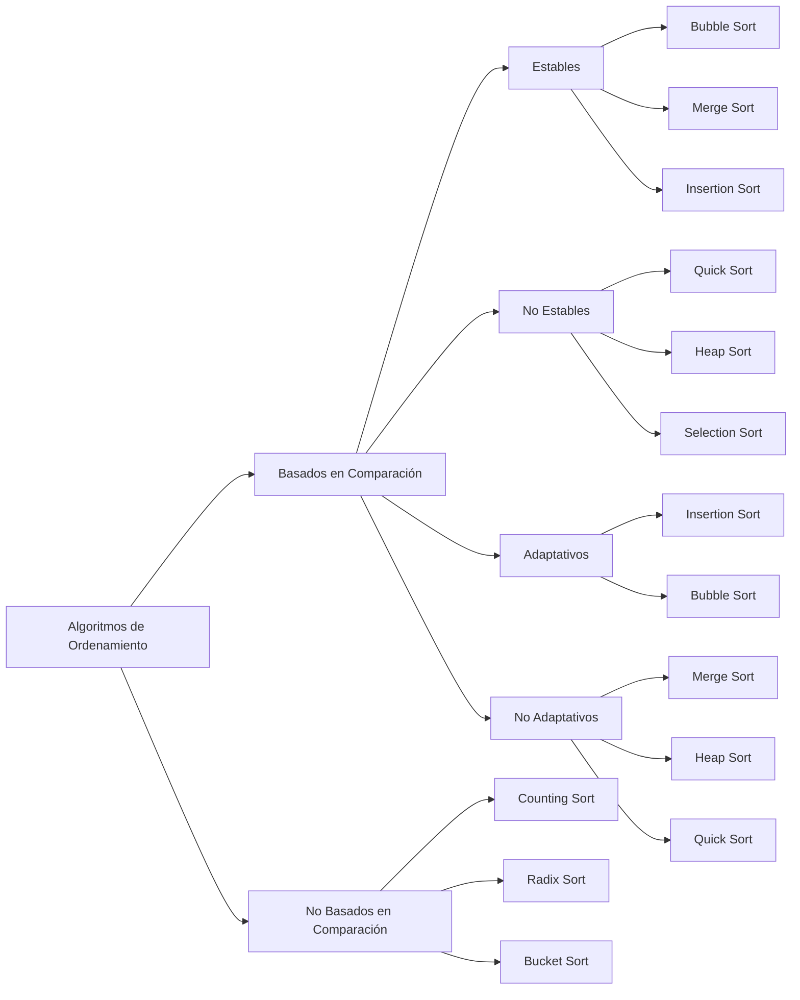

# Fundamentos del ordenamiento: estabilidad, adaptabilidad y comparaciones

El **ordenamiento (sorting)** es el proceso de organizar los elementos de una colección (arreglo, lista, etc.) de acuerdo con un criterio de comparación (por ejemplo, de menor a mayor). Los algoritmos de ordenamiento se evalúan según varias propiedades fundamentales:

## Estabilidad

Un algoritmo de ordenamiento es **estable si mantiene el orden relativo de los elementos con claves iguales**. Por ejemplo, si tenemos dos estudiantes con la misma calificación, un algoritmo estable preservará su orden original.

Algunos ejemplos de **algoritmos estables** son: Insertion Sort, Merge Sort, Bubble Sort.

En contraparte, algunos ejemplos de **algoritmos inestables** son: Quick Sort (implementaciones básicas), Heap Sort, Selection Sort.

:::info

Importancia:

- Fundamental cuando se aplican múltiples criterios de ordenamiento.
- En sistemas donde la estabilidad de datos es crítica (ej. reportes jerárquicos).

:::

## Adaptabilidad

Un algoritmo es **adaptativo si mejora su desempeño cuando la entrada está parcial o totalmente ordenada**.

Un ejemplo de un **algoritmo adaptativo** es Insertion Sort, ya que si la lista está casi ordenada, su complejidad puede acercarse a $O(n)$.

Por otra parte, Merge Sort **no es adaptativo**, ya que siempre ejecuta la misma cantidad de pasos, sin importar el estado de los datos.

:::info

Importancia:

- Muy útil cuando se espera que los datos lleguen casi ordenados.

:::

## Comparaciones

La mayoría de los algoritmos de ordenamiento se clasifican en dos tipos:

1. **Basados en comparaciones:**
   - Comparan los elementos para decidir su orden.
   - Complejidad teórica mínima en el peor caso: $O(n log n)$ (teorema de la decisión).
   - Ejemplos: Quick Sort, Merge Sort, Heap Sort, Insertion Sort.
2. **No basados en comparaciones:**
   - No dependen de comparaciones directas, usan propiedades de los datos (por ejemplo, su rango o dígitos).
   - Ejemplos: Counting Sort, Radix Sort, Bucket Sort.
   - Pueden alcanzar complejidades lineales $O(n)$ bajo ciertas condiciones.

## Relación de propiedades

## Aplicaciones prácticas

- **Estabilidad:** Ordenar registros por múltiples campos (ej. por nombre y luego por fecha).
- **Adaptabilidad:** Procesar datos de sensores que ya están parcialmente ordenados.
- Comparaciones: Selección de algoritmos en bases de datos según el tamaño y tipo de datos.

## Buenas prácticas

- **SRP:** Cada función de ordenamiento debe hacer solo una cosa: ordenar.
- **Nombres claros:** Usar nombres como insertionSort en lugar de abreviaturas.
- **Extensibilidad:** Se pueden agregar variantes (estable, inestable) sin modificar el código base.
- **Pruebas unitarias:** Validar listas vacías, con un solo elemento, ordenadas e inversas.

## Referencias

- Cormen, T. H., Leiserson, C. E., Rivest, R. L., & Stein, C. (2022). Introduction to Algorithms (4th ed.). MIT Press.
- Weiss, M. A. (2020). Data Structures and Algorithm Analysis in Java (4th ed.). Pearson.
- Sedgewick, R., & Wayne, K. (2011). Algorithms (4th ed.). Addison-Wesley.
