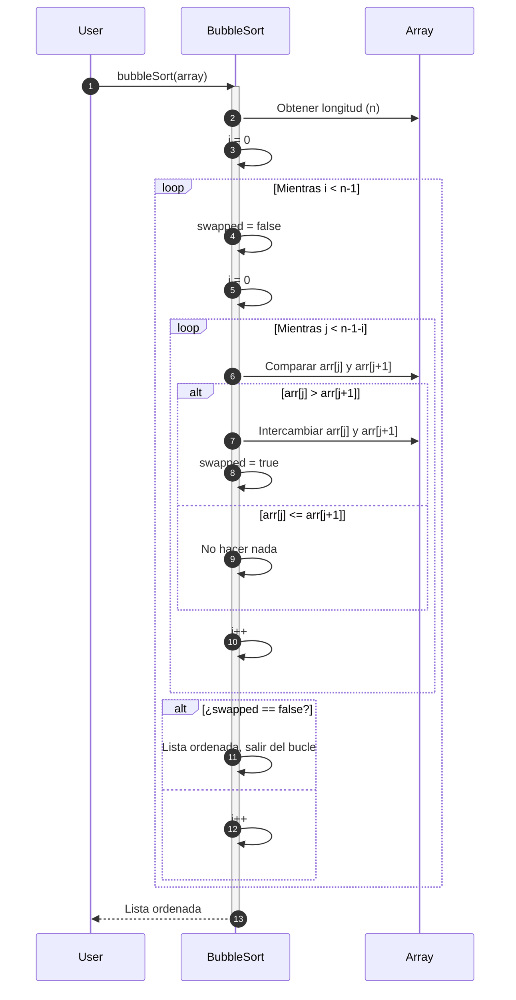

# Bubble Sort

**Bubble Sort** es uno de los algoritmos de ordenamiento más sencillos. Su nombre proviene del hecho de que los elementos "grandes" van "burbujeando" hacia el final de la lista en cada pasada.

## Funcionamiento

- Se recorre la lista comparando pares de elementos adyacentes.
- Si el par está desordenado, se intercambian.
- Este proceso se repite hasta que en una pasada completa no se realiza ningún intercambio.

## Propiedades

1. **Complejidad temporal:**
   - Mejor caso: $O(n)$ (cuando la lista ya está ordenada).
   - Peor caso: $O({n}^{2})$ (cuando está completamente invertida).
   - Caso promedio: $O({n}^{2})$.
2. **Complejidad espacial:** $O(1)$ (no necesita espacio extra, es in-place).
3. **Estabilidad:** Es **estable**, porque no altera el orden relativo de elementos iguales.
4. **Adaptabilidad:** Es **adaptativo**, mejora su desempeño si la lista ya está parcialmente ordenada.

## Diagrama de secuencia



1. El usuario desea ordenar su lista de datos usando el algoritmo de ordenamiento de burbujas.
2. El algoritmo consulta el tamaño del arreglo o lista y lo guarda en la variable `n`.
3. Se crea una variable `i` para controlar el número de iteraciones, que se inicializa en 0.
4. Se activa un loop que se rompe solo si el número de iteraciones iguala el tamaño de la lista. Dentro de esta estructura de control se crea una variable bandera para verificar si se produjo un cambio en la lista durante la iteración.
5. Se crea una variable `j` para controlar el número de iteraciones dentro del loop interno, que se inicializa en 0.
6. Se activa un loop interno que se rompe cuando el número de iteraciones `j` sea menor al tamaño del arreglo menos el número de iteraciones `i`.
7. Si el valor del elemento que se encuentra en la posición de la iteración `j` es mayor al elemento siguiente, si intercambian sus posiciones.
8. La bandera de intercambio se activa.
9. Pero, si el valor del elemento es menor o igual al elemento siguiente, entonces no se hace nada.
10. Se incrementa el valor de la iteración `j`.
11. Si al finalizar el loop interno la bandera de intercambio no se activó, entonces la lista ya está ordenada y se sale del loop principal.
12. En caso contrario incrementa la iteración `i` y continua el bloque.
13. Finalmente el usuario obtiene la lista ordenada mediante el ordenamiento de burbujas.

## Ejemplo Técnico

import Tabs from "@theme/Tabs";
import TabItem from "@theme/TabItem";

<Tabs>
<TabItem value="java" label="Paradigma:">

<Tabs>
<TabItem value="code" label="Código Java Ejemplo">

```java showLineNumbers
public class BubbleSort {
    public static void sort(int[] arr) {
        boolean swapped;
        for (int i = 0; i < arr.length - 1; i++) {
            swapped = false;
            for (int j = 0; j < arr.length - 1 - i; j++) {
                if (arr[j] > arr[j + 1]) {
                    int temp = arr[j];
                    arr[j] = arr[j + 1];
                    arr[j + 1] = temp;
                    swapped = true;
                }
            }
            if (!swapped) break; // Lista ya ordenada
        }
    }
}
```

</TabItem>
<TabItem value="test" label="Test Unitario">

```java showLineNumbers
import static org.junit.jupiter.api.Assertions.*;
import org.junit.jupiter.api.Test;

public class BubbleSortTest {
    @Test
    void testBubbleSort() {
        int[] data = {5, 1, 4, 2, 8};
        BubbleSort.sort(data);
        assertArrayEquals(new int[]{1, 2, 4, 5, 8}, data);
    }
}
```

</TabItem>
</Tabs>

</TabItem>
<TabItem value="python" label="Paradigma: Procedural">

<Tabs>
<TabItem value="code" label="Código Python Ejemplo">

```py showLineNumbers
def bubble_sort(arr):
    n = len(arr)
    for i in range(n - 1):
        swapped = False
        for j in range(n - 1 - i):
            if arr[j] > arr[j + 1]:
                arr[j], arr[j + 1] = arr[j + 1], arr[j]
                swapped = True
        if not swapped:
            break
    return arr
```

</TabItem>
<TabItem value="test" label="Test Unitario">

```py showLineNumbers
from bubble_sort import bubble_sort

def test_bubble_sort():
    assert bubble_sort([5,1,4,2,8]) == [1,2,4,5,8]
    assert bubble_sort([]) == []
    assert bubble_sort([1]) == [1]
```

</TabItem>
</Tabs>

</TabItem>
<TabItem value="ts" label="Paradigma: Funcional">

<Tabs>
<TabItem value="code" label="Código TS Ejemplo">

```ts showLineNumbers
export const bubbleSort = (arr: number[]): number[] => {
  const result = [...arr];
  for (let i = 0; i < result.length - 1; i++) {
    let swapped = false;
    for (let j = 0; j < result.length - 1 - i; j++) {
      if (result[j] > result[j + 1]) {
        [result[j], result[j + 1]] = [result[j + 1], result[j]];
        swapped = true;
      }
    }
    if (!swapped) break;
  }
  return result;
};
```

</TabItem>
<TabItem value="test" label="Test Unitario">

```ts showLineNumbers
import { bubbleSort } from "./bubbleSort";

test("bubble sort orders correctly", () => {
  expect(bubbleSort([5,1,4,2,8])).toEqual([1,2,4,5,8]);
  expect(bubbleSort([])).toEqual([]);
  expect(bubbleSort([1])).toEqual([1]);
});
```

</TabItem>
</Tabs>

</TabItem>
</Tabs>

## Referencias

- Cormen, T. H., Leiserson, C. E., Rivest, R. L., & Stein, C. (2022). Introduction to Algorithms (4th ed.). MIT Press.
- Weiss, M. A. (2020). Data Structures and Algorithm Analysis in Java (4th ed.). Pearson.
- Sedgewick, R., & Wayne, K. (2011). Algorithms (4th ed.). Addison-Wesley.
