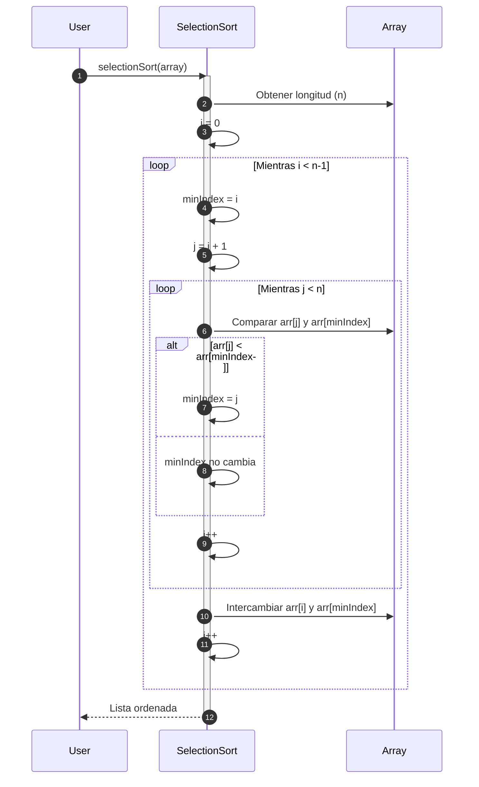

# Selection Sort

**Selection Sort** es un algoritmo de ordenamiento simple que trabaja seleccionando el **elemento más pequeño** (o más grande, según el criterio) en cada iteración y colocándolo en su posición correcta.

## Funcionamiento

1. Se divide la lista en dos partes: **ordenada** y **no ordenada**.
2. Se encuentra el elemento mínimo de la parte no ordenada.
3. Se intercambia con el primer elemento de la parte no ordenada, aumentando la parte ordenada.
4. Se repite el proceso hasta que la lista esté ordenada.

## Propiedades

1. **Complejidad temporal:**
   - Mejor caso: $O({n}^{2})$
   - Peor caso: $O({n}^{2})$
   - Caso promedio: $O({n}^{2})$
2. **No es adaptativo:** siempre realiza el mismo número de comparaciones.
3. **Complejidad espacial:** $O(1)$ (es in-place).
4. **No es estable:** El intercambio puede alterar el orden relativo de elementos iguales.

## Diagrama de Secuencia



1. El usuario llama a la función `selectionSort(array)`.
2. El algoritmo obtiene la longitud del array (`n`).
3. Se crea una variable `i` para controlar el bucle principal.
4. Mientras la iteración sea menor al tamaño del arreglo, se indica que el indice menor es igual a la posición actual (`i`).
5. Se crea una variable `j` que equivale a la posición siguiente.
6. Mientras `j` sea menor que el tamaño del arreglo, se compara el elemento en la posición `j` con el arreglo en la posición `minIndex`.
7. Si el valor del elemento en la posición `j` es menor que el valor en la posición `minIndex`, se actualiza el valor del indice menor a `j`.
8. En caso contrario no se hace nada.
9. El valor del contador `j` se incrementa en 1.
10. Si `j` ya es igual al tamaño del arreglo, se intercambia el elemento en la posición `i` con el elemento en la posición guardada en el indice menor.
11. Se incrementa el valor del contador `i` en 1.
12. Una vez se haya recorrido toda la lista, el usuario recibe la lista ordenada.

## Ejemplo Técnico

import Tabs from "@theme/Tabs";
import TabItem from "@theme/TabItem";

<Tabs>
<TabItem value="java" label="Paradigma: Orientado a Objetos">

<Tabs>
<TabItem value="code" label="Código Java Ejemplo">

```java showLineNumbers
public class SelectionSort {
    public static void sort(int[] arr) {
        for (int i = 0; i < arr.length - 1; i++) {
            int minIndex = i;
            for (int j = i + 1; j < arr.length; j++) {
                if (arr[j] < arr[minIndex]) {
                    minIndex = j;
                }
            }
            // Intercambiar
            int temp = arr[i];
            arr[i] = arr[minIndex];
            arr[minIndex] = temp;
        }
    }
}
```

</TabItem>
<TabItem value="test" label="Test Unitario">

```java showLineNumbers
import static org.junit.jupiter.api.Assertions.*;
import org.junit.jupiter.api.Test;

public class SelectionSortTest {
    @Test
    void testSelectionSort() {
        int[] data = {5, 1, 4, 2, 8};
        SelectionSort.sort(data);
        assertArrayEquals(new int[]{1, 2, 4, 5, 8}, data);
    }
}
```

</TabItem>
</Tabs>

</TabItem>
<TabItem value="python" label="Paradigma: Procedural">

<Tabs>
<TabItem value="code" label="Código Python Ejemplo">

```py showLineNumbers
def selection_sort(arr):
    n = len(arr)
    for i in range(n - 1):
        min_index = i
        for j in range(i + 1, n):
            if arr[j] < arr[min_index]:
                min_index = j
        arr[i], arr[min_index] = arr[min_index], arr[i]
    return arr
```

</TabItem>
<TabItem value="test" label="Test Unitario">

```py showLineNumbers
from selection_sort import selection_sort

def test_selection_sort():
    assert selection_sort([5,1,4,2,8]) == [1,2,4,5,8]
    assert selection_sort([]) == []
    assert selection_sort([1]) == [1]
```

</TabItem>
</Tabs>

</TabItem>
<TabItem value="ts" label="Paradigma: Funcional">

<Tabs>
<TabItem value="code" label="Código TS Ejemplo">

```ts showLineNumbers
export const selectionSort = (arr: number[]): number[] => {
  const result = [...arr];
  for (let i = 0; i < result.length - 1; i++) {
    let minIndex = i;
    for (let j = i + 1; j < result.length; j++) {
      if (result[j] < result[minIndex]) {
        minIndex = j;
      }
    }
    [result[i], result[minIndex]] = [result[minIndex], result[i]];
  }
  return result;
};
```

</TabItem>
<TabItem value="test" label="Test Unitario">

```ts showLineNumbers
import { selectionSort } from "./selectionSort";

test("selection sort works", () => {
  expect(selectionSort([5,1,4,2,8])).toEqual([1,2,4,5,8]);
  expect(selectionSort([])).toEqual([]);
  expect(selectionSort([1])).toEqual([1]);
});
```

</TabItem>
</Tabs>

</TabItem>
</Tabs>

## Referencias

- Cormen, T. H., Leiserson, C. E., Rivest, R. L., & Stein, C. (2022). Introduction to Algorithms (4th ed.). MIT Press.
- Weiss, M. A. (2020). Data Structures and Algorithm Analysis in Java (4th ed.). Pearson.
- Sedgewick, R., & Wayne, K. (2011). Algorithms (4th ed.). Addison-Wesley.
