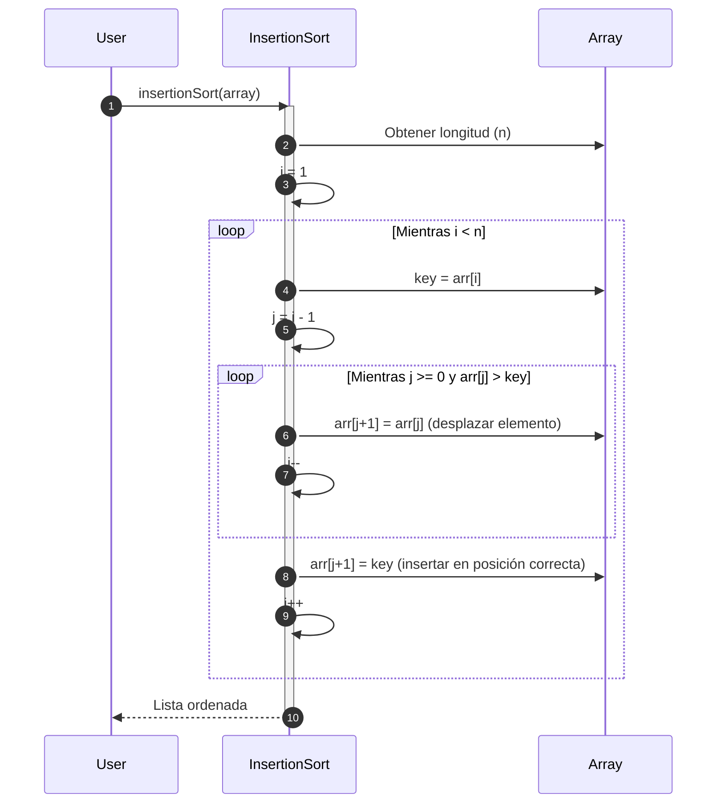

# Insertion Sort

**Insertion Sort** es un algoritmo de ordenamiento simple y eficiente para listas pequeñas o parcialmente ordenadas. Su funcionamiento se asemeja a la forma en que una persona organiza cartas en su mano: toma un elemento y lo coloca en su posición correcta respecto a los que ya están ordenados.

## Funcionamiento

1. Divide la lista en dos partes: ordenada y no ordenada.
2. Toma el primer elemento de la parte no ordenada y lo inserta en el lugar adecuado de la parte ordenada.
3. Repite el proceso hasta que todos los elementos estén ordenados.

## Propiedades

1. **Complejidad temporal:**
   - Mejor caso: $O(n)$ (lista ya ordenada).
   - Peor caso: $O({n}^{2})$ (lista en orden inverso).
   - Caso promedio: $O({n}^{2})$.
2. **Es adaptativo:** Mejora en listas parcialmente ordenadas.
3. **Complejidad espacial:** $O(1)$ (in-place).
4. **Estabilidad:** Es estable, no altera el orden relativo de elementos iguales.

## Diagrama de secuencia



1. El usuario solicita el ordenamiento de su arreglo con el algoritmo Insertion Sort.
2. El algoritmo obtiene la longitud del arreglo, y guarda este valor en la variable `n`.
3. Se inicializa un contador `i` en 1.
4. Dentro del loop que se mantiene activo mientras el contador `i` sea menor al tamaño del arreglo, se conserva como llave el elemento del arreglo que se encuentre en la posición de `i`.
5. Se actualiza un segundo contador `j` que se inicializa en `i - 1`.
6. Dentro del loop interno, mientras `j` sea mayor o igual a 0, y adicional, el elemento del arreglo que se encuentra en la posición de `j` sea mayor a la llave, se desplaza el elemento del arreglo en la posición de `j + 1` hacia la derecha.
7. Se procede a decrementar el valor de `j` en 1.
8. Fuera del arreglo interno, el elemento del arreglo en la posición de `j + 1` se actualiza con la llave, insertándolo en la posición correcta.
9. Se incrementa el contador `i` en 1.
10. Una vez terminado el bucle, se retorna el arreglo ordenado al usuario.

## Ejemplo Técnico

import Tabs from "@theme/Tabs";
import TabItem from "@theme/TabItem";

<Tabs>
<TabItem value="java" label="Paradigma: Orientado a Objetos">

<Tabs>
<TabItem value="code" label="Código Java Ejemplo">

```java showLineNumbers
public class InsertionSort {
    public static void sort(int[] arr) {
        for (int i = 1; i < arr.length; i++) {
            int key = arr[i];
            int j = i - 1;

            while (j >= 0 && arr[j] > key) {
                arr[j + 1] = arr[j];
                j--;
            }
            arr[j + 1] = key;
        }
    }
}
```

</TabItem>
<TabItem value="test" label="Test Unitario">

```java showLineNumbers
import static org.junit.jupiter.api.Assertions.*;
import org.junit.jupiter.api.Test;

public class InsertionSortTest {
    @Test
    void testInsertionSort() {
        int[] data = {5, 1, 4, 2, 8};
        InsertionSort.sort(data);
        assertArrayEquals(new int[]{1, 2, 4, 5, 8}, data);
    }
}
```

</TabItem>
</Tabs>

</TabItem>
<TabItem value="python" label="Paradigma: Procedural">

<Tabs>
<TabItem value="code" label="Código Python Ejemplo">

```py showLineNumbers
def insertion_sort(arr):
    for i in range(1, len(arr)):
        key = arr[i]
        j = i - 1

        while j >= 0 and arr[j] > key:
            arr[j + 1] = arr[j]
            j -= 1

        arr[j + 1] = key
    return arr
```

</TabItem>
<TabItem value="test" label="Test Unitario">

```py showLineNumbers
from insertion_sort import insertion_sort

def test_insertion_sort():
    assert insertion_sort([5,1,4,2,8]) == [1,2,4,5,8]
    assert insertion_sort([]) == []
    assert insertion_sort([1]) == [1]
```

</TabItem>
</Tabs>

</TabItem>
<TabItem value="ts" label="Paradigma: Funcional">

<Tabs>
<TabItem value="code" label="Código TS Ejemplo">

```ts showLineNumbers
export const insertionSort = (arr: number[]): number[] => {
  const result = [...arr];
  for (let i = 1; i < result.length; i++) {
    const key = result[i];
    let j = i - 1;

    while (j >= 0 && result[j] > key) {
      result[j + 1] = result[j];
      j--;
    }
    result[j + 1] = key;
  }
  return result;
};
```

</TabItem>
<TabItem value="test" label="Test Unitario">

```ts showLineNumbers
import { insertionSort } from "./insertionSort";

test("insertion sort orders correctly", () => {
  expect(insertionSort([5,1,4,2,8])).toEqual([1,2,4,5,8]);
  expect(insertionSort([])).toEqual([]);
  expect(insertionSort([1])).toEqual([1]);
});
```

</TabItem>
</Tabs>

</TabItem>
</Tabs>

## Referencias

- Cormen, T. H., Leiserson, C. E., Rivest, R. L., & Stein, C. (2022). Introduction to Algorithms (4th ed.). MIT Press.
- Weiss, M. A. (2020). Data Structures and Algorithm Analysis in Java (4th ed.). Pearson.
- Sedgewick, R., & Wayne, K. (2011). Algorithms (4th ed.). Addison-Wesley.
