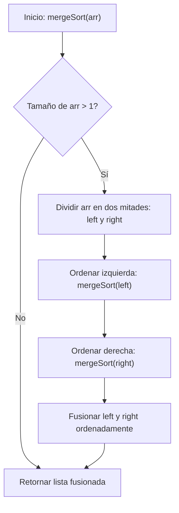
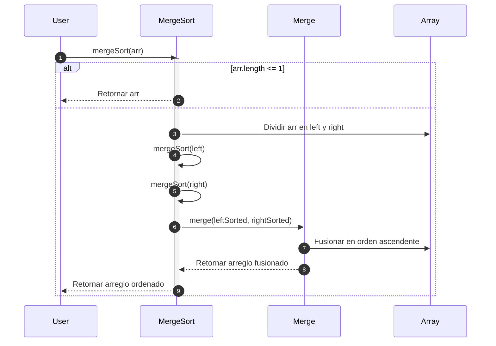

# Merge Sort

Merge Sort es un algoritmo de ordenamiento eficiente basado en el paradigma **Divide y Vencerás (Divide and Conquer)**. Se divide recursivamente la lista en mitades hasta obtener sublistas de un solo elemento, y luego se **fusionan** en orden ascendente.

Su funcionamiento general es el siguiente:

1. **Dividir:** Si la lista tiene más de un elemento, se divide en dos mitades.
2. **Conquistar:** Ordenar recursivamente ambas mitades.
3. **Combinar:** Fusionar las dos listas ordenadas en una sola lista ordenada.

## Complejidades

- En el mejor caso, la complejidad temporal es de $O(n log n)$ y la complejidad espacial es de $O(n)$
- En el caso promedio, la complejidad temporal es de $O(n log n)$ y la complejidad espacial es de $O(n)$
- En el peor caso, la complejidad temporal es de $O(n log n)$ y la complejidad espacial es de $O(n)$

> Merge sort no es **in-place** y requiere memoria adicional proporcional al tamaño de la lista.

## Propiedades

- Si es estable
- No es adaptativo
- Su eficiencia es ideal para listas grandes
- Se suele usar en bibliotecas estándar, por ejemplo: `Array.sort()` en Java para objetos.

## Diagrama de flujo



## Diagrama de secuencia



1. Un usuario solicita ordenar un arreglo usando el algoritmo Merge Sort
2. Si el arreglo solo contiene 1 o 0 elementos, se retorna el arreglo en su estado actual.
3. Se divide el arreglo en 2, la primera mitad corresponde al arreglo izquierdo, y la segundo en el arreglo derecho.
4. De manera recursiva se aplica el paso 3 y siguientes para el arreglo del lado izquierdo.
5. De manera recursiva se aplica el paso 3 y siguientes para el arreglo del lado derecho.
6. Se migran o juntan los resultados del lado izquierdo con los del lado derecho.
7. Usando el método merge, se fusionan en orden ascendente.
8. Se retorna el arreglo fusionado
9. Se retorna el arreglo ordenado

## Ejemplo técnico

import Tabs from '@theme/Tabs';
import TabItem from '@theme/TabItem';

<Tabs>
<TabItem value="java" label="Paradigma: Orientado a Objetos">

<Tabs>
<TabItem value="code" label="Código Java Ejemplo">

```java showLineNumbers
public class MergeSort {
    public static int[] sort(int[] array) {
        if (array.length <= 1) return array;

        int mid = array.length / 2;
        int[] left = sort(Arrays.copyOfRange(array, 0, mid));
        int[] right = sort(Arrays.copyOfRange(array, mid, array.length));

        return merge(left, right);
    }

    private static int[] merge(int[] left, int[] right) {
        int[] result = new int[left.length + right.length];
        int i = 0, j = 0, k = 0;

        while (i < left.length && j < right.length)
            result[k++] = (left[i] <= right[j]) ? left[i++] : right[j++];

        while (i < left.length) result[k++] = left[i++];
        while (j < right.length) result[k++] = right[j++];

        return result;
    }
}
```

</TabItem>
<TabItem value="test" label="Test Unitario">

```java showLineNumbers
import static org.junit.jupiter.api.Assertions.*;
import org.junit.jupiter.api.Test;

public class MergeSortTest {
    @Test
    void testSort() {
        int[] data = {5, 2, 9, 1, 3};
        int[] expected = {1, 2, 3, 5, 9};
        assertArrayEquals(expected, MergeSort.sort(data));
    }
}
```

</TabItem>
</Tabs>

</TabItem>
<TabItem value="python" label="Paradigma: Procedural">

<Tabs>
<TabItem value="code" label="Código Python Ejemplo">

```py showLineNumbers
def merge_sort(arr):
    if len(arr) <= 1:
        return arr

    mid = len(arr) // 2
    left = merge_sort(arr[:mid])
    right = merge_sort(arr[mid:])

    return merge(left, right)

def merge(left, right):
    result = []
    i = j = 0

    while i < len(left) and j < len(right):
        if left[i] <= right[j]:
            result.append(left[i])
            i += 1
        else:
            result.append(right[j])
            j += 1

    result.extend(left[i:])
    result.extend(right[j:])
    return result
```

</TabItem>
<TabItem value="test" label="Test Unitario">

```py showLineNumbers
from merge_sort import merge_sort

def test_merge_sort():
    assert merge_sort([3,1,4,1,5]) == [1,1,3,4,5]
    assert merge_sort([]) == []
    assert merge_sort([42]) == [42]
```

</TabItem>
</Tabs>

</TabItem>
<TabItem value="functional" label="Paradigma: Funcional">

<Tabs>
<TabItem value="code" label="Código TypeScript ejemplo">

```ts showLineNumbers
export const mergeSort = (arr: number[]): number[] => {
  if (arr.length <= 1) return arr;

  const mid = Math.floor(arr.length / 2);
  const left = mergeSort(arr.slice(0, mid));
  const right = mergeSort(arr.slice(mid));

  return merge(left, right);
};

const merge = (left: number[], right: number[]): number[] => {
  const result: number[] = [];
  while (left.length && right.length) {
    result.push(left[0] <= right[0] ? left.shift()! : right.shift()!);
  }
  return [...result, ...left, ...right];
};
```

</TabItem>
<TabItem value="test" label="Test Unitario">

```ts showLineNumbers
import { mergeSort } from './mergeSort';

test('mergeSort sorts correctly', () => {
  expect(mergeSort([5, 3, 8, 1])).toEqual([1, 3, 5, 8]);
  expect(mergeSort([])).toEqual([]);
  expect(mergeSort([1])).toEqual([1]);
});
```

</TabItem>
</Tabs>

</TabItem>
</Tabs>

## Aplicaciones prácticas

1. Ordenamiento de grandes volúmenes de datos (ej. procesamiento de logs).
2. Ordenamiento externo (cuando los datos no caben en memoria).
3. Implementaciones eficientes en sistemas embebidos y sistemas de bases de datos.
4. Algoritmo base en bibliotecas de ordenamiento híbridas (ej. Timsort).

## Referencias

- Cormen, T. H., Leiserson, C. E., Rivest, R. L., & Stein, C. (2022). Introduction to Algorithms (4th ed.). MIT Press.
- Knuth, D. E. (1998). The Art of Computer Programming, Vol. 3: Sorting and Searching (2nd ed.). Addison-Wesley.
- Sedgewick, R., & Wayne, K. (2011). Algorithms (4th ed.). Addison-Wesley.
- Weiss, M. A. (2020). Data Structures and Algorithm Analysis in Java (4th ed.). Pearson.
