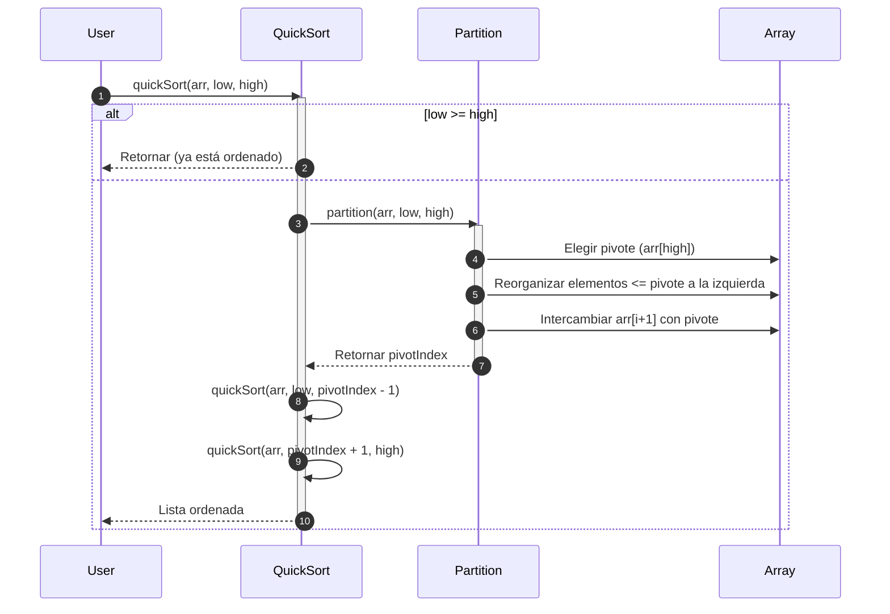

# Quick Sort

Quick Sort es un algoritmo de ordenamiento eficiente basado en el paradigma de **Divide y Vencerás**, como Merge Sort, pero con una ventaja significativa: puede ejecutarse en memoria sin espacio extra (es **in-place**).

El algoritmo funciona de la siguiente manera:

1. Elegir un **pivote** (pivot).
2. **Particionar:** reorganizar los elementos de tal manera que los menores al pivote queden a su izquierda y los mayores a su derecha.
3. **Recursión:** aplicar el mismo proceso a cada subarreglo (izquierdo y derecho del pivote).

> **Nota:** El rendimiento depende de cómo se elija el pivote.

## Complejidades

- En el mejor caso, la complejidad temporal es de $O(n log n)$, y la complejidad espacial es de $O(log n)$
- En el caso promedio, la complejidad temporal es de $O(n log n)$, y la complejidad espacial es de $O(log n)$
- En el peor caso, la complejidad temporal es de $O(n^2)$, y la complejidad espacial es de $O(log n)$

El **peor caso** corresponde a cuando el pivot es el menor o mayor elemento en cada paso. El **mejor caso** corresponde a cuando el pivot divide en 2 partes casi iguales.

## Propiedades

- El algoritmo trabaja **in-place**, es decir, no usa una estructura adicional.
- No es estable, es decir, no garantiza un orden relativo.
- No es adaptativo, no mejora con listas parcialmente ordenadas.
- Su eficiencia es alta, en la práctica es más rápido que Merge Sort en la mayoría de casos.

## Diagrama de secuencia



1. El usuario solicita ordenar un arreglo indicando la posición más baja y más alta.
2. El algoritmo valida si el valor de `low` es mayor o igual a `high`, en cuyo caso se retorna que ya está ordenado el arreglo.
3. El algoritmo particiona el arreglo usando los valores de alto y bajo.
4. Durante la partición se elige el valor pivot, el cual inicia con el valor almacenado en la posición más alta.
5. Se reorganizan los elementos menores o igual al pivot de la izquierda.
6. Se intercambia los valores de `i + 1` en el arreglo con el elemento del pivote.
7. La partición retorna el indice del pivot.
8. Quick sort repite los pasos anteriores de ordenamiento con el lado izquierdo con respecto al pivot.
9. Quick sort repite los pasos anteriores de ordenamiento con el lado derecho con respecto al pivot
10. Finalmente se retorna la lista ordenada.

## Ejemplo técnico

import Tabs from '@theme/Tabs';
import TabItem from '@theme/TabItem';

<Tabs>
<TabItem value="java" label="Paradigma: Orientado a Objetos">

<Tabs>
<TabItem value="code" label="Código Java Ejemplo">

```java showLineNumbers
public class QuickSort {
    public static void sort(int[] arr, int low, int high) {
        if (low < high) {
            int pivot = partition(arr, low, high);
            sort(arr, low, pivot - 1);
            sort(arr, pivot + 1, high);
        }
    }

    private static int partition(int[] arr, int low, int high) {
        int pivot = arr[high];
        int i = low - 1;

        for (int j = low; j < high; j++) {
            if (arr[j] <= pivot) {
                i++;
                swap(arr, i, j);
            }
        }

        swap(arr, i + 1, high);
        return i + 1;
    }

    private static void swap(int[] arr, int i, int j) {
        int temp = arr[i]; 
        arr[i] = arr[j]; 
        arr[j] = temp;
    }
}
```

</TabItem>
<TabItem value="test" label="Test Unitario">

```java showLineNumbers
import static org.junit.jupiter.api.Assertions.*;
import org.junit.jupiter.api.Test;

public class QuickSortTest {
    @Test
    void testQuickSort() {
        int[] data = {5, 2, 9, 1, 3};
        QuickSort.sort(data, 0, data.length - 1);
        assertArrayEquals(new int[]{1, 2, 3, 5, 9}, data);
    }
}
```

</TabItem>
</Tabs>

</TabItem>
<TabItem value="python" label="Paradigma: Procedural">

<Tabs>
<TabItem value="code" label="Código Python Ejemplo">

```py showLineNumbers
def quick_sort(arr, low, high):
    if low < high:
        pi = partition(arr, low, high)
        quick_sort(arr, low, pi - 1)
        quick_sort(arr, pi + 1, high)

def partition(arr, low, high):
    pivot = arr[high]
    i = low - 1

    for j in range(low, high):
        if arr[j] <= pivot:
            i += 1
            arr[i], arr[j] = arr[j], arr[i]

    arr[i+1], arr[high] = arr[high], arr[i+1]
    return i + 1
```

</TabItem>
<TabItem value="test" label="Test Unitario">

```py showLineNumbers
from quick_sort import quick_sort

def test_quick_sort():
    data = [3, 7, 2, 5, 1]
    quick_sort(data, 0, len(data) - 1)
    assert data == [1, 2, 3, 5, 7]
```

</TabItem>
</Tabs>

</TabItem>
<TabItem value="functional" label="Paradigma: Funcional">

<Tabs>
<TabItem value="code" label="Código TypeScript ejemplo">

```ts showLineNumbers
export const quickSort = (arr: number[]): number[] => {
  if (arr.length < 2) return arr;

  const pivot = arr[arr.length - 1];
  const left = arr.slice(0, -1).filter(x => x <= pivot);
  const right = arr.slice(0, -1).filter(x => x > pivot);

  return [...quickSort(left), pivot, ...quickSort(right)];
};
```

</TabItem>
<TabItem value="test" label="Test Unitario">

```ts showLineNumbers
import { quickSort } from "./quickSort";

test("quickSort works", () => {
  expect(quickSort([4, 1, 3, 9, 7])).toEqual([1, 3, 4, 7, 9]);
});
```

</TabItem>
</Tabs>

</TabItem>
</Tabs>

## Aplicaciones prácticas

- Sistemas embebidos y hardware con poca memoria.
- Librerías estándar: C++, Java, Python implementan quicksort o variantes (ej. introsort).
- Bases de datos y procesamiento en memoria.
- Lenguajes como Go, Rust, JavaScript usan quicksort híbrido internamente.

## Referencias

- Cormen, T. H., Leiserson, C. E., Rivest, R. L., & Stein, C. (2022). Introduction to Algorithms (4th ed.). MIT Press.
- Sedgewick, R., & Wayne, K. (2011). Algorithms (4th ed.). Addison-Wesley.
- Knuth, D. E. (1998). The Art of Computer Programming, Vol. 3: Sorting and Searching. Addison-Wesley.
- Weiss, M. A. (2020). Data Structures and Algorithm Analysis in Java (4th ed.). Pearson.
