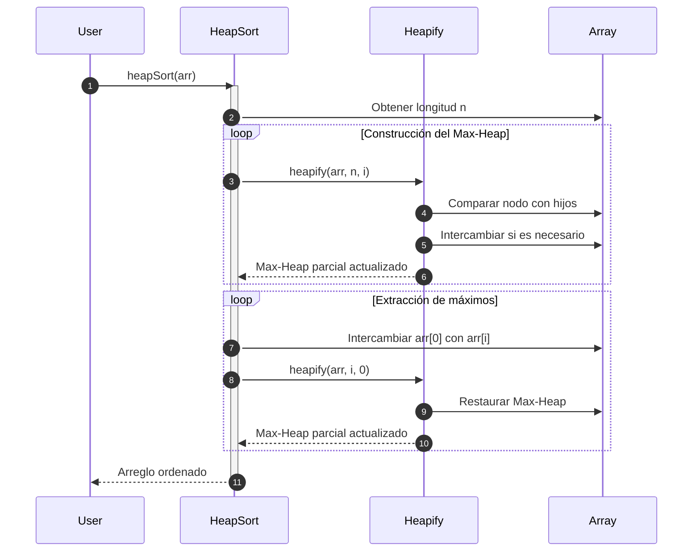

# Heap Sort

Heap Sort es un algoritmo de ordenamiento basado en la estructura de datos **heap binario** (montículo). Utiliza un **Max-Heap** (o **Min-Heap**, según el orden requerido) para organizar los datos y ordenarlos de manera eficiente.

## ¿Que es un Heap?

En español, *heap* traduce cómo *montón*, *pila* o *cúmulo*. Un **heap binario** es un **árbol binario** completo que satisface la propiedad de heap:

- En un Max-Heap, cada nodo es mayor o igual que sus hijos.
- En un Min-Heap, cada nodo es menor o igual que sus hijos.

## Funcionamiento general de Heap Sort

1. Construir un Max-Heap a partir del arreglo.
2. Repetir hasta que el heap esté vacío:
   - Intercambiar el primer elemento (máximo) con el último.
   - Reducir el tamaño del heap en 1.
   - Aplicar heapify para restaurar la propiedad del Max-Heap.

## Complejidades

- En el mejor caso, la complejidad temporal es de $O(n log n)$, y la complejidad espacial es de $O(1)$
- En el caso promedio, la complejidad temporal es de $O(n log n)$, y la complejidad espacial es de $O(1)$
- En el peor caso, la complejidad temporal es de $O(n log n)$, y la complejidad espacial es de $O(1)$

## Propiedades

1. Es In-place
2. No es estable
3. Es no adaptativo
4. Es útil cuando se requiere bajo uso de memoria adicional y rendimiento constante.

## Diagrama de secuencia



1. El usuario solicit ordenar el arreglo usando el algoritmo Heap Sort.
2. El algoritmo obtiene la longitud del arreglo y lo guarda en la variable `n`.
3. Se construye el Max-Heap para ordenar de forma ascendente, partiendo desde la mitad hacia el inicio, usando como referencia la longitud del arreglo y la iteración actual en el bucle. En este caso la variable i se inicializa desde la posición anterior a la mitad del arreglo.
4. Se compara el nodo principal del Heap con respecto a los nodos hijos.
5. Si el nodo padre es mayor al hijo, se hace el intercambio para lograr que el mayor quede en la raíz.
6. Se retorna el Max-Heap parcialmente actualizado, preparando el arreglo para que los máximos queden en la raíz.
7. En un segundo bucle se extraen los máximos, y se intercambia el elemento en la primera posición (corresponde al máximo), con el elemento de la posición `j`, que corresponde al último no ordenado.
8. Se aplica el heapify hasta que todo el arreglo esté ordenado. Es cómo ir sacando el máximo y colocándolo al final, uno a uno.
9. Finalmente se retorna el arreglo ordenado.

## Ejemplo técnico

import Tabs from '@theme/Tabs';
import TabItem from '@theme/TabItem';

<Tabs>
<TabItem value="java" label="Paradigma: Orientado a Objetos">

<Tabs>
<TabItem value="code" label="Código Java Ejemplo">

```java showLineNumbers
public class HeapSort {
    public static void sort(int[] array) {
        int length = array.length;

        for (int currentIndex = length / 2 - 1; currentIndex >= 0; currentIndex--) {
            heapify(array, length, currentIndex);
        }

        for (int lastIndex = length - 1; lastIndex > 0; lastIndex--) {
            swap(array, 0, lastIndex);
            heapify(array, lastIndex, 0);
        }
    }

    private static void heapify(int[] array, int heapSize, int rootIndex) {
        int largestIndex = rootIndex;
        int leftChildIndex = 2 * rootIndex + 1;
        int rightChildIndex = 2 * rootIndex + 2;

        if (leftChildIndex < heapSize && array[leftChildIndex] > array[largestIndex]) {
            largestIndex = leftChildIndex;
        }

        if (rightChildIndex < heapSize && array[rightChildIndex] > array[largestIndex]) {
            largestIndex = rightChildIndex;
        }

        if (largestIndex != rootIndex) {
            swap(array, rootIndex, largestIndex);
            heapify(array, heapSize, largestIndex);
        }
    }

    private static void swap(int[] array, int indexA, int indexB) {
        int temp = array[indexA];
        array[indexA] = array[indexB];
        array[indexB] = temp;
    }
}
```

</TabItem>
<TabItem value="test" label="Test Unitario">

```java showLineNumbers
import org.junit.jupiter.api.Test;
import static org.junit.jupiter.api.Assertions.*;

class HeapSortTest {
    @Test
    void testHeapSort() {
        int[] arr = {4, 10, 3, 5, 1};
        HeapSort.sort(arr);
        assertArrayEquals(new int[]{1, 3, 4, 5, 10}, arr);
    }
}
```

</TabItem>
</Tabs>

</TabItem>
<TabItem value="python" label="Paradigma: Procedural">

<Tabs>
<TabItem value="code" label="Código Python Ejemplo">

```py showLineNumbers
def heap_sort(arr):
    n = len(arr)

    for i in range(n // 2 - 1, -1, -1):
        heapify(arr, n, i)

    for i in range(n - 1, 0, -1):
        arr[0], arr[i] = arr[i], arr[0]
        heapify(arr, i, 0)

def heapify(arr, n, i):
    largest = i
    l, r = 2 * i + 1, 2 * i + 2

    if l < n and arr[l] > arr[largest]:
        largest = l
    if r < n and arr[r] > arr[largest]:
        largest = r

    if largest != i:
        arr[i], arr[largest] = arr[largest], arr[i]
        heapify(arr, n, largest)
```

</TabItem>
<TabItem value="test" label="Test Unitario">

```py showLineNumbers
from heap_sort import heap_sort

def test_heap_sort():
    arr = [4, 1, 7, 2]
    heap_sort(arr)
    assert arr == [1, 2, 4, 7]
```

</TabItem>
</Tabs>

</TabItem>
<TabItem value="functional" label="Paradigma: Funcional">

<Tabs>
<TabItem value="code" label="Código TypeScript ejemplo">

```ts showLineNumbers
export const heapSort = (arr: number[]): number[] => {
  const result = [...arr];
  const n = result.length;

  const heapify = (n: number, i: number): void => {
    let largest = i;
    const l = 2 * i + 1, r = 2 * i + 2;

    if (l < n && result[l] > result[largest]) largest = l;
    if (r < n && result[r] > result[largest]) largest = r;

    if (largest !== i) {
      [result[i], result[largest]] = [result[largest], result[i]];
      heapify(n, largest);
    }
  };

  for (let i = Math.floor(n / 2) - 1; i >= 0; i--) heapify(n, i);
  for (let i = n - 1; i > 0; i--) {
    [result[0], result[i]] = [result[i], result[0]];
    heapify(i, 0);
  }

  return result;
};
```

</TabItem>
<TabItem value="test" label="Test Unitario">

```ts showLineNumbers
import { heapSort } from "./heapSort";

test("heapSort works", () => {
  expect(heapSort([3, 9, 1, 4])).toEqual([1, 3, 4, 9]);
});
```

</TabItem>
</Tabs>

</TabItem>
</Tabs>

## Aplicaciones reales

- Sistemas con restricciones de memoria (por su comportamiento $O(1)$ en espacio).
- Ordenamiento de archivos muy grandes donde no se puede usar memoria extra.
- Algoritmo base en colas de prioridad (como PriorityQueue).
- Sistemas en tiempo real donde el peor caso $O(n log n)$ es garantizado.

## Referencias

- Cormen, T. H., Leiserson, C. E., Rivest, R. L., & Stein, C. (2022). Introduction to Algorithms (4th ed.). MIT Press.
- Sedgewick, R., & Wayne, K. (2011). Algorithms (4th ed.). Addison-Wesley.
- Knuth, D. E. (1998). The Art of Computer Programming, Vol. 3: Sorting and Searching. Addison-Wesley.
- Weiss, M. A. (2020). Data Structures and Algorithm Analysis in Java (4th ed.). Pearson.
