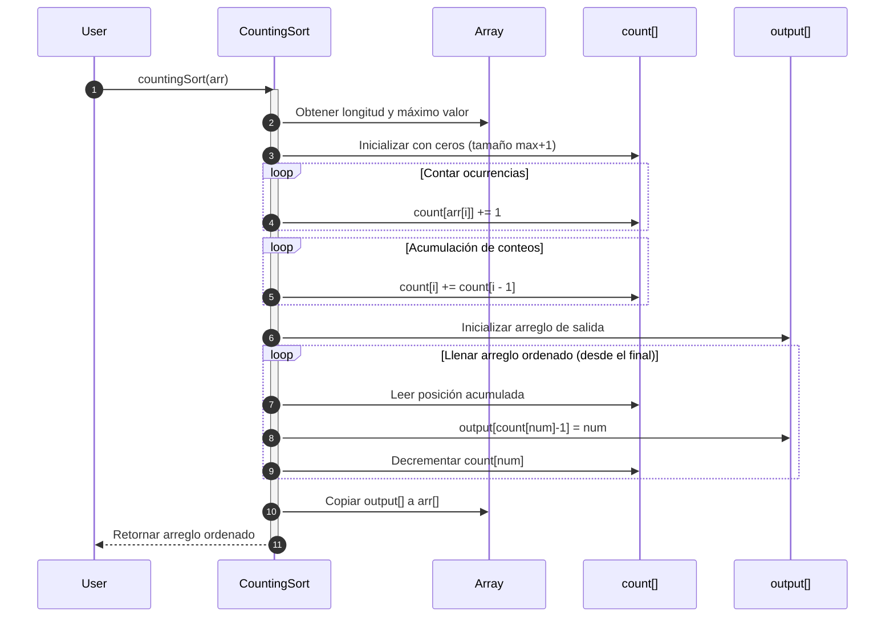

# Counting Sort

Counting Sort es un algoritmo de ordenamiento **no basado en comparación**, diseñado para ordenar enteros en un rango conocido. Se basa en **contar la cantidad de ocurrencias de cada valor**, y luego usar esta información para reconstruir el arreglo ordenado.

El funcionamiento de este algoritmo es el siguiente:

1. Se identifica el valor máximo (y opcionalmente mínimo).
2. Se crea un **arreglo auxiliar** (count) donde se almacena la frecuencia de cada elemento.
3. Se transforma el arreglo `count` en un arreglo acumulado.
4. Se recorre el arreglo original y se coloca cada elemento en su posición correcta en el arreglo de salida.
5. Se copia el resultado ordenado al arreglo original (si se desea).

## Complejidad

- En el mejor caso, la complejidad temporal es de $O(n + k)$, y la complejidad espacial es de $O(k)$
- En el caso promedio, la complejidad temporal es de $O(n + k)$, y la complejidad espacial es de $O(k)$
- En el peor caso, la complejidad temporal es de $O(n + k)$, y la complejidad espacial es de $O(k)$

Donde $n$ es el número de elementos y $k$ es el rango de los valores (máximo - mínimo).

## Propiedades

- No usa comparaciones
- Es estable (si se implementa adecuadamente)
- No es in-place (usa espacio adicional)
- Ideal cuando `k` es pequeño y `n` es grande.

## Diagrama de secuencia



1. El usuario solicitar ordenar los datos con Counting Sort.
2. El algoritmo obtiene la longitud y el valor más alto del arreglo.
3. Se inicializa un arreglo de ceros, definiendo que el tamaño es de el valor máximo + 1.
4. Dentro de un loop se empieza a contar las ocurrencias que se tienen en el arreglo original, pero, la posición dentro del arreglo contador es el valor del elemento iterado en el arreglo original.
5. En otro loop se transforma el arreglo contador para consultar cuantos elementos son menores o iguales a cada valor. Esto va a permitir que se calcule la posición final de cada elemento en el arreglo ordenado.
6. Se inicializa un arreglo que servirá como output.
7. Se recorre el arreglo original de atrás hacia adelante.
8. Se ubica el valor del número que se tiene en la iteración, en el arreglo de output teniendo en cuenta dicho número cómo índice dentro del arreglo de conteo.
9. Se decrementa el contador para manejar duplicados.
10. Se copian los valores del arreglo output dentro del arreglo a retornar.
11. Se retorna el arreglo ordenado al usuario.

## Ejemplo técnico

import Tabs from '@theme/Tabs';
import TabItem from '@theme/TabItem';

<Tabs>
<TabItem value="java" label="Paradigma: Orientado a Objetos">

<Tabs>
<TabItem value="code" label="Código Java Ejemplo">

```java showLineNumbers
public class CountingSort {
    public static void sort(int[] arr) {
        int max = Arrays.stream(arr).max().getAsInt();
        int[] count = new int[max + 1];

        for (int num : arr)
            count[num]++;

        for (int i = 1; i < count.length; i++)
            count[i] += count[i - 1];

        int[] output = new int[arr.length];
        for (int i = arr.length - 1; i >= 0; i--) {
            output[count[arr[i]] - 1] = arr[i];
            count[arr[i]]--;
        }

        System.arraycopy(output, 0, arr, 0, arr.length);
    }
}
```

</TabItem>
<TabItem value="test" label="Test Unitario">

```java showLineNumbers
@Test
void testCountingSort() {
    int[] arr = {4, 2, 2, 8, 3, 3, 1};
    CountingSort.sort(arr);
    assertArrayEquals(new int[]{1, 2, 2, 3, 3, 4, 8}, arr);
}
```

</TabItem>
</Tabs>

</TabItem>
<TabItem value="python" label="Paradigma: Procedural">

<Tabs>
<TabItem value="code" label="Código Python Ejemplo">

```py showLineNumbers
def counting_sort(arr):
    if not arr:
        return arr

    max_val = max(arr)
    count = [0] * (max_val + 1)

    for num in arr:
        count[num] += 1

    for i in range(1, len(count)):
        count[i] += count[i - 1]

    output = [0] * len(arr)
    for num in reversed(arr):
        output[count[num] - 1] = num
        count[num] -= 1

    for i in range(len(arr)):
        arr[i] = output[i]
```

</TabItem>
<TabItem value="test" label="Test Unitario">

```py showLineNumbers
from counting_sort import counting_sort

def test_counting_sort():
    arr = [4, 2, 2, 8, 3, 3, 1]
    counting_sort(arr)
    assert arr == [1, 2, 2, 3, 3, 4, 8]
```

</TabItem>
</Tabs>

</TabItem>
<TabItem value="functional" label="Paradigma: Funcional">

<Tabs>
<TabItem value="code" label="Código TypeScript ejemplo">

```ts showLineNumbers
export const countingSort = (arr: number[]): number[] => {
  if (arr.length === 0) return [];

  const max = Math.max(...arr);
  const count = Array(max + 1).fill(0);

  arr.forEach(num => count[num]++);
  for (let i = 1; i < count.length; i++)
    count[i] += count[i - 1];

  const output = Array(arr.length);
  for (let i = arr.length - 1; i >= 0; i--) {
    const num = arr[i];
    output[count[num] - 1] = num;
    count[num]--;
  }

  return output;
};
```

</TabItem>
<TabItem value="test" label="Test Unitario">

```ts showLineNumbers
import { countingSort } from './countingSort';

test('counting sort works', () => {
  expect(countingSort([4, 2, 2, 8, 3, 3, 1])).toEqual([1, 2, 2, 3, 3, 4, 8]);
});
```

</TabItem>
</Tabs>

</TabItem>
</Tabs>

## Aplicaciones Reales

- Ordenamiento de datos discretos (edades, calificaciones, colores, categorías).
- Sistemas embebidos donde el rango de valores es pequeño y fijo.
- Pre-procesamiento de algoritmos de ordenamiento lineal (Radix Sort, Bucket Sort).
- Ordenamiento de datos en tiempo casi constante.

## Referencias

- Cormen, T. H., Leiserson, C. E., Rivest, R. L., & Stein, C. (2022). Introduction to Algorithms (4th ed.). MIT Press.
- Sedgewick, R., & Wayne, K. (2011). Algorithms (4th ed.). Addison-Wesley.
- Knuth, D. E. (1998). The Art of Computer Programming, Vol. 3: Sorting and Searching. Addison-Wesley.
- Weiss, M. A. (2020). Data Structures and Algorithm Analysis in Java (4th ed.). Pearson.
