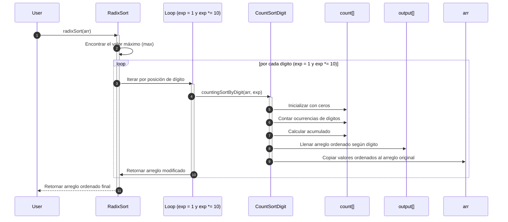

# Radix Sort

Radix Sort es un algoritmo de ordenamiento **no basado en comparación** que ordena enteros procesando **dígito por dígito** (de menor a mayor posición, o viceversa), normalmente usando **Counting Sort** como subrutina estable.

> **Principio Rector:** *Ordena los números por posición de dígito, comenzando desde la posición menos significativa (LSD – Least Significant Digit) o desde la más significativa (MSD – Most Significant Digit).*

## Complejidades

- En el mejor caso, la complejidad temporal es de $O(n k)$, y la complejidad espacial es de $O(n + k)$
- En el caso promedio, la complejidad temporal es de $O(n k)$, y la complejidad espacial es de $O(n + k)$
- En el peor caso, la complejidad temporal es de $O(n k)$, y la complejidad espacial es de $O(n + k)$

Donde:

- `n`: es el número de elementos
- `k`: es el número de dígitos del número más grande, suele ser constante, y tiene un rendimiento cercano a $O(n)$

## Características

- Es estable, pero, solo si el sort interno lo es.
- No es in-place
- Solo sirve para valores discretos (enteros, fechas, string fijos)
- Ideal cuando los datos tienen longitud limitada de representación.

## Diagrama de secuencia



1. El usuario pide ordenar los datos usando Radix Sort.
2. El algoritmo busca cual es el valor máximo dentro del arreglo, para saber cuántas posiciones decimales se deben procesar (unidades, decenas, centenas, etc.).
3. Se inicia un ciclo que recorre cada posición decimal (exp=1, 10, 100, etc.). El ciclo se repite hasta que el resultado de la división entre el número máximo sobre el valor de posición decimal sea mayor que 0. Luego se itera por cada posición decimal.
4. Se ordena el arreglo según el dígito actual (exp), usando la función `countingSortByDigit`.
5. Dentro del método de ordenamiento por dígito, se inicializa un arreglo contador en ceros.
6. Se cuenta cuantas veces aparece cada dígito en la posición actual.
7. Se acumulan los conteos para determinas las posiciones finales en el arreglo ordenado.
8. Se llena un arreglo de salida con los elementos ordenados según el dígito actual.
9. Se copia los valores del output de vuelta en el arreglo original para continuar con la siguiente iteración.
10. Se desactiva el proceso de ordenamiento por dígito.
11. Se retorna el arreglo parcialmente ordenado a Radix Sort para continuar con el siguiente dígito.
12. Se devuelve el arreglo ordenado al usuario.

## Ejemplo técnico

import Tabs from '@theme/Tabs';
import TabItem from '@theme/TabItem';

<Tabs>
<TabItem value="java" label="Paradigma: Orientado a Objetos">

<Tabs>
<TabItem value="code" label="Código Java Ejemplo">

```java showLineNumbers
import java.util.Arrays;

public class RadixSort {

    public static void sort(int[] array) {
        int maxValue = Arrays.stream(array).max().getAsInt();

        for (int digitPlace = 1; maxValue / digitPlace > 0; digitPlace *= 10) {
            sortByDigit(array, digitPlace);
        }
    }

    private static void sortByDigit(int[] array, int digitPlace) {
        int[] sortedArray = new int[array.length];
        int[] digitCount = new int[10]; 

        for (int number : array) {
            int digit = (number / digitPlace) % 10;
            digitCount[digit]++;
        }

        for (int i = 1; i < 10; i++) {
            digitCount[i] += digitCount[i - 1];
        }

        for (int i = array.length - 1; i >= 0; i--) {
            int digit = (array[i] / digitPlace) % 10;
            int position = digitCount[digit] - 1;
            sortedArray[position] = array[i];
            digitCount[digit]--;
        }

        System.arraycopy(sortedArray, 0, array, 0, array.length);
    }
}
```

</TabItem>
<TabItem value="test" label="Test Unitario">

```java showLineNumbers
@Test
void testRadixSort() {
    int[] arr = {170, 45, 75, 90, 802, 24, 2, 66};
    RadixSort.sort(arr);
    assertArrayEquals(new int[]{2, 24, 45, 66, 75, 90, 170, 802}, arr);
}
```

</TabItem>
</Tabs>

</TabItem>
<TabItem value="python" label="Paradigma: Procedural">

<Tabs>
<TabItem value="code" label="Código Python Ejemplo">

```py showLineNumbers
def counting_sort_by_digit(arr, exp):
    n = len(arr)
    output = [0] * n
    count = [0] * 10

    for num in arr:
        index = (num // exp) % 10
        count[index] += 1

    for i in range(1, 10):
        count[i] += count[i - 1]

    for i in range(n - 1, -1, -1):
        index = (arr[i] // exp) % 10
        output[count[index] - 1] = arr[i]
        count[index] -= 1

    for i in range(n):
        arr[i] = output[i]

def radix_sort(arr):
    if not arr:
        return arr
    max_num = max(arr)
    exp = 1
    while max_num // exp > 0:
        counting_sort_by_digit(arr, exp)
        exp *= 10
```

</TabItem>
<TabItem value="test" label="Test Unitario">

```py showLineNumbers
def test_radix_sort():
    arr = [170, 45, 75, 90, 802, 24, 2, 66]
    radix_sort(arr)
    assert arr == [2, 24, 45, 66, 75, 90, 170, 802]
```

</TabItem>
</Tabs>

</TabItem>
<TabItem value="functional" label="Paradigma: Funcional">

<Tabs>
<TabItem value="code" label="Código TypeScript ejemplo">

```ts showLineNumbers
export const radixSort = (arr: number[]): number[] => {
  if (arr.length === 0) return [];

  const max = Math.max(...arr);
  let exp = 1;
  let result = [...arr];

  while (Math.floor(max / exp) > 0) {
    result = countingSortByDigit(result, exp);
    exp *= 10;
  }

  return result;
};

const countingSortByDigit = (arr: number[], exp: number): number[] => {
  const output = Array(arr.length).fill(0);
  const count = Array(10).fill(0);

  arr.forEach(num => {
    const digit = Math.floor(num / exp) % 10;
    count[digit]++;
  });

  for (let i = 1; i < 10; i++)
    count[i] += count[i - 1];

  for (let i = arr.length - 1; i >= 0; i--) {
    const digit = Math.floor(arr[i] / exp) % 10;
    output[--count[digit]] = arr[i];
  }

  return output;
};
```

</TabItem>
<TabItem value="test" label="Test Unitario">

```ts showLineNumbers
import { radixSort } from "./radixSort";

test("radix sort works", () => {
  expect(radixSort([170, 45, 75, 90, 802, 24, 2, 66])).toEqual([2, 24, 45, 66, 75, 90, 170, 802]);
});
```

</TabItem>
</Tabs>

</TabItem>
</Tabs>

## Aplicaciones Reales

1. Procesamiento de grandes volúmenes de datos enteros en bancos y censos.
2. Ordenamiento de códigos postales, identificadores o fechas.
3. Datos tabulares que requieren alta velocidad y estabilidad.
4. Aplicaciones en FPGA (matriz de puertas programables en campo), ASIC (circuito integrado para aplicaciones específicas), donde se requiere rendimiento determinista sin comparaciones.

## Referencias

- Cormen, T. H., Leiserson, C. E., Rivest, R. L., & Stein, C. (2022). Introduction to Algorithms (4th ed.). MIT Press.
- Knuth, D. E. (1998). The Art of Computer Programming, Vol. 3: Sorting and Searching. Addison-Wesley.
- Sedgewick, R., & Wayne, K. (2011). Algorithms (4th ed.). Addison-Wesley.
- Weiss, M. A. (2020). Data Structures and Algorithm Analysis in Java (4th ed.). Pearson.
