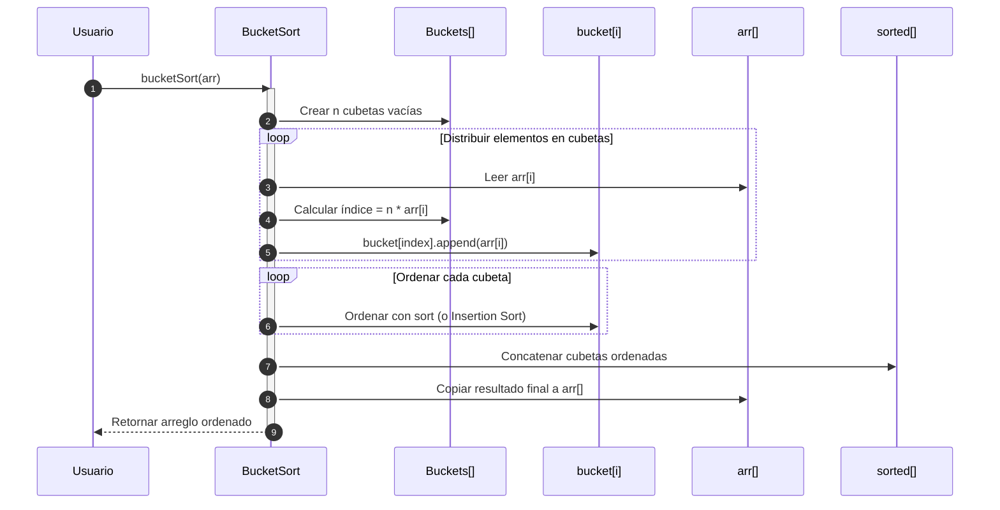

# Bucket Sort

Bucket Sort es un algoritmo de ordenamiento **no basado en comparación directa global**, sino en **distribuir los elementos en "cubetas"** (buckets) y luego ordenarlos individualmente, normalmente con un algoritmo estable (como Insertion Sort o incluso recursivamente con Bucket Sort).

El algoritmo funciona de la siguiente manera:

- Crear un número fijo de cubetas (listas vacías).
- Distribuir los elementos del arreglo original en las cubetas según una función de mapeo.
- Ordenar cada cubeta por separado (usualmente con Insertion Sort).
- Concatenar las cubetas ordenadas.

## Complejidades

- En el mejor caso, la complejidad temporal es de $O(n + k)$, y la complejidad espacial es de $O(n + k)$
- En el caso promedio, la complejidad temporal es de $O(n + k)$, y la complejidad espacial es de $O(n + k)$
- En el peor caso, la complejidad temporal es de $O(n^2)$, y la complejidad espacial es de $O(n + k)$

Donde, `k` es el número de cubetas. El peor caso ocurre si todos los elementos caen en la misma cubeta y se usa un ordenamiento cuadrático.

## Características

- Requiere una función de distribución adecuada
- Eficiente para datos reales uniformemente distribuidos
- Ideal para valores decimales entre 0 y 1
- Es un algoritmo estable si el ordenamiento interno lo es

## Diagrama de secuencia



## Ejemplo técnico

import Tabs from '@theme/Tabs';
import TabItem from '@theme/TabItem';

<Tabs>
<TabItem value="java" label="Paradigma: Orientado a Objetos">

<Tabs>
<TabItem value="code" label="Código Java Ejemplo">

```java showLineNumbers
public class BucketSort {
    public static void sort(float[] arr) {
        int n = arr.length;
        List<Float>[] buckets = new List[n];

        for (int i = 0; i < n; i++) buckets[i] = new ArrayList<>();

        for (float num : arr)
            buckets[(int)(n * num)].add(num);

        for (List<Float> bucket : buckets)
            Collections.sort(bucket); // Puede usarse InsertionSort

        int index = 0;
        for (List<Float> bucket : buckets)
            for (float num : bucket)
                arr[index++] = num;
    }
}
```

</TabItem>
<TabItem value="test" label="Test Unitario">

```java showLineNumbers
@Test
void testBucketSort() {
    float[] arr = {0.78f, 0.17f, 0.39f, 0.26f, 0.72f, 0.94f, 0.21f, 0.12f, 0.23f, 0.68f};
    BucketSort.sort(arr);
    assertArrayEquals(new float[]{0.12f, 0.17f, 0.21f, 0.23f, 0.26f, 0.39f, 0.68f, 0.72f, 0.78f, 0.94f}, arr);
}
```

</TabItem>
</Tabs>

</TabItem>
<TabItem value="python" label="Paradigma: Procedural">

<Tabs>
<TabItem value="code" label="Código Python Ejemplo">

```py showLineNumbers
def bucket_sort(arr):
    n = len(arr)
    buckets = [[] for _ in range(n)]

    for num in arr:
        index = int(n * num)
        buckets[index].append(num)

    for bucket in buckets:
        bucket.sort()  # o usar insertion_sort(bucket)

    sorted_array = [num for bucket in buckets for num in bucket]
    for i in range(n):
        arr[i] = sorted_array[i]
```

</TabItem>
<TabItem value="test" label="Test Unitario">

```py showLineNumbers
def test_bucket_sort():
    arr = [0.78, 0.17, 0.39, 0.26, 0.72, 0.94, 0.21, 0.12, 0.23, 0.68]
    bucket_sort(arr)
    assert arr == sorted(arr)
```

</TabItem>
</Tabs>

</TabItem>
<TabItem value="functional" label="Paradigma: Funcional">

<Tabs>
<TabItem value="code" label="Código TypeScript ejemplo">

```ts showLineNumbers
export const bucketSort = (arr: number[]): number[] => {
  const n = arr.length;
  if (n === 0) return [];

  const buckets: number[][] = Array.from({ length: n }, () => []);

  arr.forEach(num => {
    const index = Math.floor(n * num);
    buckets[index].push(num);
  });

  const sorted = buckets.flatMap(bucket => bucket.sort((a, b) => a - b));
  return sorted;
};
```

</TabItem>
<TabItem value="test" label="Test Unitario">

```ts showLineNumbers
import { bucketSort } from "./bucketSort";

test("bucket sort works", () => {
  const arr = [0.78, 0.17, 0.39, 0.26, 0.72, 0.94, 0.21, 0.12, 0.23, 0.68];
  expect(bucketSort(arr)).toEqual([...arr].sort((a, b) => a - b));
});
```

</TabItem>
</Tabs>

</TabItem>
</Tabs>

## Aplicaciones Reales

- Ordenamiento de probabilidades, porcentajes o valores normalizados.
- Visualización de histogramas o frecuencias distribuidas.
- Juegos de física o simulaciones donde los datos varían dentro de un rango [0, 1].
- Procesamiento de datos científicos y sensores con precisión decimal.

## Referencias

- Cormen, T. H., Leiserson, C. E., Rivest, R. L., & Stein, C. (2022). Introduction to Algorithms (4th ed.). MIT Press.
- Knuth, D. E. (1998). The Art of Computer Programming, Vol. 3: Sorting and Searching. Addison-Wesley.
- Sedgewick, R., & Wayne, K. (2011). Algorithms (4th ed.). Addison-Wesley.
- Weiss, M. A. (2020). Data Structures and Algorithm Analysis in Java (4th ed.). Pearson.
