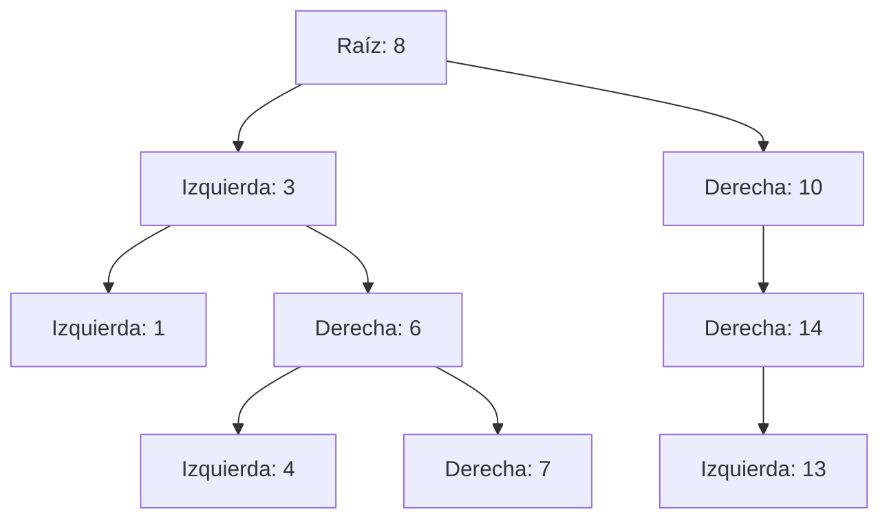
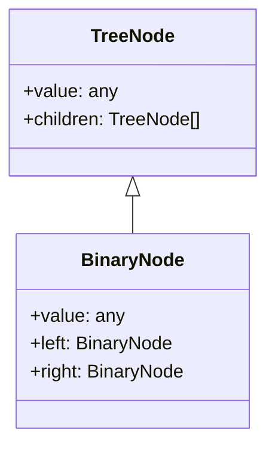

# Definición y Representación

Un árbol es una estructura de datos **jerárquica** y **no lineal**, compuesta por **nodos conectados** por aristas (enlaces). A diferencia de listas o arreglos, donde los datos se almacenan secuencialmente, los árboles permiten representar relaciones padre-hijo, jerarquías y ramificaciones.

## Propiedades básicas de un árbol

- Tiene un **nodo raíz** (root), el único sin padre.
- Cada nodo puede tener **cero o más hijos**.
- No existen ciclos.
- Hay exactamente un camino entre la raíz y cualquier otro nodo.

## Terminología clave

|Término|Definición|
|---------------|----------------------------------------------------------- |
|Nodo (Node)|Elemento que contiene un valor y referencias a otros nodos|
|Raíz (Root)|Nodo inicial del árbol.|
|Hijo (Child)|Nodo descendiente directo de otro nodo.|
|Padre (Parent)|Nodo del cual proviene un hijo.|
|Hoja (Leaf)|Nodo sin hijos.|
|Nivel (Level)|Profundidad desde la raíz (raíz = nivel 0).|
|Altura (Height|Longitud del camino más largo desde la raíz hasta una hoja|
|Subárbol|Árbol contenido dentro de otro árbol.|

## Representación de Árboles

1. Representación con nodos enlazados:

   ```txt showLineNumbers
   class Node {
       value
       left
       right
   }
   ```

   Cada nodo contiene su valor y punteros a hijos. Común en árboles binarios

2. Representación con listas de hijos

   ```txt showLineNumbers
   class Node {
       value
       children = []
   }
   ```

   Permite múltiples hijos (n-arios), útil para árboles generales.

3. Representación con arreglos (para árboles completos o heaps)

   Usado cuando los nodos tienen una posición fija como en un árbol binario completo.

   ```txt showLineNumbers
   Index i:
    Left child  = 2i + 1
    Right child = 2i + 2
    Parent      = floor((i - 1) / 2)
   ```

## Representación visual



## Diagrama de clases

El siguiente es un diagrama a de clase sobre un árbol genérico y binario.



## Ejemplo técnico

import Tabs from '@theme/Tabs';
import TabItem from '@theme/TabItem';

<Tabs>
<TabItem value="java" label="Paradigma: Orientado a Objetos">

<Tabs>
<TabItem value="code" label="Código Java Ejemplo">

```java showLineNumbers
public class TreeNode {
    int value;
    List<TreeNode> children;

    public TreeNode(int value) {
        this.value = value;
        this.children = new ArrayList<>();
    }

    public void addChild(TreeNode child) {
        children.add(child);
    }
}
```

</TabItem>
<TabItem value="test" label="Test Unitario">

```java showLineNumbers
@Test
void testAddChild() {
    TreeNode root = new TreeNode(10);
    TreeNode child = new TreeNode(5);
    root.addChild(child);
    assertEquals(1, root.children.size());
}
```

</TabItem>
</Tabs>

</TabItem>
<TabItem value="python" label="Paradigma: Procedural">

<Tabs>
<TabItem value="code" label="Código Python Ejemplo">

```python showLineNumbers
def create_node(value):
    return {'value': value, 'children': []}

def add_child(parent, child):
    parent['children'].append(child)
```

</TabItem>
<TabItem value="test" label="Test Unitario">

```python showLineNumbers
def test_add_child():
    root = create_node(10)
    child = create_node(5)
    add_child(root, child)
    assert len(root['children']) == 1
```

</TabItem>
</Tabs>

</TabItem>
<TabItem value="ts" label="Paradigma: Funcional">

<Tabs>
<TabItem value="code" label="Código TypeScript Ejemplo">

```ts showLineNumbers
export type TreeNode = {
  value: number;
  children: TreeNode[];
};

export const createNode = (value: number): TreeNode => ({
  value,
  children: [],
});

export const addChild = (parent: TreeNode, child: TreeNode): TreeNode => ({
  ...parent,
  children: [...parent.children, child],
});
```

</TabItem>
<TabItem value="ts" label="Test Unitario">

```ts showLineNumbers
import { createNode, addChild } from './Tree';

test('add child to tree node', () => {
  const root = createNode(10);
  const child = createNode(5);
  const updatedRoot = addChild(root, child);
  expect(updatedRoot.children.length).toBe(1);
});
```

</TabItem>
</Tabs>

</TabItem>
</Tabs>

## Aplicaciones Reales

- Estructura del DOM en navegadores.
- Sistemas de archivos (carpetas y subcarpetas).
- Árboles genealógicos y jerarquías organizacionales.
- Compiladores (árboles de sintaxis abstracta).
- Bases de datos (índices B-Tree).
- Juegos (árboles de decisión).

## Referencias

- Cormen, T. H., Leiserson, C. E., Rivest, R. L., & Stein, C. (2022). Introduction to Algorithms (4th ed.). MIT Press.
- Goodrich, M. T., Tamassia, R., & Goldwasser, M. H. (2014). Data Structures and Algorithms in Java (6th ed.). Wiley.
- Weiss, M. A. (2020). Data Structures and Algorithm Analysis in Java (4th ed.). Pearson.
- Sedgewick, R., & Wayne, K. (2011). Algorithms (4th ed.). Addison-Wesley.
