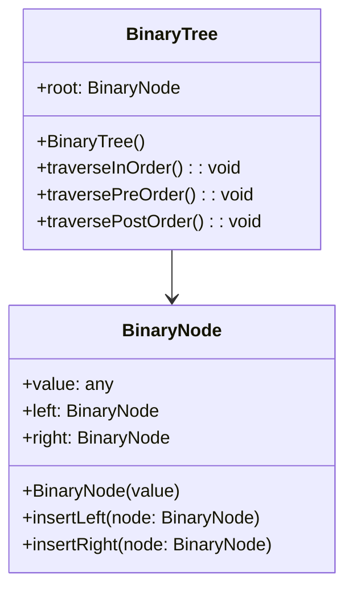

# Árboles Binarios

Un árbol binario es una **estructura de datos jerárquica** donde cada nodo tiene como máximo dos hijos, denominados comúnmente como:

- Hijo izquierdo (left)
- Hijo derecho (right)

Los árboles binarios son la base para estructuras más complejas como árboles de búsqueda binaria, AVL, Red-Black, heaps, entre otros.

## Propiedades del árbol binario

|Concepto|Definición|
|--|--|
|Altura de un nodo|Distancia desde ese nodo hasta la hoja más profunda.|
|Altura del árbol|Altura de la raíz.|
|Nivel de un nodo|Número de aristas desde la raíz hasta el nodo.|
|Nodo hoja|Nodo sin hijos.|
|Nodo interno|Nodo con al menos un hijo.|
|Árbol binario completo|Todos los niveles completos excepto el último, que se llena de izquierda a derecha|
|Árbol binario perfecto|Todos los niveles completamente llenos.|
|Árbol binario lleno|Todos los nodos tienen 0 o 2 hijos.|
|Árbol binario |Altura de subárboles difiere como máximo en 1.|

## Tipos de recorrido (transversal)

|Tipo|Orden|
|-----------|--------------------------|
|Inorden|Izquierda → Raíz → Derecha|
|Preorden|Raíz → Izquierda → Derecha|
|Postorden|Izquierda → Derecha → Raíz|
|Por niveles|Nivel por nivel (BFS)|

## Diagrama de clases

El siguiente diagrama aplica para un árbol binario básico.



## Ejemplo técnico

import Tabs from '@theme/Tabs';
import TabItem from '@theme/TabItem';

<Tabs>
<TabItem value="java" label="Paradigma: Orientado a Objetos">

<Tabs>
<TabItem value="code" label="Código Java Ejemplo">

```java showLineNumbers title="BinaryNode.java"
package domain;

public class BinaryNode {
    public int value;
    public BinaryNode left;
    public BinaryNode right;

    public BinaryNode(int value) {
        this.value = value;
        this.left = null;
        this.right = null;
    }
}
```

```java showLineNumbers title="BinaryTree.java"
package application;

import domain.BinaryNode;

public class BinaryTree {
    public BinaryNode root;

    public void insert(int value) {
        root = insertRec(root, value);
    }

    private BinaryNode insertRec(BinaryNode node, int value) {
        if (node == null) return new BinaryNode(value);
        if (value < node.value) node.left = insertRec(node.left, value);
        else if (value > node.value) node.right = insertRec(node.right, value);
        return node;
    }

    public boolean search(int value) {
        return searchRec(root, value);
    }

    private boolean searchRec(BinaryNode node, int value) {
        if (node == null) return false;
        if (node.value == value) return true;
        return value < node.value ? searchRec(node.left, value) : searchRec(node.right, value);
    }

    public void inOrder() {
        inOrderRec(root);
        System.out.println();
    }

    private void inOrderRec(BinaryNode node) {
        if (node != null) {
            inOrderRec(node.left);
            System.out.print(node.value + " ");
            inOrderRec(node.right);
        }
    }

    public void preOrder() {
        preOrderRec(root);
        System.out.println();
    }

    private void preOrderRec(BinaryNode node) {
        if (node != null) {
            System.out.print(node.value + " ");
            preOrderRec(node.left);
            preOrderRec(node.right);
        }
    }

    public void postOrder() {
        postOrderRec(root);
        System.out.println();
    }

    private void postOrderRec(BinaryNode node) {
        if (node != null) {
            postOrderRec(node.left);
            postOrderRec(node.right);
            System.out.print(node.value + " ");
        }
    }

    public void delete(int value) {
        root = deleteRec(root, value);
    }

    private BinaryNode deleteRec(BinaryNode node, int value) {
        if (node == null) return null;

        if (value < node.value) {
            node.left = deleteRec(node.left, value);
        } else if (value > node.value) {
            node.right = deleteRec(node.right, value);
        } else {
            if (node.left == null) return node.right;
            if (node.right == null) return node.left;

            BinaryNode minRight = findMin(node.right);
            node.value = minRight.value;
            node.right = deleteRec(node.right, minRight.value);
        }
        return node;
    }

    private BinaryNode findMin(BinaryNode node) {
        while (node.left != null) node = node.left;
        return node;
    }
}
```

</TabItem>
<TabItem value="test" label="Test Unitario">

```java showLineNumbers title="BinaryTreeTest.py"
import application.BinaryTree;
import org.junit.jupiter.api.BeforeEach;
import org.junit.jupiter.api.Test;

import static org.junit.jupiter.api.Assertions.*;

public class BinaryTreeTest {

    private BinaryTree tree;

    @BeforeEach
    void setUp() {
        tree = new BinaryTree();
        tree.insert(10);
        tree.insert(5);
        tree.insert(15);
        tree.insert(3);
        tree.insert(7);
    }

    @Test
    void testSearchExisting() {
        assertTrue(tree.search(10));
        assertTrue(tree.search(3));
        assertTrue(tree.search(15));
    }

    @Test
    void testSearchNonExisting() {
        assertFalse(tree.search(20));
        assertFalse(tree.search(0));
    }

    @Test
    void testDeleteLeafNode() {
        tree.delete(3);
        assertFalse(tree.search(3));
    }

    @Test
    void testDeleteNodeWithOneChild() {
        tree.delete(5); // 5 has one child (7)
        assertFalse(tree.search(5));
        assertTrue(tree.search(7));
    }

    @Test
    void testDeleteNodeWithTwoChildren() {
        tree.insert(13);
        tree.insert(17);
        tree.delete(15); // 15 has two children
        assertFalse(tree.search(15));
        assertTrue(tree.search(13));
        assertTrue(tree.search(17));
    }
}
```

</TabItem>
</Tabs>

</TabItem>
<TabItem value="python" label="Paradigma: Procedural">

<Tabs>
<TabItem value="code" label="Código Python Ejemplo">

```py showLineNumbers
def create_node(value):
    return {
        'value': value,
        'left': None,
        'right': None
    }

def insert_node(root, value):
    if root is None:
        return create_node(value)
    if value < root['value']:
        root['left'] = insert_node(root['left'], value)
    elif value > root['value']:
        root['right'] = insert_node(root['right'], value)
    return root

def search_node(root, value):
    if root is None:
        return False
    if root['value'] == value:
        return True
    elif value < root['value']:
        return search_node(root['left'], value)
    else:
        return search_node(root['right'], value)

def in_order(root):
    if root:
        in_order(root['left'])
        print(root['value'], end=' ')
        in_order(root['right'])

def pre_order(root):
    if root:
        print(root['value'], end=' ')
        pre_order(root['left'])
        pre_order(root['right'])

def post_order(root):
    if root:
        post_order(root['left'])
        post_order(root['right'])
        print(root['value'], end=' ')

def find_min(root):
    current = root
    while current and current['left']:
        current = current['left']
    return current

def delete_node(root, value):
    if root is None:
        return root
    if value < root['value']:
        root['left'] = delete_node(root['left'], value)
    elif value > root['value']:
        root['right'] = delete_node(root['right'], value)
    else:
        # Nodo encontrado
        if root['left'] is None:
            return root['right']
        elif root['right'] is None:
            return root['left']
        min_node = find_min(root['right'])
        root['value'] = min_node['value']
        root['right'] = delete_node(root['right'], min_node['value'])
    return root
```

</TabItem>
<TabItem value="test" label="Test Unitario">

```py showLineNumbers
import pytest
from binary_tree import (
    create_node,
    insert_node,
    search_node,
    delete_node,
)

@pytest.fixture
def sample_tree():
    root = None
    for value in [10, 5, 15, 3, 7, 13, 17]:
        root = insert_node(root, value)
    return root

def test_search_existing(sample_tree):
    assert search_node(sample_tree, 10) is True
    assert search_node(sample_tree, 7) is True
    assert search_node(sample_tree, 13) is True

def test_search_non_existing(sample_tree):
    assert search_node(sample_tree, 100) is False
    assert search_node(sample_tree, 0) is False

def test_delete_leaf_node(sample_tree):
    root = delete_node(sample_tree, 3)
    assert search_node(root, 3) is False

def test_delete_node_with_one_child(sample_tree):
    root = delete_node(sample_tree, 5)  # 5 has one child (7)
    assert search_node(root, 5) is False
    assert search_node(root, 7) is True

def test_delete_node_with_two_children(sample_tree):
    root = delete_node(sample_tree, 15)  # 15 has children 13 and 17
    assert search_node(root, 15) is False
    assert search_node(root, 13) is True
    assert search_node(root, 17) is True
```

</TabItem>
</Tabs>

</TabItem>
<TabItem value="typescript" label="Paradigm: Funcional">

<Tabs>
<TabItem value="code" label="Código Typescript Ejemplo">

```ts showLineNumbers
export type BinaryNode = Readonly<{
  value: number;
  left: BinaryNode | null;
  right: BinaryNode | null;
}>;

export const createNode = (value: number): BinaryNode => ({
  value,
  left: null,
  right: null,
});

export const insertNode = (node: BinaryNode | null, value: number): BinaryNode => {
  if (!node) return createNode(value);

  if (value < node.value) {
    return {
      ...node,
      left: insertNode(node.left, value),
    };
  }

  if (value > node.value) {
    return {
      ...node,
      right: insertNode(node.right, value),
    };
  }

  return node; // valores duplicados no se insertan
};

export const searchNode = (node: BinaryNode | null, value: number): boolean => {
  if (!node) return false;
  if (node.value === value) return true;

  return value < node.value
    ? searchNode(node.left, value)
    : searchNode(node.right, value);
};

export const inOrder = (node: BinaryNode | null, visit: (value: number) => void): void => {
  if (!node) return;
  inOrder(node.left, visit);
  visit(node.value);
  inOrder(node.right, visit);
};

export const preOrder = (node: BinaryNode | null, visit: (value: number) => void): void => {
  if (!node) return;
  visit(node.value);
  preOrder(node.left, visit);
  preOrder(node.right, visit);
};

export const postOrder = (node: BinaryNode | null, visit: (value: number) => void): void => {
  if (!node) return;
  postOrder(node.left, visit);
  postOrder(node.right, visit);
  visit(node.value);
};

export const findMinNode = (node: BinaryNode): BinaryNode => {
  let current = node;
  while (current.left !== null) {
    current = current.left;
  }
  return current;
};

export const deleteNode = (node: BinaryNode | null, value: number): BinaryNode | null => {
  if (!node) return null;

  if (value < node.value) {
    return {
      ...node,
      left: deleteNode(node.left, value),
    };
  }

  if (value > node.value) {
    return {
      ...node,
      right: deleteNode(node.right, value),
    };
  }

  // Nodo encontrado
  if (!node.left) return node.right;
  if (!node.right) return node.left;

  const minRight = findMinNode(node.right);
  return {
    ...node,
    value: minRight.value,
    right: deleteNode(node.right, minRight.value),
  };
};
```

</TabItem>
<TabItem value="test" label="Test Unitario">

```ts showLineNumbers
import { describe, it, expect, beforeEach } from "vitest";
import {
  BinaryNode,
  insertNode,
  searchNode,
  deleteNode,
  inOrder,
  createNode,
} from "./binary-tree";

describe("Binary Tree - Functional", () => {
  let tree: BinaryNode | null = null;

  beforeEach(() => {
    const values = [10, 5, 15, 3, 7, 13, 17];
    tree = values.reduce(insertNode, null);
  });

  it("should find existing values", () => {
    expect(searchNode(tree, 5)).toBe(true);
    expect(searchNode(tree, 13)).toBe(true);
    expect(searchNode(tree, 17)).toBe(true);
  });

  it("should not find non-existing values", () => {
    expect(searchNode(tree, 99)).toBe(false);
    expect(searchNode(tree, -1)).toBe(false);
  });

  it("should delete a leaf node", () => {
    const updated = deleteNode(tree, 3);
    expect(searchNode(updated, 3)).toBe(false);
  });

  it("should delete a node with one child", () => {
    const updated = deleteNode(tree, 5);
    expect(searchNode(updated, 5)).toBe(false);
    expect(searchNode(updated, 7)).toBe(true);
  });

  it("should delete a node with two children", () => {
    const updated = deleteNode(tree, 15);
    expect(searchNode(updated, 15)).toBe(false);
    expect(searchNode(updated, 13)).toBe(true);
    expect(searchNode(updated, 17)).toBe(true);
  });

  it("should perform in-order traversal correctly", () => {
    const visited: number[] = [];
    inOrder(tree, (v) => visited.push(v));
    expect(visited).toEqual([3, 5, 7, 10, 13, 15, 17]);
  });
});
```

</TabItem>
</Tabs>

</TabItem>
</Tabs>

## Aplicaciones Reales

- Árboles de decisión (IA, ML).
- Árboles de expresión en compiladores.
- Representación de bases de datos jerárquicas.
- Autocompletado y búsqueda.
- Indexación binaria (BST).
- Representación de expresiones matemáticas.

## Referencias

- Cormen, T. H., Leiserson, C. E., Rivest, R. L., & Stein, C. (2022). Introduction to Algorithms (4th ed.). MIT Press.
- Goodrich, M. T., Tamassia, R., & Goldwasser, M. H. (2014). Data Structures and Algorithms in Java (6th ed.). Wiley.
- Weiss, M. A. (2020). Data Structures and Algorithm Analysis in Java (4th ed.). Pearson.
- Sedgewick, R., & Wayne, K. (2011). Algorithms (4th ed.). Addison-Wesley.
