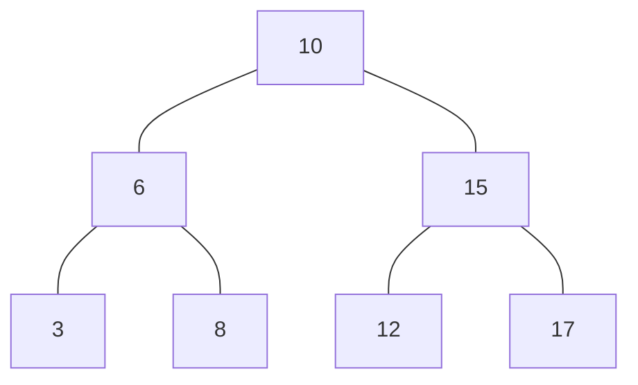

# Recorridos (inorder, preorder, postorder, BFS, DFS)

Un **recorrido** (transversal en inglés) es una estrategia para visitar todos los nodos de un árbol en un orden específico. Los dos enfoques más comunes son:

## DFS - Búsqueda en Profundidad (Depth-First Search)

El recorrido DFS explora lo más profundo posible por cada rama antes de retroceder. Tiene **3 variantes** principales para árboles binarios:

|Tipo|Orden de visita|
|--|--|
|Inorden|izquierda → raíz → derecha|
|Preorden|raíz → izquierda → derecha|
|Postorden|izquierda → derecha → raíz|

## BFS - Búsqueda en Amplitud (Breadth-First Search)

BFS explora el árbol **nivel por nivel**, de izquierda a derecha. Utiliza una cola (queue) para mantener el orden de visita. Un ejemplo de recorrido BFS sería:



Recorrido BFS: 10 → 6 → 15 → 3 → 8 → 12 → 17

## Ejemplo técnico

import Tabs from '@theme/Tabs';
import TabItem from '@theme/TabItem';

<Tabs>
<TabItem value="java" label="Paradigma: Orientado a Objetos">

<Tabs>
<TabItem value="code" label="Código Java Ejemplo">

```java showLineNumbers title="BinaryNode.java"
public class BinaryNode {
    public int value;
    public BinaryNode left;
    public BinaryNode right;

    public BinaryNode(int value) {
        this.value = value;
    }
}
```

```java showLineNumbers tittle="BinaryTree.java"
import java.util.*;

public class BinaryTree {
    private BinaryNode root;

    public void setRoot(BinaryNode root) {
        this.root = root;
    }

    public List<Integer> bfs() {
        List<Integer> result = new ArrayList<>();
        if (root == null) return result;

        Queue<BinaryNode> queue = new LinkedList<>();
        queue.offer(root);

        while (!queue.isEmpty()) {
            BinaryNode current = queue.poll();
            result.add(current.value);

            if (current.left != null) queue.offer(current.left);
            if (current.right != null) queue.offer(current.right);
        }

        return result;
    }
}
```

</TabItem>
<TabItem value="test" label="Test Unitario">

```java showLineNumbers
import org.junit.jupiter.api.Test;
import java.util.List;

import static org.junit.jupiter.api.Assertions.*;

class BinaryTreeTest {

    @Test
    void testBFS() {
        // Construcción del árbol (ejemplo arriba)
        BinaryNode root = new BinaryNode(10);
        root.left = new BinaryNode(6);
        root.right = new BinaryNode(15);
        root.left.left = new BinaryNode(3);
        root.left.right = new BinaryNode(8);
        root.right.left = new BinaryNode(12);
        root.right.right = new BinaryNode(17);

        BinaryTree tree = new BinaryTree();
        tree.setRoot(root);

        List<Integer> expected = List.of(10, 6, 15, 3, 8, 12, 17);
        List<Integer> actual = tree.bfs();

        assertEquals(expected, actual, "BFS traversal should return nodes level by level.");
    }
}
```

</TabItem>
</Tabs>

</TabItem>
<TabItem value="python" label="Paradigma: Procedural">

<Tabs>
<TabItem value="code" label="Código Python Ejemplo">

```py showLineNumbers
from collections import deque
from typing import Optional, Dict, List

def create_node(value: int, left=None, right=None) -> Dict:
    return {"value": value, "left": left, "right": right}

def bfs_traversal(root: Optional[Dict]) -> List[int]:
    if root is None:
        return []

    result = []
    queue = deque([root])

    while queue:
        node = queue.popleft()
        result.append(node["value"])

        if node["left"]:
            queue.append(node["left"])
        if node["right"]:
            queue.append(node["right"])

    return result
```

</TabItem>
<TabItem value="test" label="Test Unitario">

```python showLineNumbers
import unittest
from binary_tree import create_node, bfs_traversal

class TestBinaryTree(unittest.TestCase):
    def test_bfs_traversal(self):
        # Construcción del árbol (ejemplo arriba)
        tree = create_node(10,
            left=create_node(6,
                left=create_node(3),
                right=create_node(8)),
            right=create_node(15,
                left=create_node(12),
                right=create_node(17))
        )

        expected = [10, 6, 15, 3, 8, 12, 17]
        result = bfs_traversal(tree)

        self.assertEqual(result, expected)

if __name__ == "__main__":
    unittest.main()
```

</TabItem>
</Tabs>

</TabItem>
<TabItem value="ts" label="Paradigma: Funcional">

<Tabs>
<TabItem value="code" label="Código TypeScript Ejemplo">

```ts showLineNumbers

export type BinaryNode = {
  value: number;
  left: BinaryNode | null;
  right: BinaryNode | null;
};

export const bfs = (root: BinaryNode | null, visit: (v: number) => void): void => {
  if (!root) return;

  const queue: BinaryNode[] = [root];

  while (queue.length > 0) {
    const node = queue.shift()!;
    visit(node.value);
    if (node.left) queue.push(node.left);
    if (node.right) queue.push(node.right);
  }
};
```

</TabItem>
<TabItem value="test" label="Test Unitario">

```ts showLineNumbers
import { describe, it, expect } from "vitest";
import { bfs, BinaryNode } from "./binaryTree";

const createTree = (): BinaryNode => ({
  value: 10,
  left: {
    value: 6,
    left: { value: 3, left: null, right: null },
    right: { value: 8, left: null, right: null }
  },
  right: {
    value: 15,
    left: { value: 12, left: null, right: null },
    right: { value: 17, left: null, right: null }
  }
});

describe("bfs()", () => {
  it("should return values in level-order", () => {
    const tree = createTree();
    const values: number[] = [];

    bfs(tree, (val) => values.push(val));

    expect(values).toEqual([10, 6, 15, 3, 8, 12, 17]);
  });

  it("should handle null tree", () => {
    const values: number[] = [];
    bfs(null, (val) => values.push(val));
    expect(values).toEqual([]);
  });
});
```

</TabItem>
</Tabs>

</TabItem>
</Tabs>

## Aplicaciones prácticas

|Algoritmo|Uso Común|
|--|--|
|BFS|Juegos, AI, rutas más cortas (Dijkstra), redes|
|DFS|Verificación de conectividad, parsers, estructuras anidadas|
|Inorden|Recuperar datos ordenados|
|Preorden|Serializar árboles|
|Postorden|Eliminar estructuras recursivas|

## Referencias

- Cormen, T. H., Leiserson, C. E., Rivest, R. L., & Stein, C. (2009). [Introduction to Algorithms (3rd ed.). MIT Press.](https://mitpress.mit.edu/9780262033848/introduction-to-algorithms/)
- Sedgewick, R., & Wayne, K. (2011). [Algorithms (4th ed.). Addison-Wesley.](https://algs4.cs.princeton.edu/home/)
- GeeksforGeeks. (2024). [Tree Traversals (Inorder, Preorder and Postorder).](https://www.geeksforgeeks.org/tree-traversals-inorder-preorder-and-postorder/)
