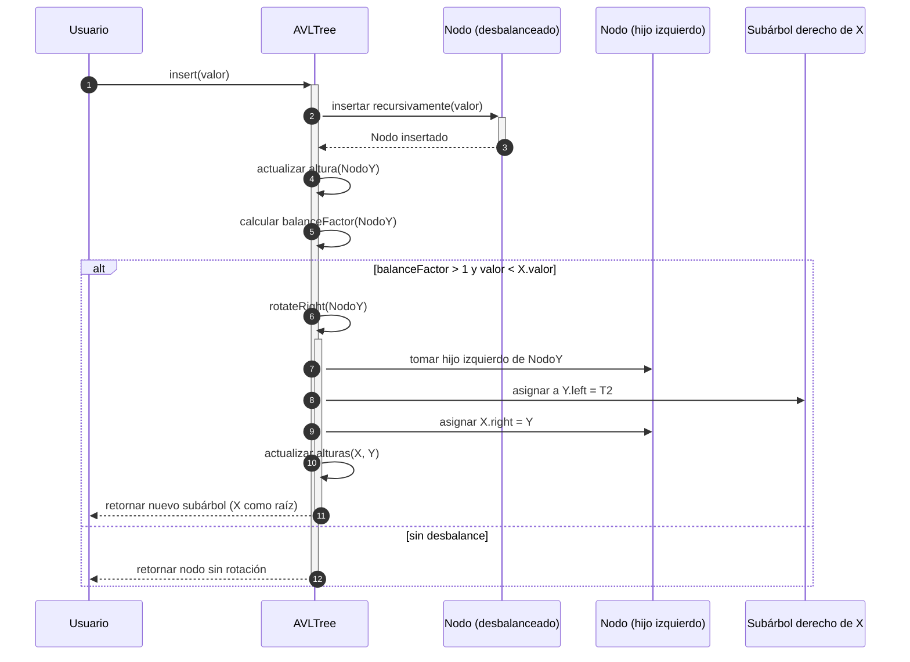
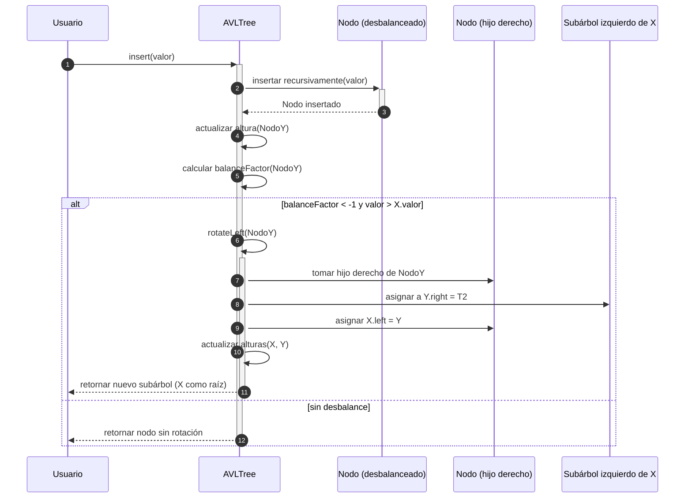
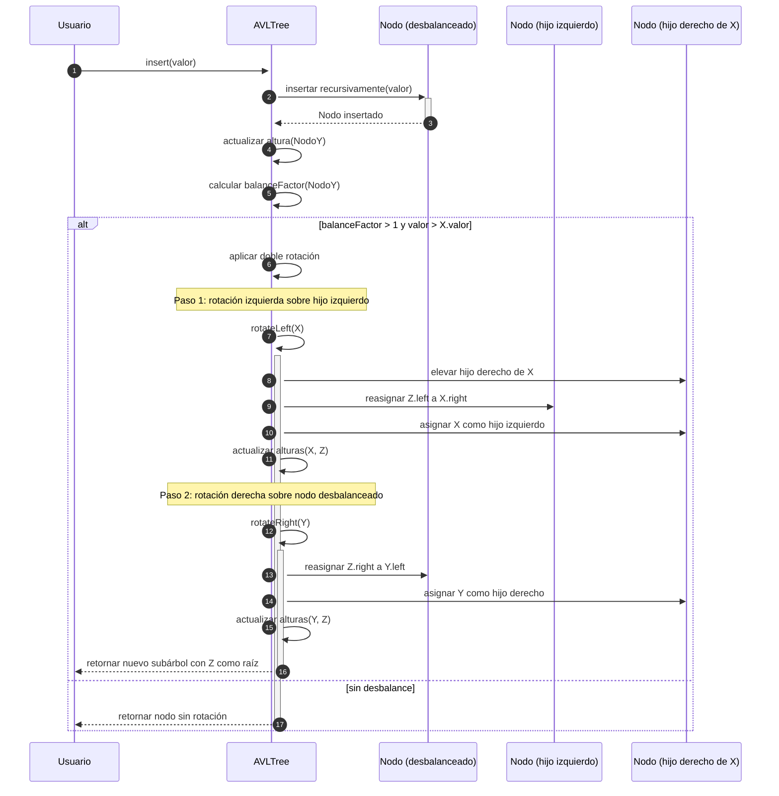
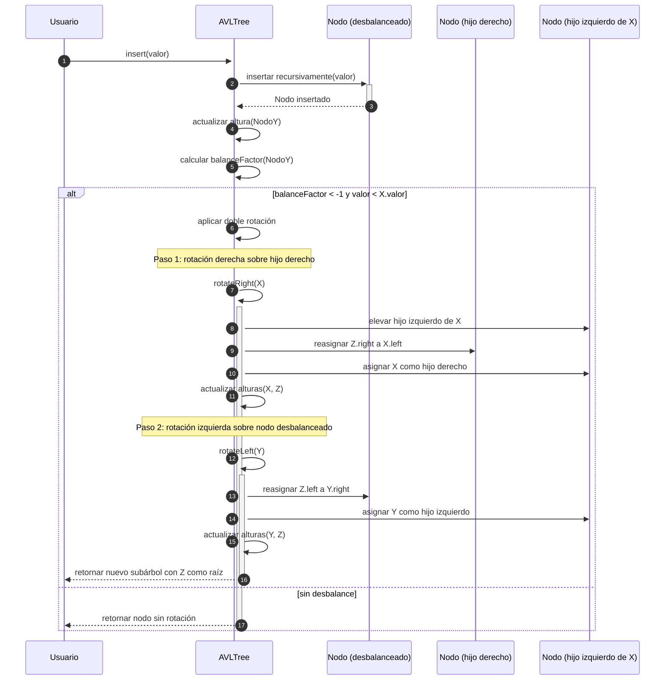

# Árboles autobalanceados AVL

Un Árbol AVL es un tipo de **árbol binario** de **búsqueda autobalanceado**, propuesto en 1962 por G. M. Adelson-Velsky y E. M. Landis. Su característica principal es que **mantiene el equilibrio de alturas entre los subárboles izquierdo y derecho** de cada nodo, lo que garantiza una complejidad de búsqueda, inserción y eliminación en tiempo $O(log n)$.

## ¿Qué es el equilibrio?

Para cada nodo, se define un factor de balance como:

$$$
balanceFactor = altura(izquierdo) - altura(derecho)
$$$

El árbol está balanceado si `balanceFactor ∈ {-1, 0, 1}` para todos los nodos.

## Razonamiento

Si un árbol binario de búsqueda se **desbalancea** (por ejemplo, por muchas inserciones ordenadas), se vuelve una estructura lineal y pierde eficiencia.

Los árboles AVL realizan **rotaciones** para mantener el equilibrio.

## Rotaciones

Los árboles AVL se **autobalancean** después de cada operación, y para hacerlo, utilizan **rotaciones** que reorganizan la estructura del árbol sin perder la propiedad del **árbol binario de búsqueda** (BST).

Cuando un nodo se desbalancea, es porque su `balanceFactor` está fuera del rango `[-1, 0, 1]`. Para corregirlo, se identifican cuatro casos posibles:

- Rotación simple izquierda-izquierda (**LL Rotation**)
- Rotación simple derecha-derecha (**RR Rotation**)
- Rotación doble izquierda-derecha (**LR Rotation**)
- Rotación doble derecha-izquierda (**RL Rotation**)

> El nombre de la rotación describe la causa del desequilibrio en un árbol AVL, no el tipo de rotación que se realiza.

### Rotación simple Izquierda-Izquierda (LL Rotation)

Ocurre cuando se inserta un nodo en el **subárbol izquierdo del hijo izquierdo** del nodo desbalanceado. Por ejemplo:

```txt
Antes de la rotación (desbalance a la izquierda):

        30
       /
     20
    /
  10

Después de la rotación:

      20
     /  \
   10    30
```

Para aplicar la rotación se realiza la siguiente operación:

- Se eleva el hijo izquierdo.
- El nodo desbalanceado pasa a ser hijo derecho del nuevo nodo raíz.



1. El usuario inserta un valor que **causa un desbalance hacia la izquierda**.
(Ejemplo: insertar 30, 20, 10 en ese orden).
2. El árbol detecta que `balanceFactor > 1` y que el valor se insertó en el subárbol izquierdo del hijo izquierdo (**LL**).
3. Se ejecuta una rotación simple a la derecha (`rotateRight`):
   - El hijo izquierdo (`X`) se convierte en la nueva raíz del subárbol.
   - El nodo desbalanceado (`Y`) pasa a ser hijo derecho de `X`.
   - El subárbol derecho de X (`T2`) se reasigna como hijo izquierdo de `Y`.
4. Se actualizan las alturas y el subárbol queda balanceado nuevamente.

```txt
Antes:
        Y(30)
       /
     X(20)
    /
  Z(10)

Después de rotación:
       X(20)
      /   \
   Z(10)  Y(30)
```

### Rotación simple Derecha-Derecha (RR Rotation)

Ocurre cuando se inserta un nodo en el **subárbol derecho del hijo derecho** del nodo desbalanceado. Por ejemplo:

```txt
Antes:

    10
      \
      20
        \
        30

Después:

      20
     /  \
   10    30
```

Para aplicar la rotación se realiza la siguiente operación:

- Se eleva el hijo derecho
- El nodo desbalanceado se convierte en hijo izquierdo del nuevo nodo raíz.



1. El usuario inserta un valor en el **subárbol derecho del hijo derecho**, provocando un desbalance hacia la derecha.
2. El `balanceFactor` del nodo (Y) es menor que `-1`, y se detecta un patrón `RR`.
3. Se ejecuta `rotateLeft(Y)`:
   - El hijo derecho (`X`) se eleva como nueva raíz del subárbol.
   - El nodo desbalanceado (`Y`) se convierte en hijo izquierdo de `X`.
   - El subárbol izquierdo de `X` (T2) se reasigna como hijo derecho de `Y`.
4. Se actualizan las alturas y se retorna el subárbol balanceado.

```txt
Antes:
      Y(10)
        \
         X(20)
           \
           Z(30)

Después de rotación:
         X(20)
        /    \
     Y(10)   Z(30)
```

### Rotation doble Izquierda-Derecha (LR Rotation)

Ocurre cuando se inserta un nodo en el **subárbol derecho del hijo izquierdo** del nodo desbalanceado. Por ejemplo:

```txt
Antes:

        30
       /
     10
       \
       20

Después (rotación doble):

        20
       /  \
     10    30
```

Para aplicar la rotación se realiza la siguiente operación:

- Rotación simple a la izquierda sobre el hijo izquierdo (`10 → 20`).
- Luego, rotación simple a la derecha sobre el nodo desbalanceado (`30 → 20`).



1. Se inserta un nodo (`Z`) que va al **subárbol derecho del hijo izquierdo** (`X`) de un nodo (`Y`) desbalanceado.
2. Se detecta que es un caso LR.
3. Primero, se hace una rotación izquierda sobre `X` → `Z` se convierte en nuevo subárbol izquierdo de `Y`.
4. Luego, se hace una rotación derecha sobre `Y` → `Z` se convierte en raíz del subárbol balanceado.

```txt
Antes de la rotación:

       Y(30)
       /
     X(10)
       \
       Z(20)

Después de rotación doble:

        Z(20)
       /    \
    X(10)   Y(30)
```

### Rotación doble Derecha-Izquierda (RL Rotation)

Ocurre cuando se inserta un nodo en el **subárbol izquierdo del hijo derecho** del nodo desbalanceado. Por ejemplo:

```txt
Antes:

      10
         \
         30
        /
      20

Después:

      20
     /  \
   10    30
```

Para aplicar la rotación se realiza la siguiente operación:

- Rotación simple a la derecha sobre el hijo derecho (`30 → 20`).
- Luego, rotación simple a la izquierda sobre el nodo desbalanceado (`10 → 20`).



1. Se inserta un nodo (`Z`) que cae en el **subárbol izquierdo del hijo derecho** (`X`) de un nodo (`Y`) desbalanceado.
2. Se detecta el patrón RL.
3. Primero se hace una rotación derecha sobre `X` → `Z` sube.
4. Luego se hace una rotación izquierda sobre `Y` → `Z` se convierte en la nueva raíz del subárbol balanceado.
5. Se actualizan las alturas.

```txt
Antes de la rotación:

      Y(10)
         \
         X(30)
        /
      Z(20)

Después de rotación doble:

        Z(20)
       /    \
    Y(10)   X(30)
```

### Reglas prácticas para detectar la rotación necesaria

|Balance Factor del nodo|Dirección de inserción|Tipo de Rotación|
|-----------------------|----------------------|----------------|
|> +1|subárbol izquierdo|LL|
|> +1|subárbol derecho|LR|
|< -1|subárbol derecho|RR|
|< -1|subárbol izquierdo|RL|

## Ejemplo Técnico

import Tabs from '@theme/Tabs';
import TabItem from '@theme/TabItem';

<Tabs>
<TabItem value="java" label="Paradigma: Orientado a Objetos">

<Tabs>
<TabItem value="code" label="Código Java Ejemplo">

```java showLineNumbers title="AVLNode.java"
package edu.usta.domain.avl;

public class AVLNode {
    public int value;
    public int height;
    public AVLNode left;
    public AVLNode right;

    public AVLNode(int value) {
        this.value = value;
        this.height = 1;
    }
}
```

```java showLineNumbers title="AVLTree.java"
package edu.usta.domain.avl;

public class AVLTree {

    private AVLNode root;

    public void insert(int value) {
        root = insert(root, value);
    }

    public AVLNode getRoot() {
        return root;
    }

    private AVLNode insert(AVLNode node, int value) {
        if (node == null) return new AVLNode(value);

        if (value < node.value)
            node.left = insert(node.left, value);
        else if (value > node.value)
            node.right = insert(node.right, value);
        else
            return node; // No duplicates

        updateHeight(node);
        return balance(node);
    }

    private void updateHeight(AVLNode node) {
        int leftHeight = height(node.left);
        int rightHeight = height(node.right);
        node.height = 1 + Math.max(leftHeight, rightHeight);
    }

    private int height(AVLNode node) {
        return node != null ? node.height : 0;
    }

    private int getBalance(AVLNode node) {
        return (node == null) ? 0 : height(node.left) - height(node.right);
    }

    private AVLNode balance(AVLNode node) {
        int balance = getBalance(node);

        // LL Case
        if (balance > 1 && getBalance(node.left) >= 0)
            return rotateRight(node);

        // RR Case
        if (balance < -1 && getBalance(node.right) <= 0)
            return rotateLeft(node);

        // LR Case
        if (balance > 1 && getBalance(node.left) < 0) {
            node.left = rotateLeft(node.left);
            return rotateRight(node);
        }

        // RL Case
        if (balance < -1 && getBalance(node.right) > 0) {
            node.right = rotateRight(node.right);
            return rotateLeft(node);
        }

        return node;
    }

    private AVLNode rotateLeft(AVLNode y) {
        AVLNode x = y.right;
        AVLNode T2 = x.left;

        x.left = y;
        y.right = T2;

        updateHeight(y);
        updateHeight(x);

        return x;
    }

    private AVLNode rotateRight(AVLNode y) {
        AVLNode x = y.left;
        AVLNode T2 = x.right;

        x.right = y;
        y.left = T2;

        updateHeight(y);
        updateHeight(x);

        return x;
    }

    // In-order traversal for testing
    public String inOrder() {
        StringBuilder sb = new StringBuilder();
        inOrder(root, sb);
        return sb.toString().trim();
    }

    private void inOrder(AVLNode node, StringBuilder sb) {
        if (node != null) {
            inOrder(node.left, sb);
            sb.append(node.value).append(" ");
            inOrder(node.right, sb);
        }
    }
}
```

</TabItem>
<TabItem value="test" label="Test Unitario">

```java showLineNumbers
package edu.usta.domain.avl;

import org.junit.jupiter.api.Test;

import static org.junit.jupiter.api.Assertions.*;

class AVLTreeTest {

    @Test
    void testInsertLLCase() {
        AVLTree tree = new AVLTree();
        tree.insert(30);
        tree.insert(20);
        tree.insert(10);

        assertEquals("10 20 30", tree.inOrder());
        assertEquals(20, tree.getRoot().value);
    }

    @Test
    void testInsertRRCase() {
        AVLTree tree = new AVLTree();
        tree.insert(10);
        tree.insert(20);
        tree.insert(30);

        assertEquals("10 20 30", tree.inOrder());
        assertEquals(20, tree.getRoot().value);
    }

    @Test
    void testInsertLRCase() {
        AVLTree tree = new AVLTree();
        tree.insert(30);
        tree.insert(10);
        tree.insert(20);

        assertEquals("10 20 30", tree.inOrder());
        assertEquals(20, tree.getRoot().value);
    }

    @Test
    void testInsertRLCase() {
        AVLTree tree = new AVLTree();
        tree.insert(10);
        tree.insert(30);
        tree.insert(20);

        assertEquals("10 20 30", tree.inOrder());
        assertEquals(20, tree.getRoot().value);
    }
}
```

</TabItem>
</Tabs>

</TabItem>
<TabItem value="python" label="Paradigma: Procedural">

<Tabs>
<TabItem value="code" label="Código Python Ejemplo">

```py showLineNumbers
def create_node(value):
    return {
        "value": value,
        "left": None,
        "right": None,
        "height": 1
    }

def height(node):
    return node["height"] if node else 0

def update_height(node):
    node["height"] = 1 + max(height(node["left"]), height(node["right"]))

def get_balance(node):
    return height(node["left"]) - height(node["right"]) if node else 0

def rotate_left(y):
    x = y["right"]
    T2 = x["left"]

    x["left"] = y
    y["right"] = T2

    update_height(y)
    update_height(x)
    return x

def rotate_right(x):
    y = x["left"]
    T2 = y["right"]

    y["right"] = x
    x["left"] = T2

    update_height(x)
    update_height(y)
    return y

def balance(node):
    update_height(node)
    balance_factor = get_balance(node)

    # LL
    if balance_factor > 1 and get_balance(node["left"]) >= 0:
        return rotate_right(node)

    # RR
    if balance_factor < -1 and get_balance(node["right"]) <= 0:
        return rotate_left(node)

    # LR
    if balance_factor > 1 and get_balance(node["left"]) < 0:
        node["left"] = rotate_left(node["left"])
        return rotate_right(node)

    # RL
    if balance_factor < -1 and get_balance(node["right"]) > 0:
        node["right"] = rotate_right(node["right"])
        return rotate_left(node)

    return node

def insert(node, value):
    if node is None:
        return create_node(value)
    
    if value < node["value"]:
        node["left"] = insert(node["left"], value)
    elif value > node["value"]:
        node["right"] = insert(node["right"], value)
    else:
        return node  # No se permiten duplicados

    return balance(node)

def in_order(node):
    if node is None:
        return []
    return in_order(node["left"]) + [node["value"]] + in_order(node["right"])
```

</TabItem>
<TabItem value="test" label="Test Unitario">

```py showLineNumbers
import unittest
from avl_procedural import insert, in_order

class TestAVLProcedural(unittest.TestCase):
    def test_insert_balanced(self):
        root = None
        for value in [30, 20, 10]:  # Caso LL
            root = insert(root, value)
        self.assertEqual(in_order(root), [10, 20, 30])
        self.assertEqual(root["value"], 20)

        root = None
        for value in [10, 20, 30]:  # Caso RR
            root = insert(root, value)
        self.assertEqual(in_order(root), [10, 20, 30])
        self.assertEqual(root["value"], 20)

        root = None
        for value in [30, 10, 20]:  # Caso LR
            root = insert(root, value)
        self.assertEqual(in_order(root), [10, 20, 30])
        self.assertEqual(root["value"], 20)

        root = None
        for value in [10, 30, 20]:  # Caso RL
            root = insert(root, value)
        self.assertEqual(in_order(root), [10, 20, 30])
        self.assertEqual(root["value"], 20)

if __name__ == "__main__":
    unittest.main()
```

</TabItem>
</Tabs>

</TabItem>
<TabItem value="ts" label="Paradigma: Funcional">

<Tabs>
<TabItem value="code" label="Código TypeScript Ejemplo">

```ts showLineNumbers
// Tipado del nodo
export type AVLNode = {
  value: number
  height: number
  left: AVLNode | null
  right: AVLNode | null
}

// Función para crear nodo
export const createNode = (value: number): AVLNode => ({
  value,
  height: 1,
  left: null,
  right: null
})

export const height = (node: AVLNode | null): number =>
  node ? node.height : 0

export const updateHeight = (node: AVLNode): AVLNode => ({
  ...node,
  height: 1 + Math.max(height(node.left), height(node.right))
})

export const getBalance = (node: AVLNode): number =>
  height(node.left) - height(node.right)

// Rotaciones

export const rotateRight = (y: AVLNode): AVLNode => {
  const x = y.left!
  const T2 = x.right

  const newY = updateHeight({ ...y, left: T2 })
  const newX = updateHeight({ ...x, right: newY })

  return newX
}

export const rotateLeft = (x: AVLNode): AVLNode => {
  const y = x.right!
  const T2 = y.left

  const newX = updateHeight({ ...x, right: T2 })
  const newY = updateHeight({ ...y, left: newX })

  return newY
}

// Balancear nodo
export const balance = (node: AVLNode): AVLNode => {
  const bf = getBalance(node)

  // LL
  if (bf > 1 && getBalance(node.left!) >= 0)
    return rotateRight(node)

  // RR
  if (bf < -1 && getBalance(node.right!) <= 0)
    return rotateLeft(node)

  // LR
  if (bf > 1 && getBalance(node.left!) < 0) {
    const newLeft = rotateLeft(node.left!)
    return rotateRight({ ...node, left: newLeft })
  }

  // RL
  if (bf < -1 && getBalance(node.right!) > 0) {
    const newRight = rotateRight(node.right!)
    return rotateLeft({ ...node, right: newRight })
  }

  return updateHeight(node)
}

// Inserción
export const insert = (node: AVLNode | null, value: number): AVLNode => {
  if (!node) return createNode(value)

  if (value < node.value)
    return balance({ ...node, left: insert(node.left, value) })
  if (value > node.value)
    return balance({ ...node, right: insert(node.right, value) })

  return node // duplicados no permitidos
}

// Recorrido inorden para prueba
export const inOrder = (node: AVLNode | null): number[] => {
  if (!node) return []
  return [...inOrder(node.left), node.value, ...inOrder(node.right)]
}
```

</TabItem>
<TabItem value="test" label="Test Unitario">

```ts showLineNumbers
import { insert, inOrder } from './avlFunctional'

describe('AVL Functional Tests', () => {
  test('should balance LL case', () => {
    let root = null
    root = insert(root, 30)
    root = insert(root, 20)
    root = insert(root, 10)
    expect(inOrder(root)).toEqual([10, 20, 30])
    expect(root?.value).toBe(20)
  })

  test('should balance RR case', () => {
    let root = null
    root = insert(root, 10)
    root = insert(root, 20)
    root = insert(root, 30)
    expect(inOrder(root)).toEqual([10, 20, 30])
    expect(root?.value).toBe(20)
  })

  test('should balance LR case', () => {
    let root = null
    root = insert(root, 30)
    root = insert(root, 10)
    root = insert(root, 20)
    expect(inOrder(root)).toEqual([10, 20, 30])
    expect(root?.value).toBe(20)
  })

  test('should balance RL case', () => {
    let root = null
    root = insert(root, 10)
    root = insert(root, 30)
    root = insert(root, 20)
    expect(inOrder(root)).toEqual([10, 20, 30])
    expect(root?.value).toBe(20)
  })
})
```

</TabItem>
</Tabs>

</TabItem>
</Tabs>

## Aplicaciones reales

- Bases de datos (cuando no se usa un árbol B)
- Indexación en estructuras de ficheros
- Sistemas de archivos (por ejemplo, ext4 usa AVL internamente)
- Compiladores (símbolos equilibrados)

## Referencias

- Cormen, T. H., Leiserson, C. E., Rivest, R. L., & Stein, C. (2009). [Introduction to Algorithms (3rd ed.). MIT Press.](https://mitpress.mit.edu/9780262033848/introduction-to-algorithms/)
- Goodrich, M. T., Tamassia, R., & Goldwasser, M. H. (2014). Data Structures and Algorithms in Java (6th ed.). Wiley.
- GeeksforGeeks. (2024). [AVL Tree.](https://www.geeksforgeeks.org/avl-tree-set-1-insertion/)
