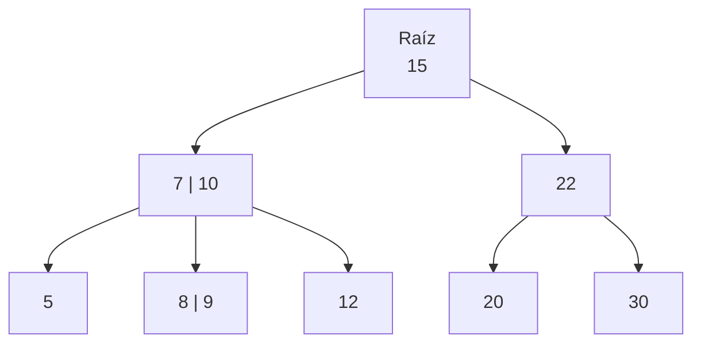
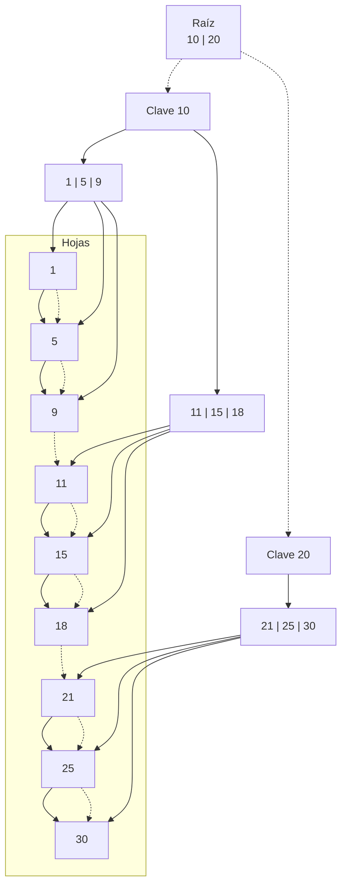

# Árboles B y B+

## ¿Qué es un Árbol B?

Un **Árbol B** (B-Tree) es una estructura de datos auto-balanceada de búsqueda generalizada, diseñada para trabajar eficientemente con sistemas de almacenamiento secundario (como discos duros o bases de datos). Fue desarrollado por Bayer y McCreight en 1972.

Se usa ampliamente en sistemas de archivos, gestores de bases de datos y sistemas indexados, donde las operaciones de inserción, eliminación y búsqueda deben mantenerse en tiempo logarítmico incluso con grandes volúmenes de datos.

## Características principales de un Árbol B (orden m)

- Cada nodo interno puede tener como máximo `m` hijos.
- Cada nodo (excepto la raíz) tiene al menos `[m⁄2]` hijos.
- Cada nodo contiene `k` **claves**, donde `⌈m⁄2⌉−1 ≤ k ≤ m−1`.
- Todos los **datos están distribuidos en nodos internos y hojas**.
- Las **hojas están al mismo nivel**.
- El árbol se **rebalancea mediante divisiones de nodos** cuando se insertan elementos.

## ¿Qué es un Árbol B+?

Un **Árbol B+** (B+ Tree) es una variación del Árbol B con diferencias clave:

- **Solo las hojas almacenan los datos** reales.
- Los **nodos internos solo contienen claves de guía**.
- Las **hojas están enlazadas secuencialmente**, facilitando recorridos en orden.
- Ofrece **mejor rendimiento en búsquedas y rangos** de valores.

## Diferencia entre Árbol B y Árbol B+

|Característica|Árbol B|Árbol B+|
|--|--|--|
|Almacenamiento de datos|Nodos internos y hojas|Solo en hojas|
|Recorridos secuenciales|No optimizados|Eficientes (listas enlazadas)|
|Nodos hoja enlazados|No|Sí|
|Claves en nodos internos|Pueden contener datos|Solo claves|

## Estructura de un árbol B (orden 3)



## Estructura de un árbol B+ (orden 3)



## Ejemplo técnico B Tree

import Tabs from '@theme/Tabs';
import TabItem from '@theme/TabItem';

<Tabs>
<TabItem value="java" label="Paradigma: Orientado a Objetos">

<Tabs>
<TabItem value="code" label="Código Java Ejemplo">

```java showLineNumbers title="BTreeNode.java"
public class BTreeNode {
    int[] keys;
    int t; // Grado mínimo
    BTreeNode[] children;
    int numKeys;
    boolean isLeaf;

    public BTreeNode(int t, boolean isLeaf) {
        this.t = t;
        this.isLeaf = isLeaf;
        this.keys = new int[2 * t - 1];
        this.children = new BTreeNode[2 * t];
        this.numKeys = 0;
    }

    public void traverse() {
        for (int i = 0; i < numKeys; i++) {
            if (!isLeaf) children[i].traverse();
            System.out.print(keys[i] + " ");
        }
        if (!isLeaf) children[numKeys].traverse();
    }

    public BTreeNode search(int key) {
        int i = 0;
        while (i < numKeys && key > keys[i]) i++;
        if (i < numKeys && keys[i] == key) return this;
        if (isLeaf) return null;
        return children[i].search(key);
    }

    public void insertNonFull(int key) {
        int i = numKeys - 1;
        if (isLeaf) {
            while (i >= 0 && keys[i] > key) {
                keys[i + 1] = keys[i];
                i--;
            }
            keys[i + 1] = key;
            numKeys++;
        } else {
            while (i >= 0 && keys[i] > key) i--;
            if (children[i + 1].numKeys == 2 * t - 1) {
                splitChild(i + 1, children[i + 1]);
                if (keys[i + 1] < key) i++;
            }
            children[i + 1].insertNonFull(key);
        }
    }

    public void splitChild(int i, BTreeNode y) {
        BTreeNode z = new BTreeNode(y.t, y.isLeaf);
        z.numKeys = t - 1;

        for (int j = 0; j < t - 1; j++)
            z.keys[j] = y.keys[j + t];

        if (!y.isLeaf)
            for (int j = 0; j < t; j++)
                z.children[j] = y.children[j + t];

        y.numKeys = t - 1;

        for (int j = numKeys; j >= i + 1; j--)
            children[j + 1] = children[j];

        children[i + 1] = z;

        for (int j = numKeys - 1; j >= i; j--)
            keys[j + 1] = keys[j];

        keys[i] = y.keys[t - 1];
        numKeys++;
    }

    // Eliminación
    public void remove(int key) {
        int idx = findKey(key);

        if (idx < numKeys && keys[idx] == key) {
            if (isLeaf)
                removeFromLeaf(idx);
            else
                removeFromNonLeaf(idx);
        } else {
            if (isLeaf) return; // No existe

            boolean flag = (idx == numKeys);

            if (children[idx].numKeys < t)
                fill(idx);

            if (flag && idx > numKeys)
                children[idx - 1].remove(key);
            else
                children[idx].remove(key);
        }
    }

    private int findKey(int key) {
        int idx = 0;
        while (idx < numKeys && keys[idx] < key) ++idx;
        return idx;
    }

    private void removeFromLeaf(int idx) {
        for (int i = idx + 1; i < numKeys; ++i)
            keys[i - 1] = keys[i];
        numKeys--;
    }

    private void removeFromNonLeaf(int idx) {
        int k = keys[idx];
        if (children[idx].numKeys >= t) {
            int pred = getPredecessor(idx);
            keys[idx] = pred;
            children[idx].remove(pred);
        } else if (children[idx + 1].numKeys >= t) {
            int succ = getSuccessor(idx);
            keys[idx] = succ;
            children[idx + 1].remove(succ);
        } else {
            merge(idx);
            children[idx].remove(k);
        }
    }

    private int getPredecessor(int idx) {
        BTreeNode cur = children[idx];
        while (!cur.isLeaf)
            cur = cur.children[cur.numKeys];
        return cur.keys[cur.numKeys - 1];
    }

    private int getSuccessor(int idx) {
        BTreeNode cur = children[idx + 1];
        while (!cur.isLeaf)
            cur = cur.children[0];
        return cur.keys[0];
    }

    private void fill(int idx) {
        if (idx != 0 && children[idx - 1].numKeys >= t)
            borrowFromPrev(idx);
        else if (idx != numKeys && children[idx + 1].numKeys >= t)
            borrowFromNext(idx);
        else {
            if (idx != numKeys)
                merge(idx);
            else
                merge(idx - 1);
        }
    }

    private void borrowFromPrev(int idx) {
        BTreeNode child = children[idx];
        BTreeNode sibling = children[idx - 1];

        for (int i = child.numKeys - 1; i >= 0; --i)
            child.keys[i + 1] = child.keys[i];

        if (!child.isLeaf)
            for (int i = child.numKeys; i >= 0; --i)
                child.children[i + 1] = child.children[i];

        child.keys[0] = keys[idx - 1];

        if (!child.isLeaf)
            child.children[0] = sibling.children[sibling.numKeys];

        keys[idx - 1] = sibling.keys[sibling.numKeys - 1];

        child.numKeys += 1;
        sibling.numKeys -= 1;
    }

    private void borrowFromNext(int idx) {
        BTreeNode child = children[idx];
        BTreeNode sibling = children[idx + 1];

        child.keys[child.numKeys] = keys[idx];

        if (!child.isLeaf)
            child.children[child.numKeys + 1] = sibling.children[0];

        keys[idx] = sibling.keys[0];

        for (int i = 1; i < sibling.numKeys; ++i)
            sibling.keys[i - 1] = sibling.keys[i];

        if (!sibling.isLeaf)
            for (int i = 1; i <= sibling.numKeys; ++i)
                sibling.children[i - 1] = sibling.children[i];

        child.numKeys += 1;
        sibling.numKeys -= 1;
    }

    private void merge(int idx) {
        BTreeNode child = children[idx];
        BTreeNode sibling = children[idx + 1];

        child.keys[t - 1] = keys[idx];

        for (int i = 0; i < sibling.numKeys; ++i)
            child.keys[i + t] = sibling.keys[i];

        if (!child.isLeaf)
            for (int i = 0; i <= sibling.numKeys; ++i)
                child.children[i + t] = sibling.children[i];

        for (int i = idx + 1; i < numKeys; ++i)
            keys[i - 1] = keys[i];

        for (int i = idx + 2; i <= numKeys; ++i)
            children[i - 1] = children[i];

        child.numKeys += sibling.numKeys + 1;
        numKeys--;
    }
}
```

```java showLineNumbers title="BTree.java"
public class BTree {
    private final int t;
    private BTreeNode root;

    public BTree(int t) {
        this.t = t;
        this.root = null;
    }

    public void traverse() {
        if (root != null)
            root.traverse();
    }

    public BTreeNode search(int key) {
        return (root == null) ? null : root.search(key);
    }

    public void insert(int key) {
        if (root == null) {
            root = new BTreeNode(t, true);
            root.keys[0] = key;
            root.numKeys = 1;
        } else {
            if (root.numKeys == 2 * t - 1) {
                BTreeNode s = new BTreeNode(t, false);
                s.children[0] = root;
                s.splitChild(0, root);

                int i = 0;
                if (s.keys[0] < key)
                    i++;
                s.children[i].insertNonFull(key);

                root = s;
            } else {
                root.insertNonFull(key);
            }
        }
    }

    public void delete(int key) {
        if (root == null)
            return;

        root.remove(key);

        if (root.numKeys == 0) {
            root = (root.isLeaf) ? null : root.children[0];
        }
    }
}
```

</TabItem>
<TabItem value="test" label="Test Unitario">

```java showLineNumbers
import org.junit.jupiter.api.Test;
import static org.junit.jupiter.api.Assertions.*;

public class BTreeTest {

    @Test
    void testInsertAndSearch() {
        BTree tree = new BTree(3);
        tree.insert(10);
        tree.insert(20);
        tree.insert(5);
        tree.insert(6);
        tree.insert(12);
        tree.insert(30);
        tree.insert(7);
        tree.insert(17);

        assertNotNull(tree.search(6));
        assertNotNull(tree.search(17));
        assertNull(tree.search(99));
    }

    @Test
    void testDelete() {
        BTree tree = new BTree(3);
        int[] keys = {10, 20, 5, 6, 12, 30, 7, 17};

        for (int key : keys) tree.insert(key);
        tree.delete(6);
        assertNull(tree.search(6));

        tree.delete(13); // no error
        assertNull(tree.search(13));
    }

    @Test
    void testTraverse() {
        BTree tree = new BTree(3);
        tree.insert(1);
        tree.insert(3);
        tree.insert(2);
        tree.insert(5);
        tree.insert(4);
        tree.traverse(); // should print in order
    }
}
```

</TabItem>
</Tabs>

</TabItem>
<TabItem value="python" label="Paradigma: Procedural">

<Tabs>
<TabItem value="code" label="Código Python Ejemplo">

```py showLineNumbers
from typing import Optional, List

def create_node(t: int, is_leaf: bool) -> dict:
    return {
        "keys": [],
        "children": [],
        "is_leaf": is_leaf,
        "t": t
    }

def search(node: Optional[dict], key: int) -> Optional[dict]:
    if node is None:
        return None
    i = 0
    while i < len(node["keys"]) and key > node["keys"][i]:
        i += 1
    if i < len(node["keys"]) and node["keys"][i] == key:
        return node
    if node["is_leaf"]:
        return None
    return search(node["children"][i], key)

def traverse(node: Optional[dict]) -> None:
    if node is None:
        return
    for i in range(len(node["keys"])):
        if not node["is_leaf"]:
            traverse(node["children"][i])
        print(node["keys"][i], end=' ')
    if not node["is_leaf"]:
        traverse(node["children"][len(node["keys"])])

def split_child(parent: dict, i: int, t: int) -> None:
    y = parent["children"][i]
    z = create_node(t, y["is_leaf"])
    z["keys"] = y["keys"][t:]
    if not y["is_leaf"]:
        z["children"] = y["children"][t:]
    y["keys"] = y["keys"][:t - 1]
    y["children"] = y["children"][:t] if not y["is_leaf"] else y["children"]
    parent["children"].insert(i + 1, z)
    parent["keys"].insert(i, y["keys"].pop())

def insert_non_full(node: dict, key: int) -> None:
    i = len(node["keys"]) - 1
    if node["is_leaf"]:
        node["keys"].append(0)
        while i >= 0 and key < node["keys"][i]:
            node["keys"][i + 1] = node["keys"][i]
            i -= 1
        node["keys"][i + 1] = key
    else:
        while i >= 0 and key < node["keys"][i]:
            i -= 1
        i += 1
        if len(node["children"][i]["keys"]) == 2 * node["t"] - 1:
            split_child(node, i, node["t"])
            if key > node["keys"][i]:
                i += 1
        insert_non_full(node["children"][i], key)

def insert(tree: dict, key: int) -> None:
    root = tree["root"]
    if len(root["keys"]) == 2 * root["t"] - 1:
        new_root = create_node(root["t"], False)
        new_root["children"].append(root)
        split_child(new_root, 0, root["t"])
        insert_non_full(new_root, key)
        tree["root"] = new_root
    else:
        insert_non_full(root, key)

def get_predecessor(node: dict) -> int:
    current = node
    while not current["is_leaf"]:
        current = current["children"][-1]
    return current["keys"][-1]

def get_successor(node: dict) -> int:
    current = node
    while not current["is_leaf"]:
        current = current["children"][0]
    return current["keys"][0]

def merge(node: dict, idx: int) -> None:
    t = node["t"]
    child = node["children"][idx]
    sibling = node["children"][idx + 1]
    child["keys"].append(node["keys"].pop(idx))
    child["keys"].extend(sibling["keys"])
    if not child["is_leaf"]:
        child["children"].extend(sibling["children"])
    node["children"].pop(idx + 1)

def fill(node: dict, idx: int) -> None:
    t = node["t"]
    if idx > 0 and len(node["children"][idx - 1]["keys"]) >= t:
        borrow_from_prev(node, idx)
    elif idx < len(node["children"]) - 1 and len(node["children"][idx + 1]["keys"]) >= t:
        borrow_from_next(node, idx)
    else:
        if idx < len(node["children"]) - 1:
            merge(node, idx)
        else:
            merge(node, idx - 1)

def borrow_from_prev(node: dict, idx: int) -> None:
    child = node["children"][idx]
    sibling = node["children"][idx - 1]
    child["keys"].insert(0, node["keys"][idx - 1])
    if not sibling["is_leaf"]:
        child["children"].insert(0, sibling["children"].pop())
    node["keys"][idx - 1] = sibling["keys"].pop()

def borrow_from_next(node: dict, idx: int) -> None:
    child = node["children"][idx]
    sibling = node["children"][idx + 1]
    child["keys"].append(node["keys"][idx])
    if not sibling["is_leaf"]:
        child["children"].append(sibling["children"].pop(0))
    node["keys"][idx] = sibling["keys"].pop(0)

def delete_from_leaf(node: dict, idx: int) -> None:
    node["keys"].pop(idx)

def delete_from_non_leaf(node: dict, idx: int) -> None:
    key = node["keys"][idx]
    if len(node["children"][idx]["keys"]) >= node["t"]:
        pred = get_predecessor(node["children"][idx])
        node["keys"][idx] = pred
        delete(node["children"][idx], pred)
    elif len(node["children"][idx + 1]["keys"]) >= node["t"]:
        succ = get_successor(node["children"][idx + 1])
        node["keys"][idx] = succ
        delete(node["children"][idx + 1], succ)
    else:
        merge(node, idx)
        delete(node["children"][idx], key)

def delete(node: dict, key: int) -> None:
    idx = 0
    while idx < len(node["keys"]) and key > node["keys"][idx]:
        idx += 1

    if idx < len(node["keys"]) and node["keys"][idx] == key:
        if node["is_leaf"]:
            delete_from_leaf(node, idx)
        else:
            delete_from_non_leaf(node, idx)
    else:
        if node["is_leaf"]:
            return  # Key not found
        if len(node["children"][idx]["keys"]) < node["t"]:
            fill(node, idx)
        if idx < len(node["keys"]) and key > node["keys"][idx]:
            idx += 1
        delete(node["children"][idx], key)

def create_btree(t: int) -> dict:
    return {
        "root": create_node(t, True)
    }
```

</TabItem>
<TabItem value="test" label="Test Unitario">

```py showLineNumbers
import unittest
from btree import *

class TestBTreeProcedural(unittest.TestCase):
    def setUp(self):
        self.tree = create_btree(3)
        for key in [10, 20, 5, 6, 12, 30, 7, 17]:
            insert(self.tree, key)

    def test_search(self):
        self.assertIsNotNone(search(self.tree["root"], 12))
        self.assertIsNone(search(self.tree["root"], 100))

    def test_traverse(self):
        traverse(self.tree["root"])  # Output: should be in sorted order

    def test_delete_existing_key(self):
        delete(self.tree["root"], 6)
        self.assertIsNone(search(self.tree["root"], 6))

    def test_delete_non_existing_key(self):
        delete(self.tree["root"], 100)  # No crash
        self.assertIsNone(search(self.tree["root"], 100))

if __name__ == '__main__':
    unittest.main()
```

</TabItem>
</Tabs>

</TabItem>
<TabItem value="ts" label="Paradigma: Funcional">

<Tabs>
<TabItem value="code" label="Código TS Ejemplo">

```ts showLineNumbers
export type BNode = {
  keys: number[];
  children: BNode[];
  isLeaf: boolean;
};

export type BTree = {
  t: number;
  root: BNode;
};

// Crear nodo
export const createNode = (isLeaf: boolean): BNode => ({
  keys: [],
  children: [],
  isLeaf
});

// Crear árbol
export const createBTree = (t: number): BTree => ({
  t,
  root: createNode(true)
});

// Buscar clave
export const search = (node: BNode, key: number): BNode | null => {
  let i = 0;
  while (i < node.keys.length && key > node.keys[i]) i++;
  if (i < node.keys.length && node.keys[i] === key) return node;
  if (node.isLeaf) return null;
  return search(node.children[i], key);
};

// Recorrer árbol
export const traverse = (node: BNode): number[] => {
  let result: number[] = [];
  for (let i = 0; i < node.keys.length; i++) {
    if (!node.isLeaf) result = result.concat(traverse(node.children[i]));
    result.push(node.keys[i]);
  }
  if (!node.isLeaf) result = result.concat(traverse(node.children[node.keys.length]));
  return result;
};

// Dividir hijo
const splitChild = (parent: BNode, i: number, t: number) => {
  const y = parent.children[i];
  const z = createNode(y.isLeaf);
  z.keys = y.keys.splice(t); // mitad superior
  if (!y.isLeaf) z.children = y.children.splice(t);
  const middle = y.keys.splice(t - 1, 1)[0];
  parent.children.splice(i + 1, 0, z);
  parent.keys.splice(i, 0, middle);
};

// Insertar en nodo no lleno
const insertNonFull = (node: BNode, key: number, t: number): void => {
  let i = node.keys.length - 1;
  if (node.isLeaf) {
    node.keys.push(key);
    node.keys.sort((a, b) => a - b);
  } else {
    while (i >= 0 && key < node.keys[i]) i--;
    i++;
    if (node.children[i].keys.length === 2 * t - 1) {
      splitChild(node, i, t);
      if (key > node.keys[i]) i++;
    }
    insertNonFull(node.children[i], key, t);
  }
};

// Insertar
export const insert = (tree: BTree, key: number): void => {
  const { root, t } = tree;
  if (root.keys.length === 2 * t - 1) {
    const newRoot = createNode(false);
    newRoot.children.push(root);
    splitChild(newRoot, 0, t);
    insertNonFull(newRoot, key, t);
    tree.root = newRoot;
  } else {
    insertNonFull(root, key, t);
  }
};

// Obtener predecesor
const getPredecessor = (node: BNode): number => {
  let current = node;
  while (!current.isLeaf) current = current.children[current.children.length - 1];
  return current.keys[current.keys.length - 1];
};

// Obtener sucesor
const getSuccessor = (node: BNode): number => {
  let current = node;
  while (!current.isLeaf) current = current.children[0];
  return current.keys[0];
};

// Fusionar nodos
const merge = (node: BNode, idx: number, t: number) => {
  const child = node.children[idx];
  const sibling = node.children[idx + 1];
  child.keys.push(node.keys[idx]);
  child.keys = child.keys.concat(sibling.keys);
  if (!child.isLeaf) {
    child.children = child.children.concat(sibling.children);
  }
  node.keys.splice(idx, 1);
  node.children.splice(idx + 1, 1);
};

// Llenar hijo antes de borrar
const fill = (node: BNode, idx: number, t: number) => {
  if (idx > 0 && node.children[idx - 1].keys.length >= t) {
    borrowFromPrev(node, idx);
  } else if (idx < node.children.length - 1 && node.children[idx + 1].keys.length >= t) {
    borrowFromNext(node, idx);
  } else {
    if (idx < node.children.length - 1) merge(node, idx, t);
    else merge(node, idx - 1, t);
  }
};

// Pedir clave prestada al hermano izquierdo
const borrowFromPrev = (node: BNode, idx: number) => {
  const child = node.children[idx];
  const sibling = node.children[idx - 1];
  child.keys.unshift(node.keys[idx - 1]);
  if (!child.isLeaf) {
    child.children.unshift(sibling.children.pop()!);
  }
  node.keys[idx - 1] = sibling.keys.pop()!;
};

// Pedir clave prestada al hermano derecho
const borrowFromNext = (node: BNode, idx: number) => {
  const child = node.children[idx];
  const sibling = node.children[idx + 1];
  child.keys.push(node.keys[idx]);
  if (!child.isLeaf) {
    child.children.push(sibling.children.shift()!);
  }
  node.keys[idx] = sibling.keys.shift()!;
};

// Borrar de hoja
const deleteFromLeaf = (node: BNode, idx: number) => {
  node.keys.splice(idx, 1);
};

// Borrar de nodo interno
const deleteFromNonLeaf = (node: BNode, idx: number, t: number) => {
  const key = node.keys[idx];
  const left = node.children[idx];
  const right = node.children[idx + 1];
  if (left.keys.length >= t) {
    const pred = getPredecessor(left);
    node.keys[idx] = pred;
    deleteKey(left, pred, t);
  } else if (right.keys.length >= t) {
    const succ = getSuccessor(right);
    node.keys[idx] = succ;
    deleteKey(right, succ, t);
  } else {
    merge(node, idx, t);
    deleteKey(left, key, t);
  }
};

// Eliminar clave
export const deleteKey = (node: BNode, key: number, t: number): void => {
  let idx = node.keys.findIndex(k => k >= key);
  if (idx !== -1 && node.keys[idx] === key) {
    node.isLeaf ? deleteFromLeaf(node, idx) : deleteFromNonLeaf(node, idx, t);
  } else {
    if (node.isLeaf) return;
    if (idx === -1) idx = node.keys.length;
    if (node.children[idx].keys.length < t) fill(node, idx, t);
    deleteKey(node.children[idx], key, t);
  }
};
```

</TabItem>
<TabItem value="test" label="Test Unitario">

```ts showLineNumbers
import { describe, it, expect, beforeEach } from 'vitest';
import { createBTree, insert, search, traverse, deleteKey } from './btree';

describe('Functional B-Tree', () => {
  let tree: ReturnType<typeof createBTree>;

  beforeEach(() => {
    tree = createBTree(3);
    [10, 20, 5, 6, 12, 30, 7, 17].forEach(v => insert(tree, v));
  });

  it('should insert and traverse keys', () => {
    const values = traverse(tree.root);
    expect(values).toEqual([5, 6, 7, 10, 12, 17, 20, 30]);
  });

  it('should find existing key', () => {
    const found = search(tree.root, 12);
    expect(found).not.toBeNull();
  });

  it('should not find missing key', () => {
    const found = search(tree.root, 99);
    expect(found).toBeNull();
  });

  it('should delete a key and not find it again', () => {
    deleteKey(tree.root, 6, tree.t);
    expect(search(tree.root, 6)).toBeNull();
  });

  it('should handle deletion of non-existent key gracefully', () => {
    deleteKey(tree.root, 1000, tree.t);
    expect(search(tree.root, 1000)).toBeNull();
  });
});
```

</TabItem>
</Tabs>

</TabItem>
</Tabs>

## Ejemplo técnico B+ Tree

<Tabs>
<TabItem value="java" label="Paradigma: Orientado a Objetos">

<Tabs>
<TabItem value="code" label="Código Java Ejemplo">

```java showLineNumbers title="BPlusNode.java"
import java.util.ArrayList;
import java.util.List;

/**
 * Represents a node in a B+ Tree.
 * Each node can store multiple keys and child pointers.
 */
public class BPlusNode {
    List<Integer> keys;
    List<BPlusNode> children;
    BPlusNode parent;
    boolean isLeaf;
    BPlusNode next; // For linked leaf nodes

    public BPlusNode(boolean isLeaf) {
        this.isLeaf = isLeaf;
        this.keys = new ArrayList<>();
        this.children = new ArrayList<>();
        this.parent = null;
        this.next = null;
    }

    public boolean isOverflow(int order) {
        return keys.size() > order - 1;
    }

    public boolean isUnderflow(int order) {
        return keys.size() < Math.ceil(order / 2.0) - 1;
    }

    @Override
    public String toString() {
        return keys.toString();
    }
}
```

```java showLineNumbers
package edu.usta.tree.bplus;

import java.util.*;

/**
 * Implementation of a B+ Tree with insert, search, delete and traversal.
 * Order defines the maximum number of children per node.
 */
public class BPlusTree {
    private final int order;
    private BPlusNode root;

    public BPlusTree(int order) {
        this.order = order;
        this.root = new BPlusNode(true);
    }

    /** Search key in the tree */
    public boolean search(int key) {
        BPlusNode node = findLeafNode(root, key);
        return node.keys.contains(key);
    }

    /** Insert a key */
    public void insert(int key) {
        BPlusNode leaf = findLeafNode(root, key);
        insertInLeaf(leaf, key);

        if (leaf.isOverflow(order)) {
            splitNode(leaf);
        }
    }

    /** Delete a key */
    public void delete(int key) {
        BPlusNode leaf = findLeafNode(root, key);
        if (!leaf.keys.contains(key)) return;

        leaf.keys.remove(Integer.valueOf(key));

        if (leaf == root) {
            if (leaf.keys.isEmpty()) root = new BPlusNode(true);
            return;
        }

        if (leaf.isUnderflow(order)) {
            rebalanceAfterDeletion(leaf);
        }
    }

    /** Print the tree level by level */
    public void printTree() {
        Queue<BPlusNode> queue = new LinkedList<>();
        queue.add(root);
        while (!queue.isEmpty()) {
            int levelSize = queue.size();
            for (int i = 0; i < levelSize; i++) {
                BPlusNode node = queue.poll();
                System.out.print(node.keys + " ");
                if (!node.isLeaf) queue.addAll(node.children);
            }
            System.out.println();
        }
    }

    /** Find leaf node for a given key */
    private BPlusNode findLeafNode(BPlusNode node, int key) {
        while (!node.isLeaf) {
            int i = 0;
            while (i < node.keys.size() && key >= node.keys.get(i)) i++;
            node = node.children.get(i);
        }
        return node;
    }

    /** Insert key in leaf */
    private void insertInLeaf(BPlusNode leaf, int key) {
        int pos = 0;
        while (pos < leaf.keys.size() && leaf.keys.get(pos) < key) pos++;
        leaf.keys.add(pos, key);
    }

    /** Split an overflowing node */
    private void splitNode(BPlusNode node) {
        int midIndex = node.keys.size() / 2;
        BPlusNode sibling = new BPlusNode(node.isLeaf);
        sibling.parent = node.parent;

        // Move half of the keys
        sibling.keys.addAll(node.keys.subList(midIndex, node.keys.size()));
        node.keys = new ArrayList<>(node.keys.subList(0, midIndex));

        // Leaf split
        if (node.isLeaf) {
            sibling.next = node.next;
            node.next = sibling;
        } else { // Internal split
            sibling.children.addAll(node.children.subList(midIndex + 1, node.children.size()));
            for (BPlusNode child : sibling.children) child.parent = sibling;
            node.children = new ArrayList<>(node.children.subList(0, midIndex + 1));
        }

        int upKey = sibling.keys.get(0);
        if (node.isLeaf) upKey = sibling.keys.get(0); // propagate smallest key up

        if (node.parent == null) {
            BPlusNode newRoot = new BPlusNode(false);
            newRoot.keys.add(upKey);
            newRoot.children.add(node);
            newRoot.children.add(sibling);
            node.parent = newRoot;
            sibling.parent = newRoot;
            root = newRoot;
        } else {
            BPlusNode parent = node.parent;
            int insertPos = 0;
            while (insertPos < parent.keys.size() && parent.keys.get(insertPos) < upKey) insertPos++;
            parent.keys.add(insertPos, upKey);
            parent.children.add(insertPos + 1, sibling);
            if (parent.isOverflow(order)) splitNode(parent);
        }
    }

    /** Rebalance after deletion */
    private void rebalanceAfterDeletion(BPlusNode node) {
        BPlusNode parent = node.parent;
        if (parent == null) return;

        int index = parent.children.indexOf(node);
        BPlusNode leftSibling = (index > 0) ? parent.children.get(index - 1) : null;
        BPlusNode rightSibling = (index < parent.children.size() - 1) ? parent.children.get(index + 1) : null;

        if (leftSibling != null && leftSibling.keys.size() > Math.ceil(order / 2.0) - 1) {
            int borrowedKey = leftSibling.keys.remove(leftSibling.keys.size() - 1);
            node.keys.add(0, borrowedKey);
            parent.keys.set(index - 1, node.keys.get(0));
        } else if (rightSibling != null && rightSibling.keys.size() > Math.ceil(order / 2.0) - 1) {
            int borrowedKey = rightSibling.keys.remove(0);
            node.keys.add(borrowedKey);
            parent.keys.set(index, rightSibling.keys.get(0));
        } else {
            if (leftSibling != null) {
                leftSibling.keys.addAll(node.keys);
                leftSibling.next = node.next;
                parent.keys.remove(index - 1);
                parent.children.remove(node);
            } else if (rightSibling != null) {
                node.keys.addAll(rightSibling.keys);
                node.next = rightSibling.next;
                parent.keys.remove(index);
                parent.children.remove(rightSibling);
            }

            if (parent == root && parent.keys.isEmpty()) {
                root = node;
                node.parent = null;
            } else if (parent.isUnderflow(order)) {
                rebalanceAfterDeletion(parent);
            }
        }
    }

    /** For testing */
    public List<Integer> traverseLeafKeys() {
        List<Integer> result = new ArrayList<>();
        BPlusNode current = root;
        while (!current.isLeaf) current = current.children.get(0);
        while (current != null) {
            result.addAll(current.keys);
            current = current.next;
        }
        return result;
    }
}
```

</TabItem>
<TabItem value="test" label="Test Unitario">

```java showLineNumbers
import org.junit.jupiter.api.Test;
import static org.junit.jupiter.api.Assertions.*;
import java.util.List;

public class BPlusTreeTest {
    @Test
    void testInsertAndSearch() {
        BPlusTree tree = new BPlusTree(3);
        int[] keys = {10, 20, 5, 6, 12, 30, 7, 17};

        for (int k : keys) tree.insert(k);

        assertTrue(tree.search(6));
        assertTrue(tree.search(20));
        assertFalse(tree.search(100));

        List<Integer> result = tree.traverseLeafKeys();
        assertEquals(List.of(5, 6, 7, 10, 12, 17, 20, 30), result);
    }

    @Test
    void testDelete() {
        BPlusTree tree = new BPlusTree(3);
        for (int k : new int[]{10, 20, 5, 6, 12, 30, 7, 17}) tree.insert(k);

        tree.delete(6);
        assertFalse(tree.search(6));

        tree.delete(17);
        assertFalse(tree.search(17));

        List<Integer> result = tree.traverseLeafKeys();
        assertEquals(List.of(5, 7, 10, 12, 20, 30), result);
    }

    @Test
    void testPrintTree() {
        BPlusTree tree = new BPlusTree(3);
        for (int k : new int[]{10, 20, 5, 6, 12, 30, 7, 17}) tree.insert(k);
        tree.printTree(); // Manual verification of structure
    }
}
```

</TabItem>
</Tabs>

</TabItem>
<TabItem value="python" label="Paradigma: Procedural">

<Tabs>
<TabItem value="code" label="Código Python Ejemplo">

```py showLineNumbers
from typing import Optional, List

# ===============================================================
#   CREACIÓN DE NODOS Y ÁRBOLES
# ===============================================================

def create_node(is_leaf: bool) -> dict:
    return {
        "keys": [],
        "children": [],
        "is_leaf": is_leaf,
        "next": None,
        "parent": None
    }

def create_bplustree(order: int) -> dict:
    return {
        "order": order,
        "root": create_node(True)
    }

# ===============================================================
#   BÚSQUEDA
# ===============================================================

def find_leaf(node: dict, key: int) -> dict:
    while not node["is_leaf"]:
        i = 0
        while i < len(node["keys"]) and key >= node["keys"][i]:
            i += 1
        node = node["children"][i]
    return node

def search(tree: dict, key: int) -> bool:
    leaf = find_leaf(tree["root"], key)
    return key in leaf["keys"]

# ===============================================================
#   INSERCIÓN
# ===============================================================

def insert_key(tree: dict, key: int):
    root = tree["root"]
    leaf = find_leaf(root, key)
    insert_in_leaf(leaf, key)

    order = tree["order"]
    if len(leaf["keys"]) > order - 1:
        split_node(tree, leaf)

def insert_in_leaf(leaf: dict, key: int):
    leaf["keys"].append(key)
    leaf["keys"].sort()

def split_node(tree: dict, node: dict):
    order = tree["order"]
    mid = len(node["keys"]) // 2

    new_node = create_node(node["is_leaf"])
    new_node["parent"] = node["parent"]
    new_node["keys"] = node["keys"][mid:] if node["is_leaf"] else node["keys"][mid + 1:]
    node["keys"] = node["keys"][:mid]

    if node["is_leaf"]:
        new_node["next"] = node["next"]
        node["next"] = new_node
    else:
        new_node["children"] = node["children"][mid + 1:]
        node["children"] = node["children"][:mid + 1]
        for c in new_node["children"]:
            c["parent"] = new_node

    up_key = new_node["keys"][0]

    if node["parent"] is None:
        new_root = create_node(False)
        new_root["keys"] = [up_key]
        new_root["children"] = [node, new_node]
        node["parent"] = new_root
        new_node["parent"] = new_root
        tree["root"] = new_root
    else:
        parent = node["parent"]
        idx = 0
        while idx < len(parent["keys"]) and up_key > parent["keys"][idx]:
            idx += 1
        parent["keys"].insert(idx, up_key)
        parent["children"].insert(idx + 1, new_node)
        new_node["parent"] = parent

        if len(parent["keys"]) > order - 1:
            split_node(tree, parent)

# ===============================================================
#   ELIMINACIÓN
# ===============================================================

def delete_key(tree: dict, key: int):
    leaf = find_leaf(tree["root"], key)
    if key not in leaf["keys"]:
        return

    leaf["keys"].remove(key)

    if leaf == tree["root"]:
        if not leaf["keys"]:
            tree["root"] = create_node(True)
        return

    order = tree["order"]
    if len(leaf["keys"]) < (order // 2):
        rebalance(tree, leaf)

def rebalance(tree: dict, node: dict):
    parent = node["parent"]
    if parent is None:
        return

    idx = parent["children"].index(node)
    left = parent["children"][idx - 1] if idx > 0 else None
    right = parent["children"][idx + 1] if idx < len(parent["children"]) - 1 else None
    order = tree["order"]

    if left and len(left["keys"]) > (order // 2):
        borrowed_key = left["keys"].pop(-1)
        node["keys"].insert(0, borrowed_key)
        parent["keys"][idx - 1] = node["keys"][0]
    elif right and len(right["keys"]) > (order // 2):
        borrowed_key = right["keys"].pop(0)
        node["keys"].append(borrowed_key)
        parent["keys"][idx] = right["keys"][0]
    else:
        if left:
            left["keys"].extend(node["keys"])
            left["next"] = node["next"]
            parent["keys"].pop(idx - 1)
            parent["children"].remove(node)
        elif right:
            node["keys"].extend(right["keys"])
            node["next"] = right["next"]
            parent["keys"].pop(idx)
            parent["children"].remove(right)

        if parent == tree["root"] and not parent["keys"]:
            tree["root"] = left or node
            tree["root"]["parent"] = None
        elif len(parent["keys"]) < (order // 2):
            rebalance(tree, parent)

# ===============================================================
#   RECORRIDO
# ===============================================================

def traverse_leaves(tree: dict) -> List[int]:
    node = tree["root"]
    while not node["is_leaf"]:
        node = node["children"][0]

    result = []
    while node:
        result.extend(node["keys"])
        node = node["next"]
    return result
```

</TabItem>
<TabItem value="test" label="Test Unitario">

```py showLineNumbers
import unittest
from bplus_tree import *

class TestBPlusTreeProcedural(unittest.TestCase):

    def setUp(self):
        self.tree = create_bplustree(3)
        for key in [10, 20, 5, 6, 12, 30, 7, 17]:
            insert_key(self.tree, key)

    def test_search_existing_and_missing(self):
        self.assertTrue(search(self.tree, 6))
        self.assertFalse(search(self.tree, 99))

    def test_traverse_leaves(self):
        expected = [5, 6, 7, 10, 12, 17, 20, 30]
        self.assertEqual(traverse_leaves(self.tree), expected)

    def test_delete_key(self):
        delete_key(self.tree, 6)
        delete_key(self.tree, 17)
        self.assertFalse(search(self.tree, 6))
        self.assertFalse(search(self.tree, 17))
        expected = [5, 7, 10, 12, 20, 30]
        self.assertEqual(traverse_leaves(self.tree), expected)

    def test_delete_non_existing_key(self):
        delete_key(self.tree, 999)  # No error expected
        self.assertFalse(search(self.tree, 999))

if __name__ == "__main__":
    unittest.main()
```

</TabItem>
</Tabs>

</TabItem>
<TabItem value="ts" label="Paradigma: Funcional">

<Tabs>
<TabItem value="code" label="Código TS Ejemplo">

```ts showLineNumbers
export type BPlusNode = Readonly<{
  isLeaf: boolean
  keys: number[]
  children?: BPlusNode[]
  values?: number[][]
  next?: BPlusNode
}>

export type BPlusTree = Readonly<{
  order: number
  root: BPlusNode
}>

export const createLeafNode = (): BPlusNode => ({
  isLeaf: true,
  keys: [],
  values: [],
})

export const createInternalNode = (keys: number[], children: BPlusNode[]): BPlusNode => ({
  isLeaf: false,
  keys,
  children,
})

const splitLeaf = (leaf: BPlusNode, order: number): [number, BPlusNode, BPlusNode] => {
  const mid = Math.floor(order / 2)
  const left: BPlusNode = {
    ...leaf,
    keys: leaf.keys.slice(0, mid),
    values: leaf.values?.slice(0, mid),
  }
  const right: BPlusNode = {
    ...leaf,
    keys: leaf.keys.slice(mid),
    values: leaf.values?.slice(mid),
    next: leaf.next,
  }
  left.next = right
  return [right.keys[0], left, right]
}

const splitInternal = (node: BPlusNode, order: number): [number, BPlusNode, BPlusNode] => {
  const mid = Math.floor(order / 2)
  const [leftKeys, rightKeys] = [node.keys.slice(0, mid), node.keys.slice(mid + 1)]
  const [leftChildren, rightChildren] = [node.children!.slice(0, mid + 1), node.children!.slice(mid + 1)]
  return [
    node.keys[mid],
    createInternalNode(leftKeys, leftChildren),
    createInternalNode(rightKeys, rightChildren),
  ]
}

export const insert = (tree: BPlusTree, key: number, value: number): BPlusTree => {
  const insertRecursive = (
    node: BPlusNode
  ): [boolean, number?, BPlusNode?, BPlusNode?] => {
    if (node.isLeaf) {
      const idx = node.keys.findIndex(k => k >= key)
      if (idx >= 0 && node.keys[idx] === key) return [false]

      const newKeys = [...node.keys]
      const newValues = [...(node.values ?? [])]
      const insertPos = idx >= 0 ? idx : node.keys.length
      newKeys.splice(insertPos, 0, key)
      newValues.splice(insertPos, 0, [value])
      const newLeaf: BPlusNode = { ...node, keys: newKeys, values: newValues }

      if (newKeys.length < tree.order) return [true, undefined, newLeaf]

      const [promoted, left, right] = splitLeaf(newLeaf, tree.order)
      return [true, promoted, left, right]
    }

    const idx = node.keys.findIndex(k => key < k)
    const childIdx = idx === -1 ? node.keys.length : idx
    const [inserted, promoted, leftChild, rightChild] = insertRecursive(node.children![childIdx])

    if (!inserted) return [false]

    if (!promoted) {
      const newChildren = [...node.children!]
      newChildren[childIdx] = leftChild!
      return [true, undefined, { ...node, children: newChildren }]
    }

    const newKeys = [...node.keys]
    const newChildren = [...node.children!]
    newKeys.splice(childIdx, 0, promoted)
    newChildren.splice(childIdx, 1, leftChild!, rightChild!)

    const newNode: BPlusNode = { ...node, keys: newKeys, children: newChildren }

    if (newKeys.length < tree.order) return [true, undefined, newNode]

    const [middleKey, left, right] = splitInternal(newNode, tree.order)
    return [true, middleKey, left, right]
  }

  const [inserted, promoted, left, right] = insertRecursive(tree.root)

  if (!inserted) return tree

  if (!promoted) {
    return { ...tree, root: left! }
  }

  const newRoot = createInternalNode([promoted!], [left!, right!])
  return { ...tree, root: newRoot }
}

export const search = (tree: BPlusTree, key: number): number[] | undefined => {
  let node = tree.root
  while (!node.isLeaf) {
    const idx = node.keys.findIndex(k => key < k)
    node = node.children![idx === -1 ? node.keys.length : idx]
  }
  const i = node.keys.indexOf(key)
  return i !== -1 ? node.values![i] : undefined
}

export const traverse = (tree: BPlusTree): number[] => {
  let node = tree.root
  while (!node.isLeaf) node = node.children![0]
  const result: number[] = []
  while (node) {
    result.push(...node.keys)
    node = node.next!
  }
  return result
}

export const remove = (tree: BPlusTree, key: number): BPlusTree => {
  const removeLeaf = (node: BPlusNode): BPlusNode => {
    const idx = node.keys.indexOf(key)
    if (idx === -1) return node
    const newKeys = [...node.keys]
    const newValues = [...(node.values ?? [])]
    newKeys.splice(idx, 1)
    newValues.splice(idx, 1)
    return { ...node, keys: newKeys, values: newValues }
  }

  const removeRecursive = (node: BPlusNode): BPlusNode => {
    if (node.isLeaf) return removeLeaf(node)

    const idx = node.keys.findIndex(k => key < k)
    const childIdx = idx === -1 ? node.keys.length : idx
    const updatedChild = removeRecursive(node.children![childIdx])
    const newChildren = [...node.children!]
    newChildren[childIdx] = updatedChild
    return { ...node, children: newChildren }
  }

  return { ...tree, root: removeRecursive(tree.root) }
}

export const createTree = (order: number): BPlusTree => ({
  order,
  root: createLeafNode(),
})
```

</TabItem>
<TabItem value="test" label="Test Unitario">

```ts showLineNumbers
import { describe, expect, it, beforeEach } from 'vitest'
import { createTree, insert, search, traverse, remove } from './bplus-tree'

describe('B+ Tree Functional', () => {
  let tree = createTree(3)

  beforeEach(() => {
    tree = createTree(3)
    for (const key of [10, 20, 5, 6, 12, 30, 7, 17]) {
      tree = insert(tree, key, key)
    }
  })

  it('should insert and search keys', () => {
    expect(search(tree, 12)).toEqual([12])
    expect(search(tree, 99)).toBeUndefined()
  })

  it('should traverse leaves in order', () => {
    expect(traverse(tree)).toEqual([5, 6, 7, 10, 12, 17, 20, 30])
  })

  it('should remove a key', () => {
    tree = remove(tree, 10)
    tree = remove(tree, 6)
    expect(search(tree, 10)).toBeUndefined()
    expect(search(tree, 6)).toBeUndefined()
    expect(traverse(tree)).toEqual([5, 7, 12, 17, 20, 30])
  })

  it('should ignore removal of non-existing key', () => {
    tree = remove(tree, 999)
    expect(search(tree, 999)).toBeUndefined()
  })
})
```

</TabItem>
</Tabs>

</TabItem>
</Tabs>

## Aplicaciones prácticas

- Bases de datos (MySQL, PostgreSQL, Oracle): índices tipo B+ Tree.
- Sistemas de archivos: NTFS (Windows), HFS+ (macOS), Ext4 (Linux).
- Almacenamiento en disco: lectura secuencial optimizada.
- Sistemas OLAP: permiten exploración rápida de rangos.

## Referencias

- Bayer, R., & McCreight, E. M. (1972). [Organization and Maintenance of Large Ordered Indexes. Acta Informatica, 1(3), 173–189](https://doi.org/10.1007/BF00288683).
- Cormen, T. H., Leiserson, C. E., Rivest, R. L., & Stein, C. (2009). Introduction to Algorithms (3rd ed.). MIT Press.
- Silberschatz, A., Korth, H. F., & Sudarshan, S. (2020). Database System Concepts (7th ed.). McGraw-Hill Education.
- GeeksforGeeks. (n.d.). [B-Trees.](https://www.geeksforgeeks.org/b-tree-set-1-introduction-2/)
