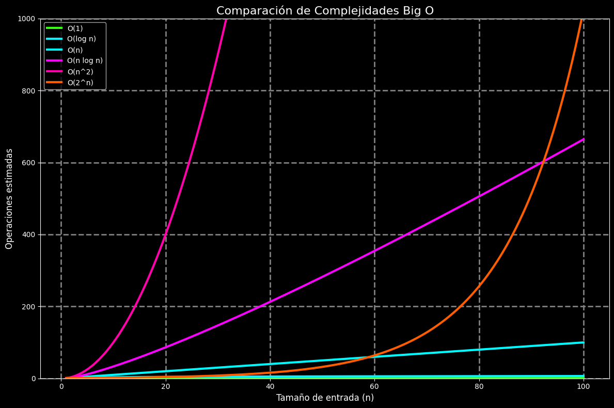

# Eficiencia, Espacio y Tiempo

Cuando hablamos de estructuras de datos o algoritmos, **eficiencia** se refiere a qué tan bien utilizan los **recursos computacionales** (como tiempo y memoria). Evaluar la eficiencia nos permite tomar decisiones informadas sobre qué **estructura** o **algoritmo** es el más adecuado para una tarea específica.

## Complejidad temporal (tiempo)

La **complejidad temporal** indica cuánto tarda un algoritmo en ejecutarse, según la cantidad de datos de entrada (`n`). Se expresa usando la **notación Big O**:

|Notación|Ejemplo de algoritmo|Descripción|
|--|--|--|
|O(1)|Acceso directo a un arreglo|Tiempo constante|
|O(log n)|Búsqueda binaria|Tiempo logarítmico|
|O(n)|Recorrido de una lista|Tiempo lineal|
|O(n log n)|Merge sort|Tiempo subcuadrático|
|O(n^2)|Burbujas (Bubble Sort)|Tiempo cuadrático|

## Complejidad espacial (espacio)

La **complejidad espacial** analiza la cantidad de memoria adicional que un algoritmo necesita. Por ejemplo:

- Guardar datos temporales o estructuras auxiliares (pilas, tablas)
- Uso de recursión, donde cada llamada consume memoria de pila.

> "Evaluar tanto el tiempo de ejecución como el consumo de memoria es esencial para sistemas donde los recursos son limitados o el rendimiento es crítico" (Sedgewick & Wayne, 2011).

## Aplicaciones prácticas

|Escenario|Relevancia de análisis de eficiencia|
|--|--|
|Juegos en línea|Tiempo de respuesta en tiempo real|
|Motores de búsqueda|Optimizar búsquedas en grandes volúmenes|
|Dispositivos móviles|Uso eficiente de memoria limitada|
|Inteligencia artificial|Procesamiento rápido de grandes datasets|

## Representación visual



## Comparación de tiempos de ejecución teóricos

```txt
Input (n) → █ Tiempo

O(1):      █
O(log n):  ███
O(n):      ███████
O(n log n):███████████
O(n²):     █████████████████
```

## Ejemplos

import Tabs from "@theme/Tabs";
import TabItem from "@theme/TabItem";

<Tabs>
<TabItem value="java" label="Paradigma: Orientado a Objetos">

<Tabs>
<TabItem value="java-code" label="Código Java Ejemplo">

```java title="TimeSpaceAnalyzer.java" showLineNumbers
import java.util.ArrayList;
import java.util.List;

public class TimeSpaceAnalyzer {
    public static int sumLinear(List<Integer> list) {
        int total = 0;

        for (int num : list) {
        total += num;
        }

        return total;
    }

    public static int[][] createMatrix(int n) {
        // highlight-next-line
        return new int[n][n]; // Espacio O(n^2)
    }
}
```

</TabItem>
<TabItem value="java-test" label="Test Unitario">

```java title="TimeSpaceAnalyzerTest.java" showLineNumbers
import org.junit.jupiter.api.Test;
import java.util.Arrays;
import static org.junit.jupiter.api.Assertions.*;

class TimeSpaceAnalyzerTest {
    @Test
    void testSumLinear() {
        var list = Arrays.asList(1, 2, 3, 4);
        assertEquals(10, TimeSpaceAnalyzer.sumLinear(list));
    }

    @Test
    void testCreateMatrixSize() {
        int[][] matrix = TimeSpaceAnalyzer.createMatrix(3);
        assertEquals(3, matrix.length)
    }
}
```

</TabItem>
</Tabs>

</TabItem>
<TabItem value="python" label="Paradigma: Procedural">

<Tabs>
<TabItem value="python-code" label="Código Python Ejemplo">

```py title="efficiency.py" showLineNumbers
def factorial(n):
    if n == 0 or n == 1:
        return 1
    return n * factorial(n - 1)

def memory_heavy_list(n):
    # highlight-next-line
    return [[0]*n for _ in range(n)] # Espacio O(n^2)
```

</TabItem>
<TabItem value="python-test" label="Test Unitario">

```py title="test_efficiency.py" showLineNumbers
import unittest
from efficiency import factorial, memory_heavy_list

class TestEfficiency(unittest.TestCase):
    def test_factorial(self):
        self.assertEquals(factorial(5), 120)

    def test_memory_heavy(self):
        mat = memory_heavy_list(4)
        self.assertEquals(len(mat), 4)

if __name__ == "__main__":
    unittest.main()
```

</TabItem>
</Tabs>

</TabItem>
<TabItem value="ts" label="Paradigma: Funcional">

<Tabs>
<TabItem value="ts-code" label="Código TypeScript Ejemplo">

```ts title="binarySearch.ts" showLineNumbers
export const binarySearch = (arr: number[], target: number): number => {
    let left = 0, right = arr.length - 1;

    while (left <= right) {
        const mid = Math.floor((left + right) / 2);
        if (arr[mid] === target) return mid;
        arr[mid] < target ? left = mid + 1 : right = mid - 1;
    }

    return -1;
}
```

</TabItem>
<TabItem value="ts-test" label="Test Unitario">

```ts title="binarySearch.test.ts" showLineNumbers
import { binarySearch } from "./binarySearch";

test("binarySearch finds index", () => {
    const array = [1, 3, 5, 7, 9]
    expect(binarySearch(array, 5)).toBe(2);
});

test("binarySearch not found", () => {
    expect(binarySearch([1, 2, 3], 10)).toBe(-1);
});
```

</TabItem>
</Tabs>

</TabItem>
</Tabs>

## Referencias

- Cormen, T. H., Leiserson, C. E., Rivest, R. L., & Stein, C. (2022). Introduction to Algorithms (4.ª ed.). MIT Press.
- Sedgewick, R., & Wayne, K. (2011). Algorithms (4.ª ed.). Addison-Wesley.
- [Python Software Foundation. (2024).](https://docs.python.org/)
- [Oracle Java Documentation. (2024).](https://docs.oracle.com/en/java/)
- [TypeScript Handbook. (2024).](https://www.typescriptlang.org/docs/)
