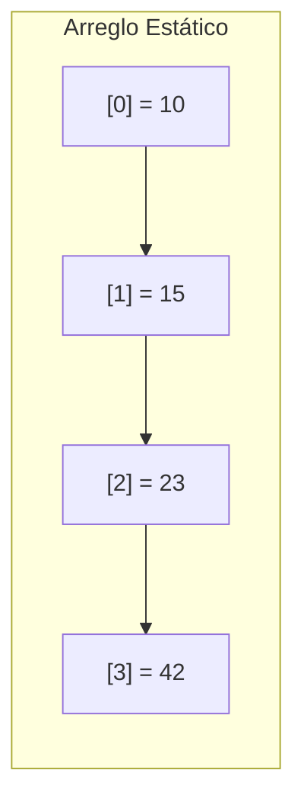

# Arreglos estáticos

Un **arreglo estático** (también llamado array de tamaño fijo) es una **estructura de datos lineal** que almacena una colección de elementos del mismo tipo en **posiciones de memoria contiguas**. Su tamaño se define en el momento de la creación y **no puede cambiar durante la ejecución del programa**.

## ¿Cómo se implementan en memoria?

El arreglo estático se almacena como un **bloque continua de memoria**, donde:

- El primer elemento se guarda en una dirección base.
- Los demás elementos se colocan en posiciones consecutivas, calculadas por desplazamiento.

## Fórmula para acceder a un elemento

```txt
Dirección del elemento = Dirección base + índice * tamaño del tipo de dato
```

> Según Cormen et al. (2022), esta propiedad de acceso por índice permite que las operaciones de lectura y escritura sean de **tiempo constante O(1)**.

## Ventajas

- Acceso directo y rápido a cualquier elemento (`O(1)`).
- Eficiencia en el uso de CPU y caché por memoria contigua.
- Sencillez de implementación.

## Limitaciones

- Tamaño fijo: se debe conocer de antemano
- Ineficacia al insertar o eliminar (requiere mover elementos)
- Uso potencialmente ineficiente de memoria (espacios sin utilizar)

## Aplicaciones prácticas

|Área|Uso del arreglo estático|
|--|--|
|Imágenes digitales|Representación de píxeles|
|Juegos 2D|Matrices para representar mapas/tableros|
|Sensores IoT|Buffer de muestras de tamaño fijo|
|Simulaciones científicas|Modelo de matrices o vectores o vectores físicos|

## Representación visual

Tenemos un arreglo estático de 4 posiciones. El arreglo no puede crecer, solo cambiar sus valores.



## Ejemplos

import Tabs from "@theme/Tabs";
import TabItem from "@theme/TabItem";

<Tabs>
<TabItem value="java" label="Paradigma: Orientado a Objetos">

<Tabs>
<TabItem value="java-code" label="Código Java Ejemplo">

```java title="StaticArray.java" showLineNumbers
package datastructures;

public class StaticArray {
    private final int[] data;

    public StaticArray(int size) {
        // highlight-next-line
        data = new int[size];
    }
    
    public void set(int index, int value) {
        if (index < 0 || index >= data.length)
            throw new IndexOutOfBoundsException("Índice fuera de rango");
        data[index] = value;
    }

    public int get(int index) {
        if (index < 0 || index >= data.length)
            throw new IndexOutOfBoundsException("Índice fuera de rango");
        return data[index];
    }

    public int length() {
        return data.length;
    }
}
```

</TabItem>
<TabItem value="java-test" label="Test Unitario">

```java title="StaticArrayTest.java" showLineNumbers
import org.junit.jupiter.api.Test;
import static org.junit.jupiter.api.Assertions.*;

class StaticArrayTest {

    @Test
    void testSetAndGet() {
        StaticArray array = new StaticArray(3);
        array.set(0, 5);
        array.set(2, 10);
        assertEquals(5, array.get(0));
        assertEquals(10, array.get(2));
    }

    @Test
    void testInvalidIndex() {
        StaticArray array = new StaticArray(2);
        assertThrows(IndexOutOfBoundsException.class, () -> array.set(3, 99));
    }
}
```

</TabItem>
</Tabs>

</TabItem>
<TabItem value="python" label="Paradigma: Procedural">

<Tabs>
<TabItem value="python-code" label="Código Python Ejemplo">

```py title="static_array.py" showLineNumbers
def create_static_array(size: int) -> list[int]:
    # highlight-next-line
    return [0] * size;

def set_value(arr: list[int], index: int, value: int) -> None:
    if index < 0 or index >= len(arr):
        raise IndexError("Índice fuera de rango")
    arr[index] = value

def get_value(arr: list[int], index: int) -> int:
    if index < 0 or index >= len(arr):
        raise IndexError("Índice fuera de rango")
    return arr[index]
```

</TabItem>
<TabItem value="python-test" label="Test Unitario">

```py title="test_static_array.py" showLineNumbers
import unittest
from static_array import create_static_array, set_value, get_value

class TestStaticArray(unittest.TestCase):
    def test_access(self):
        arr = create_static_array(4)
        set_value(arr, 0, 12)
        set_value(arr, 3, 8)
        self.assertEqual(get_value(arr, 0), 12)
        self.assertEqual(get_value(arr, 3), 8)

    def test_out_of_bounds(self):
        arr = create_static_array(2)
        with self.assertRaises(IndexError):
            set_value(arr, 5, 1)

if __name__ == '__main__':
    unittest.main()
```

</TabItem>
</Tabs>

</TabItem>
<TabItem value="ts" label="Paradigma: Funcional">

<Tabs>
<TabItem value="ts-code" label="Código TypeScript Ejemplo">

```ts title="structures.ts" showLineNumbers
// highlight-next-line
export const createArray = (size: number): number[] => Array.from({ length: size }, () => 0);

export const setValue = (arr: number[], index: number, value: number): number[] => {
    if (index < 0 || index >= arr.length) throw new Error("Índice fuera de rango");
    const copy = [...arr];
    copy[index] = value;
    return copy;
};

export const getValue = (arr: number[], index: number): number => {
    if (index < 0 || index >= arr.length) throw new Error("Índice fuera de rango");
    return arr[index];
};
```

</TabItem>
<TabItem value="ts-test" label="Test Unitario">

```ts title="structures.test.ts" showLineNumbers
import { createArray, setValue, getValue } from "./staticArray";

test("crear y acceder arreglo", () => {
    let arr = createArray(3);
    arr = setValue(arr, 1, 7);
    expect(getValue(arr, 1)).toBe(7);
});

test("índice fuera de rango", () => {
    const arr = createArray(2);
    expect(() => setValue(arr, 5, 99)).toThrow("Índice fuera de rango");
});
```

</TabItem>
</Tabs>

</TabItem>
</Tabs>

## Referencias

- Cormen, T. H., Leiserson, C. E., Rivest, R. L., & Stein, C. (2022). Introduction to Algorithms (4.ª ed.). MIT Press.
- Goodrich, M. T., Tamassia, R., & Goldwasser, M. H. (2014). Data Structures and Algorithms in Python. Wiley.
- [Oracle Java Documentation. (2024).](https://docs.oracle.com/en/java/>)
- [TypeScript Handbook. (2024).](https://www.typescriptlang.org/docs/>)
- [Python Docs. (2024).](https://docs.python.org/3/>)
